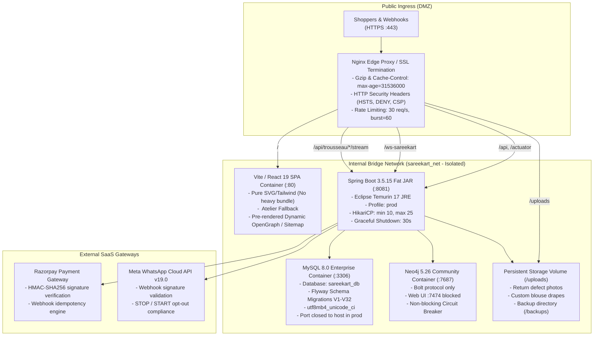

# SareeKart — Production Go-Live & Operations Manual

> **Document Status:** CANONICAL PRODUCTION RUNBOOK  
> **Platform Version:** 3.0.0-PROD (Enterprise Luxury Handlooms)  
> **Repository Root:** `/Users/chaitanyachaitu/Downloads/SareeKart-main`  
> **Target Environment:** Containerized Production (Docker / Docker Compose / Kubernetes)  
> **Audience:** DevOps Engineers, Site Reliability Engineers (SRE), Platform Administrators  

---

## 1. Executive Summary & Go-Live Criteria

This document is the authoritative operations guide for deploying, operating, and maintaining the SareeKart production e-commerce platform. Before initiating a production launch or migration, verify that the following 6 prerequisite criteria are met:

- [x] **Backend Test Suite:** 574/574 tests passing with zero failures, zero errors (`./mvnw test`).
- [x] **Frontend Quality & Budget:** Clean ESLint, bundle build successful, all chunks strictly $< 500\text{ kB}$ (largest vendor chunk $\le 230\text{ kB}$).
- [x] **Database Schema:** Flyway migrations V1 through V32 applied; `spring.jpa.hibernate.ddl-auto: validate` enabled in production profile.
- [x] **Secret Quarantine:** All secrets externalized to environment variables; zero plain-text secrets in git.
- [x] **Disaster Recovery:** Tested restore procedure (`./manage.sh dr_check` passing 6/6; verified SHA-256 backup on file).
- [x] **Storage Discipline:** System disk headroom $\ge 30\%$ free space (~105 GiB free on `/System/Volumes/Data`).

---

## 2. Production Architecture & Network Topology



### Network & Port Map

| Component | Container Port | Host Port (Prod) | Access Rule | Protocol |
|---|:---:|:---:|---|---|
| **Nginx Proxy** | `80`, `443` | `80`, `443` | Public Ingress | HTTP / HTTPS (TLS 1.3) |
| **Frontend SPA** | `80` | None (Internal) | Nginx Reverse Proxy only | HTTP/1.1 |
| **Backend API** | `8081` | None (Internal) | Nginx Reverse Proxy only | HTTP/1.1 & WebSocket |
| **MySQL Database** | `3306` | None (Internal) | Backend container only | MySQL Native (TCP) |
| **Neo4j Graph** | `7687` | None (Internal) | Backend container only | Bolt (TCP) |
| **Actuator Probes** | `8081/actuator` | `8081` (Internal) | Load Balancer / Monitoring only | HTTP/1.1 |

---

## 3. Production Environment Variables Reference Matrix

Create a production `.env` file in the project root (permissions `chmod 600 .env`) based on `.env.example`:

| Variable Name | Required | Default / Format | Description / Security Policy |
|---|:---:|---|---|
| `SPRING_PROFILES_ACTIVE` | **YES** | `prod` | Activates `application-prod.yaml` (`ddl-auto: validate`, strict HikariCP). |
| `SPRING_DATASOURCE_URL` | **YES** | `jdbc:mysql://mysql:3306/sareekart_db?...` | Production JDBC URL with TLS and reconnect parameters. |
| `SPRING_DATASOURCE_USERNAME` | **YES** | `sareekart_prod` | Dedicated non-root MySQL application user. |
| `SPRING_DATASOURCE_PASSWORD` | **YES** | `(Random 32+ char)` | High-entropy production database password. |
| `MYSQL_ROOT_PASSWORD` | **YES** | `(Random 32+ char)` | MySQL root administrative password. |
| `JWT_SECRET` | **YES** | `(64+ Hex / Base64)` | High-entropy HS256 secret for signing customer authentication tokens. |
| `JWT_EXPIRATION_MS` | NO | `86400000` (24 hrs) | Token expiration duration in milliseconds. |
| `RAZORPAY_KEY_ID` | **YES** | `rzp_live_...` | Live Razorpay merchant key ID for Indian card/UPI checkout. |
| `RAZORPAY_KEY_SECRET` | **YES** | `(Live Key Secret)` | Secret key used for cryptographic checkout signature verification. |
| `RAZORPAY_WEBHOOK_SECRET` | **YES** | `(Webhook Secret)` | Secret for verifying incoming Razorpay server-to-server webhook events. |
| `WHATSAPP_PHONE_NUMBER_ID`| **YES** | `10-15 digit ID` | Meta WhatsApp Cloud API registered business phone number ID. |
| `WHATSAPP_ACCESS_TOKEN` | **YES** | `EAAG...` | Permanent Meta System User Access Token with `whatsapp_business_messaging`. |
| `WHATSAPP_WEBHOOK_VERIFY_TOKEN`| **YES** | `(Random 32+ char)` | Challenge token configured in Meta Developer App for webhook registration. |
| `WHATSAPP_APP_SECRET` | **YES** | `(Meta App Secret)` | Meta App Secret for validating `X-Hub-Signature-256` HTTP headers. |
| `SPRING_NEO4J_URI` | NO | `bolt://neo4j:7687` | Internal Bolt connection string for luxury knowledge graph. |
| `SPRING_NEO4J_AUTHENTICATION_USERNAME` | NO | `neo4j` | Neo4j graph user. |
| `SPRING_NEO4J_AUTHENTICATION_PASSWORD` | NO | `(Random 16+ char)` | Neo4j graph authentication password. |
| `APP_CORS_ALLOWED_ORIGINS` | **YES** | `https://sareekart.com` | Strict comma-separated origin whitelist for browser CORS enforcement. |

---

## 4. Production Cold-Start Launch Sequence

Execute the following 5-step sequence when launching SareeKart in production:

### Step 1: Initialize Persistent Storage & Set Permissions
```bash
cd /Users/chaitanyachaitu/Downloads/SareeKart-main

# Ensure upload and backup directories exist with restricted permissions
mkdir -p uploads/return-photos backups
chmod 750 uploads backups
```

### Step 2: Provision Production Network & Database
```bash
# Build and start the database and graph persistence layer in background
docker compose -f docker-compose.prod.yml up -d mysql neo4j

# Wait for MySQL health probe to return healthy (approx. 10s)
docker compose -f docker-compose.prod.yml ps mysql
```

### Step 3: Verify Database Migration Status
The Spring Boot application automatically applies Flyway migrations (`V1` through `V32`) on startup. To verify or apply migrations prior to application boot:
```bash
# Verify schema tables exist and V32 migration is registered
docker compose -f docker-compose.prod.yml exec mysql mysql -u root -p"$MYSQL_ROOT_PASSWORD" sareekart_db \
  -e "SELECT version, description, success FROM flyway_schema_history ORDER BY installed_rank DESC LIMIT 5;"
```

### Step 4: Launch Application & Ingress Layer
```bash
# Launch Spring Boot backend and Nginx reverse proxy
docker compose -f docker-compose.prod.yml up -d --build backend frontend

# Tail startup logs to verify clean Spring Boot initialization
docker compose -f docker-compose.prod.yml logs -f backend
```

### Step 5: Verify Production Health Probes
```bash
# Probe 1: Spring Boot Actuator Liveness
curl -fsS http://localhost:8081/actuator/health | jq .
# Expected output: {"status":"UP"}

# Probe 2: Public Nginx SSL / Catalog Endpoint
curl -fsSI http://localhost/api/products | head -n 5
# Expected output: HTTP/1.1 200 OK

# Probe 3: SEO Dynamic Sitemap
curl -fsSI http://localhost/sitemap.xml | head -n 5
# Expected output: HTTP/1.1 200 OK, Content-Type: application/xml
```

---

## 5. Zero-Downtime Rolling Upgrade Procedure

To deploy a new application version without interrupting active shopper checkout sessions:

1. **Pull and Build New Images:**
   ```bash
   git pull origin master
   docker compose -f docker-compose.prod.yml build backend frontend
   ```
2. **Execute Database Migrations:**
   Ensure new Flyway migrations are strictly forward-compatible (additive only: new tables, nullable columns, defaults).
3. **Graceful Container Restart:**
   Spring Boot is configured with `server.shutdown: graceful` (30-second drain period).
   ```bash
   docker compose -f docker-compose.prod.yml up -d --no-deps --scale backend=2 backend
   sleep 15
   docker compose -f docker-compose.prod.yml up -d --no-deps --scale backend=1 backend
   ```
4. **Reload Nginx Cache & Configuration:**
   ```bash
   docker compose -f docker-compose.prod.yml exec frontend nginx -s reload
   ```

---

## 6. Observability, Health Probes & Monitoring

### Endpoints
- **Liveness & Readiness:** `GET /actuator/health` (Publicly accessible to load balancer). Returns `{"status":"UP"}`.
- **Application Info:** `GET /actuator/info` (Public). Returns build version, artifact ID, and git commit hash.
- **JVM & Connection Pool Metrics:** `GET /actuator/metrics` (Requires `ROLE_ADMIN` or `ROLE_OWNER` JWT token).

### Metric Thresholds & Alert Triggers

| Metric | Normal Range | Warning Threshold | Critical Incident Action |
|---|:---:|:---:|---|
| **HikariCP Active Connections** | 2 – 8 | $\ge 18$ of 25 | Investigate long-running queries; review catalog indexes. |
| **JVM Heap Usage** | $256\text{ MB} - 768\text{ MB}$ | $\ge 1.5\text{ GB}$ (80%) | Capture heap dump (`jcmd`); inspect leak in image buffers. |
| **HTTP 5xx Error Rate** | $< 0.1\%$ | $\ge 1.0\%$ | Check error log: `docker compose logs --tail=100 backend`. |
| **Disk Headroom** | $> 40\%$ | $< 30\%$ | Run `manage.sh backup` rotation; purge old docker layers. |
| **P95 API Response Time** | $< 120\text{ms}$ | $> 500\text{ms}$ | Inspect MySQL slow query log; verify Neo4j circuit breaker. |

---

## 7. Incident Triage, Fallbacks & Circuit Breakers

### Subsystem 1: Neo4j Graph Outage
- **Symptom:** Neo4j container crash or port 7687 unreachable.
- **Automatic Behavior:** `Neo4jConfig` catches connection failure, logs `WARN: SareeKart commerce will continue with deterministic fallback`.
- **Shopper Impact:** Zero impact on checkout, browsing, or payments. Recommendations seamlessly fall back to MySQL relational queries.
- **Recovery Action:** Restart container: `docker compose restart neo4j`. Rebuild graph cache via backend: `POST /api/admin/graph/sync`.

### Subsystem 2: Razorpay Webhook Degradation
- **Symptom:** Razorpay webhook delivery fails or times out.
- **Automatic Behavior:** Customer checkout creates order in `PENDING` status. Client frontend polls verification endpoint with `razorpay_payment_id` and cryptographic signature.
- **Idempotency Protection:** Double webhook delivery returns HTTP 200 immediately without duplicate order fulfillment or inventory decrement.
- **Triage Action:** Check logs: `grep "Razorpay webhook" backend.log`.

### Subsystem 3: WhatsApp Cloud API Rate Limiting / Degradation
- **Symptom:** Meta API returns HTTP 429 (Rate Limit) or HTTP 500.
- **Automatic Behavior:** `WhatsAppRateLimiter` enforces in-memory throttling (5 msgs/min per customer). Failed outbound notifications log error without throwing exceptions to shopper checkout flow.
- **Regulatory Compliance:** Shoppers sending `STOP` are immediately unsubscribed locally, blocking further outbound templates regardless of API status.

---

## 8. Rollback Procedures

### Scenario A: Application Rollback (Bug in New Release)
Because database migrations V29–V32 are strictly additive, rolling back the application container to a previous commit does not require a database rollback.
```bash
# 1. Check out previous known good commit
git checkout <previous_commit_hash>

# 2. Rebuild and deploy application containers
docker compose -f docker-compose.prod.yml up -d --build backend frontend

# 3. Verify health
curl -fsS http://localhost:8081/actuator/health
```

### Scenario B: Database Restoration from Backup (Data Corruption)
```bash
# 1. Run DR readiness check
./manage.sh dr_check

# 2. Inspect and verify latest backup checksum
./manage.sh verify backups/sareekart_db_latest.sql

# 3. Restore into staging/recovery target first to verify parity
./manage.sh restore backups/sareekart_db_latest.sql sareekart_recovery_drill_db

# 4. If emergency production restore is required, invoke with affirmative flag
./manage.sh restore backups/sareekart_db_latest.sql sareekart_db --force-production-overwrite
```

---

## 9. SRE Operational Cheat Sheet

```bash
# Check service health and running status
./manage.sh status

# Run complete 6-point Disaster Recovery Diagnostic
./manage.sh dr_check

# Create immediate point-in-time database backup (SHA-256 sidecar + auto-rotation)
./manage.sh backup

# Verify integrity of any backup dump
./manage.sh verify backups/sareekart_db_<timestamp>.sql

# Check disk space compliance (>= 30% free space rule)
~/scripts/check_disk_health.sh

# Rebuild frontend and check chunk sizes (< 500 kB budget)
cd frontend && npm run build
```
