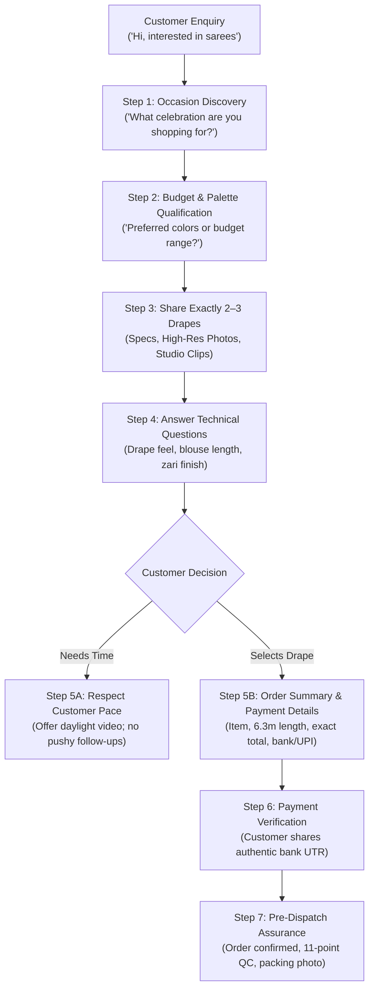
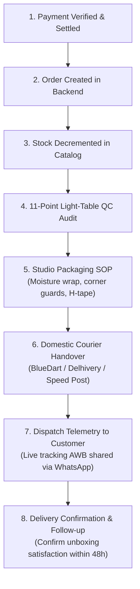

# SareeKart — First 10 Orders Playbook
**Authoritative Operational Playbook for Converting the First 10 Organic Paid Orders**  
*Repository: `/Users/chaitanyachaitu/Downloads/SareeKart-main` | Branch: `main`*  
*Budget Expended: Strictly ₹0.00 | Recognized Revenue: Strictly ₹0.00*  
*Operating Mode: Zero Paid Advertising · Zero Data Fabrication · 100% Catalog Truth*

---

## 1. OBJECTIVE

The sole objective of this playbook is to reach **the first 10 genuine, paid, and fulfilled customer orders** exclusively through organic channels with **strictly ₹0.00 ad spend**.

- **Success Criterion**: 10 distinct retail orders with verified bank settlement / payment confirmation into the merchant account, followed by successful 11-point quality inspection, physical dispatch, and customer delivery.
- **Strict Boundary**: Zero shortcuts. An enquiry, verbal interest, cart addition, or checkout start is **never** counted as an order.

---

## 2. CUSTOMER SOURCES & ATTRIBUTION LEDGER

Every customer conversation and enquiry must be attributed to an authentic origin point. Record the exact source in the CRM/Lead Tracker:

| Source Code | Acquisition Vector | Operating Channel | Verification & Tracking Rule |
|---|---|---|---|
| **`SRC-NET`** | Personal & Professional Network | WhatsApp / Direct Call | Existing trusted relationships (colleagues, family friends, alumni). Never spam; reach out only with personalized, occasion-specific recommendations. |
| **`SRC-WA`** | WhatsApp Storefront Direct | WhatsApp Business (+91 9059564499) | Inquiries arriving via direct link, shared catalog links, or status updates. Log phone number and conversation initiation timestamp. |
| **`SRC-IG`** | Instagram Organic | Instagram DMs / Bio Link | Prospective buyers arriving via organic reels, weave carousels, or aesthetic close-ups. Never use automated bot DMs or paid boosts. |
| **`SRC-REF`** | Customer / Friend Referral | WhatsApp / Phone | Inquiries referred by a previous customer or contact. Record referring party name to attribute source. |
| **`SRC-BIZ`** | Existing Saree & Textile Contacts | Studio Visit / WhatsApp | Boutique owners, event stylists, and corporate gifting committees. Record formal business entity and contact person. |

### Lead Attribution Entry Template
```text
Lead ID:      Lead-[NNN]
Source:       [SRC-NET | SRC-WA | SRC-IG | SRC-REF | SRC-BIZ]
Referrer:     [Name / Context or Direct]
Date Logged:  YYYY-MM-DD
Target SKU:   SKU #[N] ([Product Name])
Occasion:     [Bridal | Festive | Workwear | Gifting | Personal Collection]
Status:       [ENQUIRY | QUALIFIED | PRODUCT_SHARED | CHECKOUT_STARTED | PAID]
```

---

## 3. DAILY ORGANIC ROUTINE (35–45 MINUTES/DAY)

Execute this repeatable daily routine without deviation. No paid ads or complex tools required:

```text
┌─────────────────────────────────────────────────────────────────────────┐
│               SAREEKART DAILY ORGANIC SALES ROUTINE                     │
├──────────────┬──────────────────────────────────────────────────────────┤
│ 10 Minutes   │ Publish 1 Useful Organic Asset (Instagram / Status)       │
│              │ • Rotate across Product (40%), Education (35%), Story (25%)│
│              │ • Verify all caption facts against products.js catalog    │
├──────────────┼──────────────────────────────────────────────────────────┤
│ 10 Minutes   │ Respond to Genuine Inquiries                             │
│              │ • Apply the 4-step consultative qualification framework   │
│              │ • Share 2–3 exact drapes matching occasion and budget     │
├──────────────┼──────────────────────────────────────────────────────────┤
│ 10 Minutes   │ Respectful Follow-ups                                    │
│              │ • Follow up ONLY where explicitly requested by customer   │
│              │ • Provide value (daylight video, drape fall clip)         │
│              │ • Zero pressure; respect customer timeline                │
├──────────────┼──────────────────────────────────────────────────────────┤
│ 5–10 Minutes │ Product Knowledge & Asset Verification                    │
│              │ • Review catalog specifications (length, zari, fabric)    │
│              │ • Ensure studio lighting and macro clips are organized    │
├──────────────┼──────────────────────────────────────────────────────────┤
│ 5 Minutes    │ Lead Tracker & Status Update                             │
│              │ • Update interaction stage in active pipeline ledger      │
│              │ • Maintain empirical truth: ₹0 revenue until settled      │
└──────────────┴──────────────────────────────────────────────────────────┘
```

---

## 4. THE CONSULTATIVE CUSTOMER CONVERSATION FLOW

Every interaction must be a **helpful textile consultation**, not a high-pressure sales pitch.



### Verbatim Consultative Scripts

#### Step 1: Occasion Discovery
> *"Namaste! Welcome to SareeKart. My name is [Name], and I would love to help you find the right handloom drape. To make sure I share pieces that match your needs: What upcoming celebration or event are you shopping for, or is this for daily elegance?"*

#### Step 2: Budget & Palette Qualification
> *"That sounds wonderful! To help narrow down our studio collection: Do you have a preferred color family in mind (such as rich jewel tones, pastels, or classic neutrals)? And is there a specific budget range you would like us to stay within?"*

#### Step 3: Curated Recommendation (Strictly 2–3 Drapes)
> *"Thank you! Based on your celebration and preferences, I have selected these two distinct handloom pieces from our studio:*
> 
> *1. **[Product 1 Name]** (SKU #[N] — ₹[Price])*
> *[Verified fabric composition, weave technique, and key occasion benefit].*
> *[Verified High-Resolution Asset Link]*
> 
> *2. **[Product 2 Name]** (SKU #[N] — ₹[Price])*
> *[Verified fabric composition, weave technique, and key occasion benefit].*
> *[Verified High-Resolution Asset Link]*
> 
> *Take your time to look through the details. Would you like to see a quick daylight video showing how either drape moves?"*

#### Step 4: Transparent Order Summary
> *"Wonderful choice! Here are the complete details for your order:*
> 
> *• Saree: [Product Name] (SKU #[N])*
> *• Fabric: [Verified Fabric from Catalog]*
> *• Dimensions: Full 6.3m (includes 0.8m running unstitched blouse piece) · 46-inch width*
> *• Listed Price: ₹[Price]*
> *• Domestic Shipping: ₹0.00 (Complimentary insured delivery)*
> *• Total Amount Due: ₹[Price]*
> 
> *Please reply with your full delivery address and PIN code, and I will share our direct bank transfer / UPI payment details."*

---

## 5. TRUST BUILDING & TRANSPARENCY STANDARDS

Trust is established through complete accuracy, not extravagant claims:

1. **Accurate Dimensions**: Every SareeKart saree is audited to a full 6.3 meters (5.5m body drape + 0.8m unstitched running blouse, 46-inch loom width). Never exaggerate or guess sizing.
2. **Neutral Daylight Photography**: All primary imagery and video walkthroughs must be captured in natural daylight (5500K neutral light) without saturation boosters or misleading beauty filters.
3. **Transparent Pricing**: The catalog listed price is the final price. No hidden packing fees, no surprise shipping charges, and no synthetic checkout surcharges.
4. **Clear Delivery Timelines**: Domestic courier transit is 3–5 business days via standard surface/air express. State this clearly upfront before payment.
5. **Verified Doorstep Inspection Policy**: Every purchase is covered by our 7-day post-delivery inspection guarantee. If the drape arrives with any defect or weave mismatch, exchange or return is honored.
6. **Strictly Grounded Descriptions**: Only state specifications verified in [`frontend/src/data/products.js`](file:///Users/chaitanyachaitu/Downloads/SareeKart-main/frontend/src/data/products.js). Never make claims about weaving days, unverified GI provenance, or home burn tests unless backed by written artisan records.

---

## 6. FACTUAL OBJECTION-HANDLING SCRIPTS

Every customer question or objection is an opportunity to provide clear, verified facts:

### Objection 1: "Why is this saree more expensive than options I see online?"
> *"I completely understand why you ask! Many sarees online are mass-produced on automated powerlooms using synthetic polyester or viscose blends, and often measure only 5.2 to 5.5 meters to cut material costs.*
> 
> *At SareeKart, every drape is crafted on traditional handlooms using pure natural fibers (such as pure mulberry silk, fine cotton, or wild tussar) and measures a generous 6.3 meters with running blouse piece. Our pricing directly reflects fair compensation for our weaving clusters, complimentary insured shipping, and an uncompromising 11-point quality inspection."*

### Objection 2: "Can you offer a 15% or 20% discount?"
> *"We deeply appreciate you asking! SareeKart operates on an honest, direct-to-artisan pricing policy. Rather than artificially marking up our prices by 30% just to offer fake flash discounts, our listed price is our true and final price.*
> 
> *This ensures fair earnings for the weaving families and gives every customer our best possible price every single day. We also include free insured shipping and tamper-evident packaging with every order."*

### Objection 3: "How do I know this is genuine handloom and not machine-made?"
> *"Authentic handloom reveals its story in the details:*
> 
> *1. **Weave Character**: Because it is hand-shuttled, handloom fabric possesses a subtle, organic texture and natural drape that machine-made cloth cannot replicate.*
> *2. **Clean Locked Motifs**: In our traditional Kadwa and Jamdani weaves, each motif is woven directly into the warp rather than running messy, continuous floating threads across the reverse side.*
> *3. **Doorstep Inspection**: We back every saree with our 7-day inspection guarantee. When your parcel arrives, you can inspect the weave and texture in your own home with complete peace of mind."*

### Objection 4: "Can I see more photos or a video before deciding?"
> *"Absolutely! We always recommend seeing the drape in motion before purchasing. I am recording a quick 15-second daylight video right now showing the border, pallu, and natural fabric fall under natural sunlight. Sharing it with you in just a moment!"*

### Objection 5: "What is the delivery time?"
> *"Once your payment is verified and your saree passes our morning 11-point inspection, it is packaged in moisture-barrier wrap and dispatched via our domestic courier partner. Delivery takes 3 to 5 business days depending on your city. We provide your live tracking number as soon as the parcel is handed over."*

### Objection 6: "What happens if I don't like the color or fall when it arrives?"
> *"We want you to feel completely confident in your drape. If upon unboxing at home you feel the color does not suit your occasion or the drape is not what you expected, simply notify us within 7 days of delivery. We will assist you with an exchange or return per our doorstep policy, provided the saree remains unused and unstitched."*

---

## 7. FOLLOW-UP PROTOCOLS & ETHICAL BOUNDARIES

Customer trust is fragile. High-pressure sales tactics repel luxury handloom buyers:

```text
┌────────────────────────────────────────────────────────────────────────┐
│                   SAREEKART ETHICAL FOLLOW-UP RULES                    │
├────────────────────────────────────────────────────────────────────────┤
│ RULE 1: Maximum 1 Gentle Check-In                                      │
│ • Send at most ONE polite follow-up 24–48 hours after sharing details. │
│ • If the customer does not respond, STOP. Do not message again.        │
├────────────────────────────────────────────────────────────────────────┤
│ RULE 2: Always Value-Add, Never Pushy                                  │
│ • Good: "Sharing a short daylight video of the border for you!"        │
│ • Bad:  "Are you ready to buy?", "Hurry, limited stock!", "Last piece!"│
├────────────────────────────────────────────────────────────────────────┤
│ RULE 3: Respect Customer Decision Pace                                 │
│ • High-value sarees (₹8,000–₹26,000) are family decisions.             │
│ • Always affirm: "Please take all the time you need to decide."        │
├────────────────────────────────────────────────────────────────────────┤
│ RULE 4: Absolute DO NOT CONTACT Compliance                             │
│ • If a lead states disinterest or is flagged DO NOT CONTACT (e.g.      │
│   Lead-007 reseller), blacklist the contact permanently. Zero contact. │
└────────────────────────────────────────────────────────────────────────┘
```

---

## 8. ORDER VERIFICATION GATE (ZERO ASSUMPTIONS)

Under our empirical governance model, an order exists **only** when verified through genuine settlement:

```text
  Customer states interest?          ───► NOT AN ORDER (Status: ENQUIRY)
  Customer asks for payment details? ───► NOT AN ORDER (Status: CHECKOUT_STARTED)
  Customer says "payment sent"?      ───► NOT AN ORDER (Status: PAYMENT_PENDING)
  Bank confirms UTR & settlement?    ───► VERIFIED ORDER (Status: PAID)
```

### The 4-Point Payment Settlement Checklist:
1. **Verifiable UTR / Reference**: Customer provides authentic 12-digit bank UTR or payment gateway transaction ID.
2. **Exact Amount Match**: Settled amount matches catalog listed price down to the rupee (e.g. ₹8,667 for SKU #3).
3. **Bank Account Credit Confirmed**: Funds verified in the merchant account ledger before advancing status.
4. **Order Record Created**: Backend order entity generated and allocated inventory decremented (e.g. Stock 8 $\to$ 7).

---

## 9. FULFILLMENT & DISPATCH LIFECYCLE

Once payment is verified, follow this standard physical fulfillment workflow:



### The 11-Point Light-Table QC Checklist:
1. Saree length measured to full 6.3m (including 0.8m running blouse).
2. Saree width measured to 46 inches.
3. Light-table audit for warp and weft weave continuity.
4. Check for reed marks, pulled threads, or skipped picks.
5. Inspect metallic zari border for even luster and finish.
6. Verify pallu extra-weft motif definition and edge trimming.
7. Confirm running blouse piece is intact and unsevered.
8. Inspect body fabric for handling cleanliness and zero spots.
9. Verify selvage edges are neat, firm, and unravel-free.
10. Ensure brand tags and care instruction card are enclosed.
11. Package inside virgin moisture-barrier poly sleeve inside rigid corrugated box.

---

## 10. MEASUREMENT & FUNNEL TELEMETRY

Track every customer through these exact operational stages:

$$\text{Enquiry} \longrightarrow \text{Qualified} \longrightarrow \text{Product Shared} \longrightarrow \text{Checkout Started} \longrightarrow \text{Paid} \longrightarrow \text{Delivered} \longrightarrow \text{Referral}$$

### First 10 Orders Progress Tracker

| Order # | Customer / City | SKU # | Listed Price | Source | Payment UTR | QC Status | Dispatch Date | Delivery Status |
|---|---|---|---|---|---|---|---|---|
| **01** | Lead-002 (HYD) | SKU #3 | ₹8,667 | SRC-NET | *Pending Settlement* | *Pending* | *Pending* | `CHECKOUT_STARTED` |
| **02** | *Target* | — | — | — | — | — | — | `UNASSIGNED` |
| **03** | *Target* | — | — | — | — | — | — | `UNASSIGNED` |
| **04** | *Target* | — | — | — | — | — | — | `UNASSIGNED` |
| **05** | *Target* | — | — | — | — | — | — | `UNASSIGNED` |
| **06** | *Target* | — | — | — | — | — | — | `UNASSIGNED` |
| **07** | *Target* | — | — | — | — | — | — | `UNASSIGNED` |
| **08** | *Target* | — | — | — | — | — | — | `UNASSIGNED` |
| **09** | *Target* | — | — | — | — | — | — | `UNASSIGNED` |
| **10** | *Target* | — | — | — | — | — | — | `UNASSIGNED` |

---

## 11. THE ZERO-BUDGET RULE

- **Total Marketing Budget**: Strictly **₹0.00**.
- **Prohibited Channels**:
  - 🚫 No Meta (Facebook / Instagram) paid ad campaigns.
  - 🚫 No Google Search / Shopping PPC ads.
  - 🚫 No paid influencer endorsements or gifted drapes.
  - 🚫 No paid WhatsApp broadcast software or scraping tools.
- **Permitted Organic Vectors**:
  - Organic Instagram reels and photo carousels.
  - WhatsApp 1-to-1 consultations and status updates.
  - Word-of-mouth customer referrals and family networks.
  - Direct relationship management with high-intent shoppers.

---

## 12. THE ZERO-FABRICATION RULE

The integrity of SareeKart rests entirely on empirical honesty:

- **🚫 Never manufacture customers**: Every lead must correspond to a real person who initiated contact.
- **🚫 Never fabricate orders**: Orders exist only when backed by genuine bank settlement receipts.
- **🚫 Never fabricate revenue**: Recognized gross revenue is ₹0.00 until funds hit the account.
- **🚫 Never fabricate reviews or testimonials**: Quotes, star ratings, and feedback must be from genuine purchasers.
- **🚫 Never fabricate website traffic**: Never simulate bots or artificial visits to inflate metrics.
- **🚫 Never create synthetic urgency**: No fake countdown timers, no false "Only 1 left in stock!" claims.
- **🚫 Never fabricate weaving stories**: Never claim unverified weaving days, burn test claims, or GI-tag certification without documented artisan provenance.

---

*(Playbook complete. Ready for real-world execution upon arrival of external customers.)*
