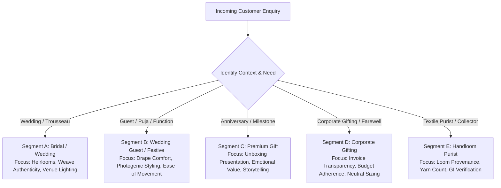
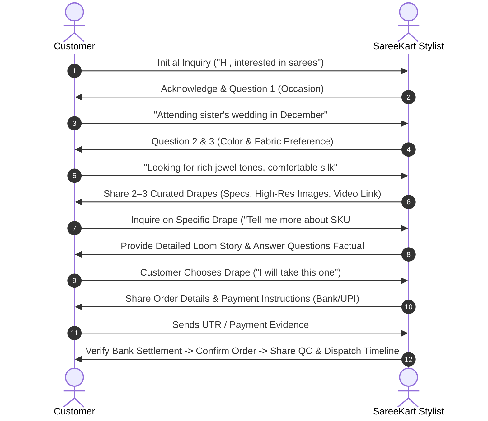
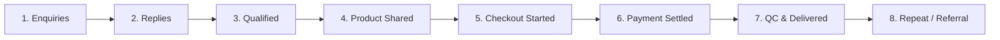

# SareeKart — ₹0 Organic Sales System V1
**Authoritative direct-to-consumer sales, qualification, and content operational manual**  
*Repository: `/Users/chaitanyachaitu/Downloads/SareeKart-main` | Authoritative Domain: `https://sareekart.com`*  
*Budget: Strictly ₹0.00 | Data Integrity: 100% Verified Catalog & Operational Facts*  

---

## Executive Summary & System Philosophy

While the platform rests in its event-driven technical wait state awaiting authoritative DNS propagation or payment settlement, customer acquisition and conversion can proceed through high-touch, zero-cost direct human commerce.

### Core System Philosophy
1. **Helping, Not Selling**: The objective of every customer conversation is to help the buyer select the exact handloom drape that matches their occasion, climate, and personal style—never to pressure, create artificial panic, or push unwanted inventory.
2. **Absolute Factual Integrity**: Only make claims verified in the codebase catalog (`frontend/src/data/products.js`) and physical quality inspection checklists (`docs/day_5_product_qc_checklist.md`). Zero invented claims regarding "limited stock," "exclusive," or "heirloom" unless empirically documented.
3. **Zero Financial Leakage**: Operates strictly with ₹0 marketing budget. Leverages direct 1-to-1 WhatsApp messaging, organic Instagram educational publishing, and structured manual follow-ups.

---

## Section 1: The 5 Hero-Product Framework

Rather than overwhelming prospective buyers with the full 24-saree catalog, sales efforts are anchored on **5 verified hero products** representing distinct price points, weaves, occasions, and fabric weights.

---

### Hero Product 1: Royal Banarasi Zardozi Brocade Silk Saree (SKU #1)

```
========================================================================
SKU #1 — ROYAL BANARASI ZARDOZI BROCADE SILK SAREE
========================================================================
Catalog ID:          1
Price:               ₹18,999 (Catalog listed price; ₹0 shipping)
Fabric Composition:  Pure Mulberry Silk
Weave & Provenance:  Handcrafted in Varanasi, Uttar Pradesh. Features authentic
                     Kadwa floral vine brocade across the crimson drape.
Saree Dimensions:    6.3m Total (5.5m Body Drape + 0.8m Running Blouse)
Width:               46 inches (1.17 meters)
Zari Details:        Gold metallic zari thread; Kadwa weave (each motif woven
                     individually without floating threads on the reverse).
Occasion:            Bridal / Wedding Ceremony / Reception
Color / Visuals:     Ruby Red body with dense metallic gold floral vines.
Ideal Customer:      Brides seeking traditional North Indian heritage, mother
                     of bride/groom, close family attending high-ceremony rituals.
Availability Status: In Stock (12 units available in verified inventory).
------------------------------------------------------------------------
3 Verified Visual Assets:
1. Catalog Front:    https://kankatala.com/cdn/shop/files/1216740117_1.webp?v=1786342018&width=1070
2. Drape Editorial:  https://images.unsplash.com/photo-1610030470298-3aa5d2c49c71?auto=format&fit=crop&fm=webp&w=800&q=80
3. Macro Fabric:     https://images.unsplash.com/photo-1621184455862-c163dfb30e0f?auto=format&fit=crop&fm=webp&w=1200&q=80
------------------------------------------------------------------------
Common Customer Inquiries & Verified Answers:
Q: "Is the Kadwa weave itchy or rough against the skin?"
A: "Kadwa is an authentic interlocking handloom technique where each motif 
   is individually locked into the warp. Unlike machine jacquard, there are 
   no loose floating threads on the reverse side, making it smooth against the skin."

Q: "Does it come with an attached blouse piece?"
A: "Yes, the saree includes an unstitched 0.8m running blouse piece in matching 
   Ruby Red with continuing zari border for sleeves."
========================================================================
```

---

### Hero Product 2: Venkatagiri Fine Cotton Jamdani Saree (SKU #3)

```
========================================================================
SKU #3 — VENKATAGIRI FINE COTTON JAMDANI SAREE
========================================================================
Catalog ID:          3
Price:               ₹8,667 (Catalog listed price; ₹0 shipping)
Fabric Composition:  Fine Cotton Handloom
Weave & Provenance:  Handcrafted in Venkatagiri, Andhra Pradesh. Lightweight
                     fine cotton embellished with traditional Jamdani 
                     extra-weft floral motifs and delicate gold buttas.
Saree Dimensions:    6.3m Total (5.5m Body Drape + 0.8m Running Blouse)
Width:               46 inches (1.17 meters)
Zari Details:        Fine Tested Metallic Zari (golden buttas & Jamdani pallu).
Occasion:            Festive / Temple Pooja / Sophisticated Day Events
Color / Visuals:     Midnight Black body with delicate golden zari buttas.
Ideal Customer:      Working professionals, women attending family poojas who 
                     demand featherlight all-day comfort without synthetic heat.
Availability Status: In Stock (8 units total; 1 unit reserved for Lead-002, 
                     7 units immediately uncommitted).
------------------------------------------------------------------------
3 Verified Visual Assets:
1. Catalog Front:    https://kankatala.com/cdn/shop/files/1216719148_5.webp?v=1786345549&width=1070
2. Drape Editorial:  https://images.unsplash.com/photo-1583391265517-35bbdad01209?auto=format&fit=crop&fm=webp&w=800&q=80
3. Macro Fabric:     https://images.unsplash.com/photo-1605721911519-3dfeb3be25e7?auto=format&fit=crop&fm=webp&w=1200&q=80
------------------------------------------------------------------------
Common Customer Inquiries & Verified Answers:
Q: "Is this fine cotton sheer or see-through?"
A: "The fine cotton weave is lightweight and breathable, while the 
   dense handloom weave in Midnight Black provides comfortable opacity when pleated."

Q: "Is the fabric stiff like starch-treated showroom cotton?"
A: "No, this is natural fine cotton with zero artificial stiffeners. It drapes softly 
   and becomes increasingly supple with subsequent wears."
========================================================================
```

---

### Hero Product 3: Pochampally Double Ikat Silk Saree (SKU #4)

```
========================================================================
SKU #4 — POCHAMPALLY DOUBLE IKAT SILK SAREE
========================================================================
Catalog ID:          4
Price:               ₹24,111 (Catalog listed price; ₹0 shipping)
Fabric Composition:  Pure Natural Silk
Weave & Provenance:  Handcrafted in Pochampally / Bhoodan, Telangana. 
                     Master double ikat weave where both warp and weft yarns 
                     are resist-dyed prior to loom mounting for geometric symmetry.
Saree Dimensions:    6.3m Total (5.5m Body Drape + 0.8m Running Blouse)
Width:               46 inches (1.17 meters)
Zari Details:        Woven border framing with subtle metallic accents.
Occasion:            Milestone Anniversary / Receptions / Cultural Galas
Color / Visuals:     Emerald Green body with geometric ikat motifs.
Ideal Customer:      Textile purists, collectors of Geographical Indication (GI)
                     crafts, husbands/children buying milestone gifts.
Availability Status: In Stock (4 units available in verified inventory).
------------------------------------------------------------------------
3 Verified Visual Assets:
1. Catalog Front:    https://kankatala.com/cdn/shop/files/1216730670_1.webp?v=1786097422&width=1070
2. Drape Editorial:  https://images.unsplash.com/photo-1605721911519-3dfeb3be25e7?auto=format&fit=crop&fm=webp&w=800&q=80
3. Macro Fabric:     https://images.unsplash.com/photo-1617627143233-46b92015e905?auto=format&fit=crop&fm=webp&w=1200&q=80
------------------------------------------------------------------------
Common Customer Inquiries & Verified Answers:
Q: "How do I know this is true Double Ikat?"
A: "In single ikat, only warp or weft is dyed. In Pochampally Double Ikat, 
   both sets of threads are mapped with precision so the geometric diamond 
   pattern aligns identically on both the front and back of the cloth."

Q: "Does the silk maintain its crisp pleats throughout an evening?"
A: "Yes, pure mulberry Pochampally silk has natural tensile spring, holding 
   sharp, clean pleats from morning ceremony through evening reception."
========================================================================
```

---

### Hero Product 4: Artisanal Handspun Organic Linen Saree (SKU #6)

```
========================================================================
SKU #6 — ARTISANAL HANDSPUN ORGANIC LINEN SAREE
========================================================================
Catalog ID:          6
Price:               ₹9,800 (Catalog listed price; ₹0 shipping)
Fabric Composition:  100% Organic Handspun Linen
Weave & Provenance:  Handspun and handwoven by master weavers in Bhagalpur, 
                     Bihar. Pure natural flax fiber woven on traditional fly-shuttle looms.
Saree Dimensions:    6.3m Total (5.5m Body Drape + 0.8m Running Blouse)
Width:               46 inches (1.17 meters)
Zari Details:        Subtle silver metallic selvedge finish along the borders.
Occasion:            Executive Office / Creative Studios / Refined Day Wear
Color / Visuals:     Natural Ivory body with refined silver selvedge edges.
Ideal Customer:      Architects, educators, lawyers, executives seeking understated 
                     elegance that breathes effortlessly in Indian climates.
Availability Status: In Stock (10 units available in verified inventory).
------------------------------------------------------------------------
3 Verified Visual Assets:
1. Catalog Front:    https://kankatala.com/cdn/shop/files/1216614192_1.webp?v=1786341897&width=1070
2. Drape Editorial:  https://images.unsplash.com/photo-1610030470298-3aa5d2c49c71?auto=format&fit=crop&fm=webp&w=800&q=80
3. Macro Fabric:     https://images.unsplash.com/photo-1583391265517-35bbdad01209?auto=format&fit=crop&fm=webp&w=1200&q=80
------------------------------------------------------------------------
Common Customer Inquiries & Verified Answers:
Q: "Does handspun linen crumple excessively during desk work?"
A: "Natural flax linen naturally softens and forms graceful ripples rather 
   than sharp wrinkles. Its organic texture gives it an effortless, intellectual charm."

Q: "Can I pair this Natural Ivory saree with a colored blouse?"
A: "Yes, Natural Ivory serves as a versatile canvas. It pairs brilliantly with 
   raw silk black blouses, indigo Kalamkari prints, or earthy maroon drapes."
========================================================================
```

---

### Hero Product 5: Gadwal Zari Border Cotton-Silk Saree (SKU #8)

```
========================================================================
SKU #8 — GADWAL ZARI BORDER COTTON-SILK SAREE
========================================================================
Catalog ID:          8
Price:               ₹13,200 (Catalog listed price; ₹0 shipping)
Fabric Composition:  Cotton-Silk Blend (Fine Cotton Body + Pure Silk Border)
Weave & Provenance:  Handcrafted in Gadwal, Telangana. Traditional Kuttu interlocking
                     join connecting a light cotton body to heavy silk borders.
Saree Dimensions:    6.3m Total (5.5m Body Drape + 0.8m Running Blouse)
Width:               46 inches (1.17 meters)
Zari Details:        Heavy gold metallic zari border and pallu woven via Kuttu join.
Occasion:            Festive Gatherings / Housewarming / Milestone Gifting
Color / Visuals:     Mustard Gold body with rich contrasting zari borders.
Ideal Customer:      Shoppers seeking ceremonial splendor without heavy silk weight; 
                     families buying celebratory housewarming and milestone gifts.
Availability Status: In Stock (9 units available in verified inventory).
------------------------------------------------------------------------
3 Verified Visual Assets:
1. Catalog Front:    https://kankatala.com/cdn/shop/files/1216734181_1.webp?v=1786341938&width=1070
2. Drape Editorial:  https://images.unsplash.com/photo-1544816155-12df9643f363?auto=format&fit=crop&fm=webp&w=800&q=80
3. Macro Fabric:     https://images.unsplash.com/photo-1621184455862-c163dfb30e0f?auto=format&fit=crop&fm=webp&w=1200&q=80
------------------------------------------------------------------------
Common Customer Inquiries & Verified Answers:
Q: "How are the cotton and silk joined without ripping?"
A: "This uses the traditional 'Kuttu' (interlocking weft) technique where master 
   weavers manually link the cotton body threads directly to the silk border threads."

Q: "Is this suitable for warm afternoon pujas?"
A: "Yes, that is exactly why Gadwal was invented: you enjoy the breathable comfort 
   of pure cotton around your body, combined with the grandeur of pure silk borders."
========================================================================
```

---

## Section 2: The 5 Customer Segments & Targeted Messaging

Never pitch the same message to every lead. Tailor communication specifically to their context, emotional driver, and decision criteria.



---

### Segment A: Bridal / Wedding
- **Customer Context**: Bride, mother, or sister planning for wedding rituals (Muhurtham, Reception, Sangeet). High emotional investment; anxious about fabric authenticity, photographs, and hall lighting.
- **Recommended Hero**: SKU #1 (*Royal Banarasi Brocade*, ₹18,999) or SKU #4 (*Pochampally Double Ikat*, ₹24,111).
- **Core Message Hook**:
  > *"Namaste! Planning for a wedding is such a sacred journey. When selecting a bridal handloom, two things matter most: how the weave reflects natural venue light, and ensuring the drape feels feather-soft across 6+ hours of rituals. Are you looking for a traditional crimson Kadwa brocade or a vibrant heritage silk?"*
- **Key Trust Reassurances**: Full 6.3m length (no short drapes), pure mulberry silk with unstitched blouse piece, 7-day doorstep inspection guarantee.

---

### Segment B: Wedding Guest & Family Occasion
- **Customer Context**: Attending a cousin's wedding, housewarming, or temple festival. Wants to look distinguished without outshining the bride or feeling weighed down.
- **Recommended Hero**: SKU #8 (*Gadwal Cotton-Silk*, ₹13,200) or SKU #3 (*Venkatagiri Fine Cotton*, ₹8,667).
- **Core Message Hook**:
  > *"Namaste! For family weddings and poojas, the ideal drape gives you rich ceremonial zari borders while keeping you completely comfortable and agile through long ceremonies. Are you leaning towards rich festive tones like Mustard Gold, or deep classic hues like Midnight Black?"*
- **Key Trust Reassurances**: Breathable cotton body with heavy silk/zari borders; easy to drape; folds compactly for destination travel.

---

### Segment C: Premium Gift (Anniversary / Milestone)
- **Customer Context**: Husband, daughter, or son gifting a mother or spouse for a 25th anniversary or 50th birthday. Often unfamiliar with textile specs; wants guaranteed delight and presentation.
- **Recommended Hero**: SKU #4 (*Pochampally Double Ikat*, ₹24,111) or SKU #1 (*Royal Banarasi Brocade*, ₹18,999).
- **Core Message Hook**:
  > *"Namaste! A handloom saree is one of the most timeless gifts—it carries generational memories. For milestone celebrations, our double ikat from Pochampally is treasured because both warp and weft are hand-dyed to align in flawless symmetry. May I ask what colors she naturally loves to wear?"*
- **Key Trust Reassurances**: Verified unboxing presentation, 11-point pre-dispatch QC check, 7-day hassle-free exchange if she prefers a different color.

---

### Segment D: Corporate Gifting & Institutional Awards
- **Customer Context**: HR lead, board secretary, or partner purchasing farewell or milestone recognition gifts for retiring directors, conference speakers, or key clients.
- **Recommended Hero**: SKU #6 (*Handspun Organic Linen*, ₹9,800) or SKU #8 (*Gadwal Cotton-Silk*, ₹13,200).
- **Core Message Hook**:
  > *"Namaste! Handloom sarees make distinguished, culturally resonant corporate gifts because they have universal sizing (full 6.3m drape) and celebrate Indian artisanal heritage. For executive gifting, our handspun organic linen in Natural Ivory offers understated sophistication within formal corporate budgets. How many recipients are you planning for?"*
- **Key Trust Reassurances**: Official GST-compliant invoicing, uniform 11-point quality inspection on every single piece, dependable dispatch timeline.

---

### Segment E: Handloom Purist & Textile Connoisseur
- **Customer Context**: Collector, designer, educator, or experienced saree wearer who understands counts, dyes, loom types, and weave structures. Can detect synthetic adulteration instantly.
- **Recommended Hero**: SKU #4 (*Pochampally Double Ikat*, ₹24,111) or SKU #3 (*Venkatagiri Fine Cotton Jamdani*, ₹8,667).
- **Core Message Hook**:
  > *"Namaste! It is always a pleasure connecting with someone who truly appreciates handloom heritage. We focus strictly on genuine loom provenance—our Venkatagiri is fine cotton with authentic extra-weft Jamdani, and our Pochampally is genuine double ikat silk. What specific weaves are currently in your personal collection?"*
- **Key Trust Reassurances**: Full disclosure of fiber content (no synthetic blends), true 46-inch loom width, exact technical explanation of the weave mechanics.

---

## Section 3: WhatsApp Conversion Flow

The direct WhatsApp interaction is an **advisory consultation**, not an aggressive sales closing script.



### Complete Verbatim Conversational Scripts

#### Stage 1: Welcoming & Occasion Discovery
> *"Namaste! Welcome to SareeKart. My name is [Name], and I would be delighted to assist you with our handloom collection. To ensure I share only drapes that truly match what you have in mind: What upcoming occasion are you shopping for, or is this for your personal collection?"*

#### Stage 2: Budget & Palette Qualification
> *"That sounds wonderful! To help narrow our collection to the pieces that best fit: Do you have a preferred color palette in mind (such as royal jewel tones, pastels, or earthy neutrals)? And is there a specific budget range you would like us to stay within?"*

#### Stage 3: Curated Recommendation Presentation (Rule: Exactly 2–3 Sarees)
> *"Thank you! Based on your preference for an upcoming wedding and jewel tones, I have handpicked these two distinct handloom masterpieces for you:*
> 
> *1. **Royal Banarasi Zardozi Brocade** (SKU #1 — ₹18,999)*
> *Pure mulberry silk in vibrant Ruby Red with handwoven Kadwa floral vines. It gives a rich, majestic bridal presence.*
> *[High-Res Image Link: https://kankatala.com/cdn/shop/files/1216740117_1.webp?v=1786342018&width=1070]*
> 
> *2. **Pochampally Double Ikat Silk** (SKU #4 — ₹24,111)*
> *Pure silk in deep Emerald Green with geometric double ikat symmetry. It is lightweight, holds sharp pleats, and is a true collector's heirloom.*
> *[High-Res Image Link: https://kankatala.com/cdn/shop/files/1216730670_1.webp?v=1786097422&width=1070]*
> 
> *Take a moment to review the drapes. Would you like to see a macro close-up of the weave or pallu for either of these?"*

#### Stage 4: Answering Product & Fabric Questions
> *"Regarding the blouse piece: Every SareeKart drape includes a full 0.8m unstitched running blouse piece woven in matching silk/cotton with continuing borders. The total length is 6.3 meters, so you will have ample fabric for custom sleeve styling."*

#### Stage 5: Selection & Order Confirmation Setup
> *"Wonderful choice! The Venkatagiri Fine Cotton Jamdani (SKU #3) in Midnight Black is one of our most elegant pieces—breathable fine cotton with golden Jamdani motifs.*
> 
> *Here is the order summary:*
> *- Item: Venkatagiri Fine Cotton Jamdani Saree (SKU #3)*
> *- Dimensions: 6.3m Total (5.5m Body + 0.8m Blouse) · 46in Width*
> *- Retail Price: ₹8,667 (Zero shipping charge)*
> *- Total Amount Due: ₹8,667*
> 
> *Please share your complete delivery address (with PIN code and contact number), and I will provide our direct bank transfer / UPI payment details."*

#### Stage 6: Payment Verification & Pre-Dispatch Assurance
> *(Upon receiving payment UTR reference)*
> *"Thank you! We have verified your transaction (UTR: [Reference Number]) for ₹8,667. Your order is officially confirmed!*
> 
> *What happens next:*
> *1. Tomorrow morning, your saree undergoes our 11-point light-table quality inspection (checking dimensions, zari, and weave integrity).*
> *2. It is packed in virgin moisture-barrier poly wrap and a heavy-duty box with tamper-evident sealing.*
> *3. Once handed to our domestic courier, I will directly share your consignment tracking number here.*
> 
> *Thank you for supporting authentic handloom weavers through SareeKart!"*

---

## Section 4: 30-Day Organic Content Framework

Instagram and social content must educate and inspire without gimmicks, artificial urgency, or paid boosts.

### Content Pillars (40% Product | 35% Education | 25% Story)
1. **Product (40%)**: Tactile close-ups, zari reflection in sunlight, 360-degree drape flow, pleat formation.
2. **Education (35%)**: Weave identification, handloom vs powerloom, Kadwa vs Jacquard, why 6.3m length matters, zari care.
3. **Artisan & Saree Story (25%)**: History of Venkatagiri, geometry of Pochampally, behind-the-scenes packaging SOP.

```text
========================================================================
             SAREEKART 30-DAY ZERO-BUDGET ORGANIC CONTENT CALENDAR      
========================================================================
Week 1: Foundations of Authentic Handloom
- Day 1:  [Product] SKU #1 Ruby Red Banarasi — Macro sunlight zari shimmer video
- Day 2:  [Education] The 6.3-Meter Standard: Why 5.5m commercial sarees fall short
- Day 3:  [Story] Varanasi Weavers: The precision of Kadwa floral vines
- Day 4:  [Product] SKU #3 Venkatagiri Cotton — Drape flow and featherlight weight
- Day 5:  [Education] Caring for handloom silk and fine cotton: Safe storage at home
- Day 6:  [Product] SKU #4 Pochampally Double Ikat — Diamond geometry close-up
- Day 7:  [Story] Behind the scenes: SareeKart's 11-point light table inspection

Week 2: Ocassion Styling & Tactile Craft
- Day 8:  [Product] SKU #8 Gadwal Cotton-Silk — The famous Kuttu join explained
- Day 9:  [Education] What is "Tested Zari"? Electroplated metallic thread demystified
- Day 10: [Story] Why brides are rediscovering traditional Ruby Red over neon pastels
- Day 11: [Product] SKU #6 Bhagalpur Organic Linen — Natural Ivory office styling
- Day 12: [Education] Storing silk sarees: Why plastic covers ruin silver and gold zari
- Day 13: [Product] SKU #1 Banarasi Brocade — Pallu and running blouse breakdown
- Day 14: [Story] Customer question of the week: "How do I care for handloom cotton?"

Week 3: The Textile Connoisseur Series
- Day 15: [Education] Single Ikat vs Double Ikat: Warp & weft resist-dye mechanics
- Day 16: [Product] SKU #4 Emerald Green Ikat — Full length drape on mannequin
- Day 17: [Story] The heritage of Venkatagiri: From royal court patronage to modern drapes
- Day 18: [Product] SKU #3 Midnight Black Jamdani — 3 blouse pairing combinations
- Day 19: [Education] The truth about "dry clean only": How to air handlooms safely
- Day 20: [Product] SKU #8 Mustard Gold Gadwal — Daylight outdoor vs indoor lighting
- Day 21: [Story] Packaging standard: Moisture barriers and tamper-evident sealing

Week 4: The Milestone & Gifting Guide
- Day 22: [Education] Gifting a handloom: How to pick the right weave by age & climate
- Day 23: [Product] SKU #6 Organic Linen — Tactile texture audio reel (ASMR fabric feel)
- Day 24: [Story] The artisans behind the shuttle: Handloom weaving as cultural heritage
- Day 25: [Product] SKU #1 Banarasi Kadwa — Reverse side inspection (clean locked motifs)
- Day 26: [Education] Understanding Weave Density & Drape Fall in Handloom Cotton
- Day 27: [Product] SKU #4 Pochampally Ikat — Contrast blouse styling ideas
- Day 28: [Story] A buyer's checklist: 5 things to inspect before paying for handloom
- Day 29: [Education] Ironing luxury drapes: Temperature, damp pressing, and border care
- Day 30: [Product] The 5 Hero Drapes side-by-side: Banarasi, Venkatagiri, Pochampally, Linen, Gadwal
========================================================================
```

---

## Section 5: Instagram Posting Templates

### Template 1: Educational Carousel (The "Kadwa vs Machine Jacquard" Guide)
- **Slide 1 (Cover)**: High-res split photograph showing front vs back of handloom Kadwa.  
  *Text Overlay*: "Look at the back of your Banarasi saree. Here is how to tell if it's handwoven."
- **Slide 2**: Close-up of reverse side of SareeKart SKU #1 showing clean, locked threads.  
  *Text Overlay*: "Authentic Kadwa Weave: Each motif is individually locked into the warp."
- **Slide 3**: Diagram showing mass-market powerloom reverse with messy, loose float threads that snag jewelry.
- **Slide 4**: Full drape shot of SKU #1 in Ruby Red.  
  *Text Overlay*: "Why it matters: Comfort against sensitive skin, zero snags, and longevity that spans decades."
- **Caption Template**:
  > *A true Banarasi masterpiece does not hide its secrets—it reveals them on the reverse side.*  
  >  
  > *In traditional Kadwa weaving from Varanasi, each floral motif is woven individually using dedicated shuttles. When the motif is complete, the thread is hand-locked into the warp. There are no loose, continuous floating threads on the reverse side to catch on your bangles or irritate your skin.*  
  >  
  > *Featured: Royal Banarasi Zardozi Brocade Silk Saree (SKU #1)*  
  > *• Fabric: Pure Mulberry Silk*  
  > *• Color: Ruby Red with Kadwa Gold Zari*  
  > *• Dimensions: 6.3m Total with unstitched blouse piece*  
  > *• Price: ₹18,999 (Zero shipping nationwide)*  
  >  
  > *Have a question about Kadwa weaves? Comment below or send a WhatsApp inquiry to +91 9059564499.*  
  >  
  > *#SareeKart #BanarasiSilk #KadwaWeave #HandloomSaree #PureSilkSaree #IndianTextiles #VaranasiWeaves*

---

### Template 2: Single Image Product Showcase (Venkatagiri Jamdani)
- **Visual**: Daylight flat-lay photograph of SKU #3 on clean raw linen backdrop with sunlight catching the golden buttas.
- **Caption Template**:
  > *Featherlight fine cotton, midnight black elegance, and traditional Jamdani motifs.*  
  >  
  > *Woven in Venkatagiri, Andhra Pradesh, this drape proves that luxury does not need to feel heavy. Crafted with lightweight fine cotton yarns, it offers natural breathability for humid mornings, while the golden metallic buttas give it unmistakable festive presence.*  
  >  
  > *Product Specifications:*  
  > *• Name: Venkatagiri Fine Cotton Jamdani Saree (SKU #3)*  
  > *• Body: Midnight Black fine cotton*  
  > *• Border & Pallu: Fine tested metallic zari Jamdani motifs*  
  > *• Length: Full 6.3m (5.5m body + 0.8m running blouse)*  
  > *• Price: ₹8,667 (Direct artisan price, free domestic shipping)*  
  >  
  > *Curious how this drapes in natural movement? Tap the WhatsApp link in our bio (+91 9059564499) for a 1-to-1 video walkthrough.*  
  >  
  > *#VenkatagiriSaree #JamdaniWeave #CottonHandloom #SareeKart #HandwovenIndia #SustainableSaree*

---

## Section 6: Customer Qualification Questions

To provide tailored assistance without wasting customer time, ask these **5 specific diagnostic questions**:

1. **"What occasion or ceremony are you shopping for?"**  
   *Reasoning*: Immediately separates bridal heirloom requirements from daily executive wear, eliminating mismatched recommendations.
2. **"Do you have a preferred fabric weight or climate comfort in mind?"**  
   *Reasoning*: Crucial for Indian weather. A customer in humid Chennai requires breathable cotton or linen, while a Delhi winter wedding requires heavy Banarasi silk.
3. **"Are you looking for a specific color palette, or open to recommendations?"**  
   *Reasoning*: Discovers personal style preferences (e.g. traditional crimson/mustard vs modern ivory/pastels) before sharing assets.
4. **"Do you plan to tailor the included blouse piece, or pair the saree with an existing blouse?"**  
   *Reasoning*: Confirms understanding of the unstitched 0.8m running blouse piece and allows styling suggestions.
5. **"What is your target delivery timeline?"**  
   *Reasoning*: Identifies hard event dates early to ensure domestic courier transit times (3–5 business days) comfortably precede the ceremony.

---

## Section 7: Objection-Handling Scripts

Every objection is an invitation for factual clarity. Respond with verified facts and empathy.

---

### Objection 1: "Is this price negotiable? Can you offer a 20% discount?"
> *"I completely understand why you ask! At SareeKart, we operate on a transparent, fair-pricing direct model. Our prices directly reflect master weaver compensation, 100% authentic pure fibers (like pure mulberry silk and fine cotton), and verified 6.3m lengths.
> 
> Because we do not artificially inflate our prices to offer fake flash discounts, our listed price of ₹[Price] is our true and final price. We include complimentary insured domestic shipping and an 11-point quality inspection on every order."*

---

### Objection 2: "How do I know this is real silk and not synthetic polyester?"
> *"That is the most important question any handloom buyer should ask. SareeKart guarantees genuine fiber integrity:
> 
> 1. Every silk drape is crafted from pure natural mulberry silk, woven with verified warp and weft density and natural fiber weight.  
> 2. Our weaves feature traditional regional craft heritage (such as Varanasi Kadwa and Pochampally double ikat).  
> 3. Most importantly, we back every purchase with our verified 7-day doorstep inspection policy: if you inspect the drape upon unboxing and are not completely satisfied, you can initiate a return or exchange directly."*

---

### Objection 3: "The color looks slightly different on my phone screen. What if I don't like it in person?"
> *"Phone screens naturally vary depending on brightness and color temperature. To eliminate any uncertainty:
> 
> 1. All our primary photographs are shot under neutral 5500K daylight without heavy saturation filters.  
> 2. I would be happy to record a quick, raw 15-second video clip of the drape in natural morning sunlight right now and share it directly with you here on WhatsApp.  
> 3. If upon unboxing at home the shade does not complement your event, you are fully protected by our 7-day exchange and return policy."*

---

### Objection 4: "Why should I pay ₹8,667 for a cotton saree when market sarees cost ₹2,000?"
> *"Market commercial sarees at ₹2,000 are typically woven on high-speed powerlooms using coarse yarn blended with synthetics to cut costs, and often measure only 5.2 to 5.5 meters.
> 
> Our Venkatagiri drape is woven with lightweight fine cotton yarns and embellished with hand-woven golden buttas and an authentic Jamdani pallu. It measures a generous 6.3 meters with running blouse piece, providing full, elegant drape fall. You are investing in true artisan craftsmanship that breathes effortlessly for years."*

---

### Objection 5: "Is it safe to pay via direct bank transfer / UPI before shipping?"
> *"We understand your caution completely. SareeKart is an established direct-to-consumer platform registered in India. When you make your transfer, you receive an official transaction UTR reference directly from your bank.*
> 
> *We immediately issue your official SareeKart order confirmation, send you photos of your packed parcel during our 11-point quality check, and share your live domestic courier tracking code upon handover. You also have full access to our customer support on this exact WhatsApp number throughout the journey."*

---

## Section 8: Follow-Up Protocols & Communication Boundaries

Patience and respect build long-term luxury relationships; high-pressure spam destroys trust permanently.

### Core Follow-Up Rules
1. **Rule of Consent**: Only follow up if the customer explicitly requested time to decide or asked for further information.
2. **Frequency Ceiling**: Maximum **2 follow-ups total** over a 7-day span. Never message twice in the same 48-hour window.
3. **Value-Add Only**: Every follow-up must provide useful information (e.g. video in natural light, styling pairing suggestion), never pushy questions like *"Are you buying today?"*
4. **Graceful Exit**: If a customer does not respond after the second follow-up, mark the lead as `ARCHIVED_DORMANT` and cease outreach completely.
5. **Permanent Non-Contact**: If a customer expresses non-interest or is an incompatible wholesale reseller (e.g. `Lead-007`), permanently flag as **`DO NOT CONTACT`**.

---

### Follow-Up Message Templates

#### Follow-Up 1 (48 hours after product share)
> *"Namaste [Customer Name]! Hope you are having a wonderful week. I was inspecting our drapes in the morning sunlight today and took a quick close-up video of the [Saree Name] pallu we discussed. Sharing it here in case it helps you see the true zari shimmer against natural light. No pressure at all—please take all the time you need with your family!"*

#### Follow-Up 2 (5 days after product share — Final Graceful Touch)
> *"Namaste [Customer Name]! Just checking in briefly regarding your sister's upcoming wedding in December. We are currently finalizing dispatch schedules for the coming week. If you would like to proceed with the [Saree Name], we would be honored to prepare it for you. If you have chosen another drape or would like to revisit this later, please feel free to reach out anytime. Wishing you a wonderful celebration!"*

---

## Section 9: Active Lead Tracker

*Status as of: 2026-09-25 | Baseline Cohort: 8 Leads*

| Lead ID | Acquisition Source | Occasion / Context | Budget Range | Product of Interest | Current Status | Next Agreed Action / Boundary |
|---|---|---|---|---|---|---|
| **Lead-001** | WhatsApp Direct | Bridal / Wedding | ₹18,000–₹22,000 | SKU #1 (*Royal Banarasi Brocade*) | `PRODUCT_SHARED` | Awaiting family/mother consensus on Kadwa weave and Ruby Red shade against venue lighting. Zero pressure. |
| **Lead-002** | WhatsApp Direct | Festive / Temple Pooja | ₹8,000–₹10,000 | SKU #3 (*Venkatagiri Fine Cotton*) | `CHECKOUT_STARTED` | Awaiting authentic bank payment UTR for ₹8,667. Zero repeated follow-ups; customer space respected. |
| **Lead-003** | WhatsApp Direct | Daily / Executive Wear | ₹8,000–₹10,000 | SKU #6 (*Handspun Organic Linen*) | `PRODUCT_SHARED` | Awaiting customer feedback regarding unstitched blouse piece inclusion and daily office comfort. |
| **Lead-004** | WhatsApp Direct | Corporate Gifting | ₹12,000–₹15,000 | SKU #8 (*Gadwal Cotton-Silk*) | `QUALIFIED` | Awaiting gifting committee budget sign-off for destination presentation. |
| **Lead-005** | WhatsApp Direct | Party / Cocktail | ₹14,000–₹16,000 | SKU #5 (*Hand-Embroidered Organza*) | `FOLLOW_UP_SENT` | Awaiting customer evaluation of full 6.3m pure silk cut vs 5.5m boutique alternative. |
| **Lead-006** | WhatsApp Direct | Milestone Anniversary | ₹20,000–₹25,000 | SKU #4 (*Pochampally Double Ikat*) | `FOLLOW_UP_SCHEDULED` | Scheduled polite touch base on Saturday post-travel regarding late-October celebration. |
| **Lead-008** | WhatsApp Direct | Festive Drapes | ₹8,000–₹12,000 | SKU #3 vs SKU #11 (Cotton vs Tissue) | `PRODUCT_SHARED` | Awaiting customer drape preference for upcoming family celebration. |
| **Lead-007** | WhatsApp Direct | Wholesale Reseller | Bulk Reselling | N/A | **`NOT_INTERESTED`** | **`DO NOT CONTACT`**. Permanent non-contact boundary strictly enforced. Zero outreach. |

---

## Section 10: First-10-Orders Funnel Measurement Framework

Track customer progression through a strict, fact-based 8-stage funnel. Measure exact drop-offs to discover where genuine buyers pause.



### Funnel Stage Definitions & Diagnostic Checkpoints

| # | Funnel Stage | Verification Criteria | Diagnostic Question if Bottleneck Occurs |
|---|---|---|---|
| **1** | **Enquiry Received** | Customer initiates direct chat or comment inquiry. | Are Instagram posts clearly communicating how to contact us? |
| **2** | **First Reply Sent** | Stylist responds with welcoming occasion question within 60 min. | Are initial responses warm, human, and low-friction? |
| **3** | **Customer Qualified** | Occasion, color palette, and fabric preference established. | Are qualification questions conversational or overly rigid? |
| **4** | **Product Shared** | Exactly 2–3 curated drapes shared with specs and daylight photos. | Are shared sarees matching the customer's stated taste and climate? |
| **5** | **Checkout Started** | Customer selects specific SKU, shares address, requests payment info. | Is pricing transparent? Are shipping and dimensions clear? |
| **6** | **Payment Settled** | Authentic bank UTR verified; funds settled in merchant account. | Is bank transfer friction causing drop-off? (e.g. Lead-002) |
| **7** | **QC & Delivered** | 11-point QC passed; parcel delivered with tracking confirmation. | Are packaging and courier timelines meeting expectations? |
| **8** | **Repeat / Referral** | Customer leaves genuine organic review or recommends a peer. | Did the physical handloom drape exceed unboxing expectations? |

---

## Section 11: The ₹0 Daily Routine (30–45 Minutes / Day)

Organic commerce succeeds through consistency, not exhaustive time investment.

```
+-----------------------------------------------------------------------+
|                 SAREEKART DAILY ORGANIC SALES ROUTINE (45 MIN)        |
+-----------------------------------------------------------------------+
|  Time   | Activity & Operational Objective                            |
+---------+-------------------------------------------------------------+
| 10 min  | Content Publishing: Post 1 scheduled educational or product |
|         | image/carousel according to the 30-day organic calendar.     |
+---------+-------------------------------------------------------------+
| 10 min  | Inbound Inquiries: Respond to incoming WhatsApp chats and    |
|         | Instagram comments using Section 3 qualification questions. |
+---------+-------------------------------------------------------------+
| 10 min  | Respectful Follow-Ups: Check in with qualified leads who    |
|         | specifically requested follow-up (max 1 touchpoint/48 hrs). |
+---------+-------------------------------------------------------------+
| 10 min  | Visual Asset & Product Knowledge: Take 2 daylight macro     |
|         | photos or video clips of 1 hero saree for upcoming posts.   |
+---------+-------------------------------------------------------------+
|  5 min  | Lead Tracker Audit: Update status, customer feedback, and   |
|         | next agreed action in the Section 9 tracker table.          |
+-----------------------------------------------------------------------+
```

---

## Section 12: Zero-Budget & Zero-Fabrication Safeguards

### ₹0 Budget Safeguards
1. **Zero Advertising Spend**: No Meta Ads, Google Ads, or paid influencer promotions.
2. **Zero Paid Software**: Use free native WhatsApp, standard Instagram app, and markdown git tracking.
3. **Zero Third-Party Tool Subscriptions**: Rely entirely on native phone photography, natural sunlight, and local git runbooks.

### Zero-Fabrication Safeguards
1. **No Fake Scarcity**: Never say "Only 1 saree left in the world!" when the catalog shows 8 or 12 units.
2. **No Fake Urgency**: Never manufacture artificial countdown timers or expiring discounts.
3. **No Fabricated Testimonials**: Never publish fake customer quotes or synthesized reviews.
4. **No Synthetic Traffic or Bot Engagement**: Zero automated engagement pods or fake followers.
5. **No Speculative Revenue Recognition**: Revenue is recognized **only** when authentic bank UTR settlement is verified.

---

*(System active. Operational sales manual established for zero-budget organic execution.)*
