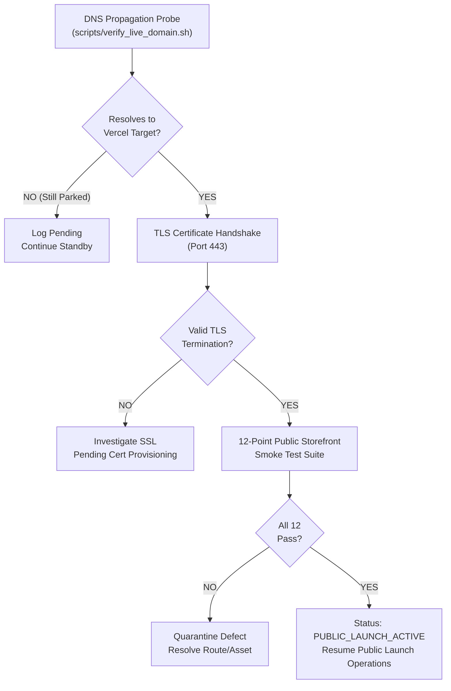
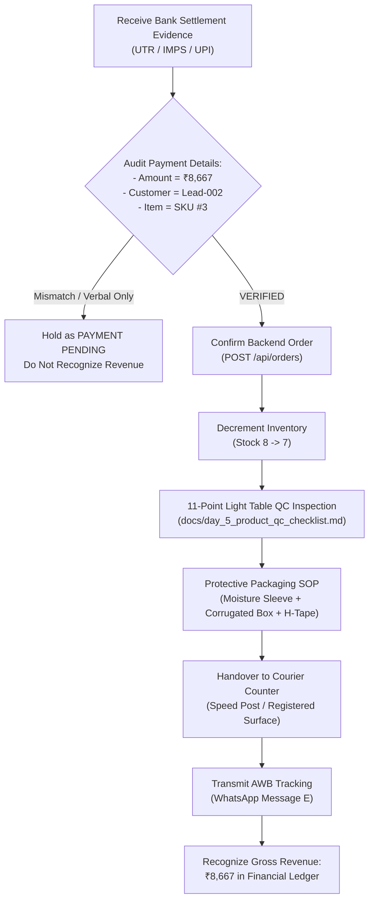

# SareeKart — Trigger-Based Resumption Protocol
**Operational Runbook & Execution Governance for Event-Driven Resumption**  
*Repository: `/Users/chaitanyachaitu/Downloads/SareeKart-main` | Authoritative Domain: `https://sareekart.com`*  
*Budget Expended: ₹0.00 | Operational Disposition: WAITING FOR EXTERNAL TRIGGER*  

---

## 1. System State & Governance Declaration

The SareeKart technical and operational launch phase (Days 1–8) is **officially concluded and paused**. 

**Current System State**: **`WAITING FOR EXTERNAL TRIGGER`**

All software engineering, backend persistence, frontend UI components, product quality control standards, and direct customer interactions are verified and complete. There is no scheduled "Day 9" or calendar-driven operational task. 

Operations will resume **exclusively** upon the empirical occurrence of one of two external events:
1. **Trigger A: DNS Cutover & TLS Activation for `sareekart.com`**
2. **Trigger B: Verified Customer Payment Receipt for `Lead-002`**

### Strict Standby Boundaries Until Trigger
- **No New Features**: Zero architectural changes, zero new modules.
- **No Refactoring**: Zero code churn or speculative optimization.
- **No Fabricated Data**: Zero synthetic orders, fake payments, artificial revenue, or simulated traffic.
- **No Paid Advertising**: Maintain strictly ₹0 marketing and infrastructure spend.
- **No Synthetic Customer Activity**: Zero automated outreach or pressure-based messaging.
- **No Scheduled "Day" Reports**: Operational reporting resumes only upon trigger verification.

---

## 2. Trigger A Protocol — Authoritative DNS Cutover & Public Storefront Launch

Trigger A activates immediately when registrar DNS records for `sareekart.com` are updated.



### Execution Steps:
1. **DNS Resolution Probe**:
   - Execute domain probe harness:
     ```bash
     ./scripts/verify_live_domain.sh
     ```
   - Verify Apex `sareekart.com` resolves to Vercel IP.
   - Verify `www.sareekart.com` resolves to `cname.vercel-dns.com`.
   - **Dynamic DNS Guard**: Cross-check active Vercel project deployment dashboard at moment of cutover rather than assuming static values:
     - `@ A` $\longrightarrow$ `76.76.21.21`
     - `CNAME www` $\longrightarrow$ `cname.vercel-dns.com`
2. **TLS / HTTPS Handshake Audit**:
   - Probe HTTPS port 443 for valid certificate termination (`curl -sv -m 5 https://sareekart.com`).
   - Confirm active TLS handshake without certificate validation errors.
3. **12-Point Public Storefront Smoke Test Suite**:
   Must achieve 12 / 12 PASS across live production URLs:
   - [ ] **1. Homepage**: `https://sareekart.com/` (HTTP 200, luxury branding renders)
   - [ ] **2. Product Catalog**: `https://sareekart.com/products` (HTTP 200, 24 sarees render)
   - [ ] **3. Product Detail Page**: `https://sareekart.com/product/3` (HTTP 200, 6.3m dimensions render)
   - [ ] **4. Instant Search**: `https://sareekart.com/search` (HTTP 200, search queries respond)
   - [ ] **5. Category Taxonomy**: `https://sareekart.com/categories` (HTTP 200, handloom categories load)
   - [ ] **6. Customer Auth & Login**: `https://sareekart.com/login` (HTTP 200, JWT auth flow active)
   - [ ] **7. Wishlist Persistence**: `https://sareekart.com/wishlist` (HTTP 200, localStorage state intact)
   - [ ] **8. Cart Subtotals**: `https://sareekart.com/cart` (HTTP 200, subtotal calculations accurate)
   - [ ] **9. Checkout Initialization**: `https://sareekart.com/checkout` (HTTP 200, checkout form ready)
   - [ ] **10. SEO Directives**: `https://sareekart.com/robots.txt` (HTTP 200, search bot directives served)
   - [ ] **11. XML Sitemap**: `https://sareekart.com/sitemap.xml` (HTTP 200, valid canonical URLs)
   - [ ] **12. Backend API Health**: `https://sareekart.com/actuator/health` (HTTP 200, `{"status":"UP"}`)
4. **Transition Gate**:
   - If all 12 pass: Transition system status to **`PUBLIC_LAUNCH_ACTIVE`**.
   - If any fail: Retain `STOREFRONT BLOCKED` status until resolved; do not announce launch.

---

## 3. Trigger B Protocol — Customer Payment Verification & Order Fulfillment

Trigger B activates immediately when authentic payment settlement evidence is received from `Lead-002`.



### Execution Steps:
1. **Authentic Payment Verification**:
   - Require independent bank UTR (Unique Transaction Reference) / IMPS reference.
   - Audit settled credit amount against catalog retail price: strictly **₹8,667** (zero unauthorized discounts, ₹0 shipping).
   - Match transaction ownership to `Lead-002` (Hyderabad) for SKU #3 (*Venkatagiri Fine Cotton Jamdani Saree*, Midnight Black).
   - *Financial Rule:* Verbal payment promises or intent messages do NOT constitute revenue.
2. **Order Confirmation & Ledger Persistence**:
   - Create confirmed order in backend system (`POST /api/orders`).
   - Set status to `ORDER CONFIRMED`.
   - Decrement SKU #3 inventory count from 8 to 7.
3. **11-Point Pre-Dispatch QC Inspection**:
   - Inspect item on light table against [`docs/day_5_product_qc_checklist.md`](file:///Users/chaitanyachaitu/Downloads/SareeKart-main/docs/day_5_product_qc_checklist.md):
     - SKU & catalog description match (SKU #3, *Venkatagiri Fine Cotton Jamdani*)
     - Dimensional tape measure verification: Full 6.3m (5.5m body + 0.8m running blouse, 46in width)
     - Combed 100s fine cotton fabric integrity & metallic tested zari
     - Zero weave tears, reed marks, stains, or loose selvage threads
     - Photographic fidelity against catalog PDP imagery
4. **Protective Packaging SOP**:
   - Traditional 4-fold orientation with pallu protected inward.
   - Enclose in virgin moisture-barrier poly sleeve / butter paper wrap.
   - Place into heavy-duty corrugated shipping box.
   - Seal all seams with tamper-evident H-tape.
   - Affix waterproof shipping label containing recipient address, pin code, sender details, and barcode.
   - *Collateral boundary:* Do NOT promise physical printed artisan cards or luxury rigid boxes until physical print stock is procured.
5. **Courier Handover & Customer Notification**:
   - Hand package over to domestic postal counter (Speed Post / registered surface).
   - Obtain consignment tracking number (AWB).
   - Transmit WhatsApp Message E (Tracking Shared) to customer.
6. **Financial Revenue Recognition**:
   - Recognize **₹8,667** gross revenue in official accounting ledgers.

---

## 4. Gate 3 — Pipeline Maintenance Boundaries

While awaiting external triggers, maintain the existing 8-lead cohort with strict communication hygiene:

| Lead ID | Location | Journey / Segment | Target Item | Stated Value | Operational Protocol |
|---|---|---|---|---|---|
| **Lead-002** | Hyderabad | Festive / Pooja | SKU #3 (*Venkatagiri Cotton*) | ₹8,667 | Status: `CHECKOUT_STARTED`. No repeated messages. Space respected. |
| **Lead-001** | Bangalore | Bridal / Wedding | SKU #1 (*Royal Banarasi Brocade*) | ₹18,999 | Await family/mother consensus on Kadwa weave. Zero pressure. |
| **Lead-003** | Chennai | Daily / Office | SKU #6 (*Handloom Linen*) | ₹9,800 | Await feedback on blouse piece inclusion and daily comfort. |
| **Lead-004** | Delhi | Corporate / Housewarming | SKU #8 (*Gadwal Cotton-Silk*) | ₹13,200 | Await gifting committee budget sign-off. |
| **Lead-005** | Mumbai | Party / Cocktail | SKU #5 (*Organza Pastel*) | ₹14,500 | Await customer evaluation of 6.3m cut vs boutique alternative. |
| **Lead-006** | Pune | Milestone Anniversary | SKU #4 (*Pochampally Ikat Silk*) | ₹24,111 | Deliver scheduled polite touch base on Saturday post-travel. |
| **Lead-008** | Bangalore | Festive Drapes | SKU #3 / SKU #11 (Cotton / Tissue) | ₹8,667–₹11,800 | Await customer drape preference for family function. |
| **Lead-007** | Kolkata | Wholesale Reseller | Bulk Inquiry | N/A | **DO NOT CONTACT.** Permanent non-contact boundary strictly enforced. |

---

## 5. Local Full-Stack Services Runbook

The local development and staging environment remains operational for ongoing testing:

```bash
# Check service status
./manage.sh status

# Probe backend health directly
curl -s http://localhost:8081/actuator/health

# Access local frontend
open http://localhost:5173

# Stop local services when idle
./manage.sh stop
```

---

## 6. Verification & Governance Safeguards
- **Zero Financial Leakage**: Maintain strictly ₹0 marketing and infrastructure spend.
- **Zero Fabrication**: Never fabricate DNS propagation, web visits, orders, payments, reviews, or revenue.
- **Zero Artificial Urgency**: Never manufacture fake countdowns, fake stock shortages, or fake discounts.
- **Privacy & Security**: Zero customer PII, phone numbers, or API secrets committed to version control.

*(Protocol active. System resting in verified wait state.)*
