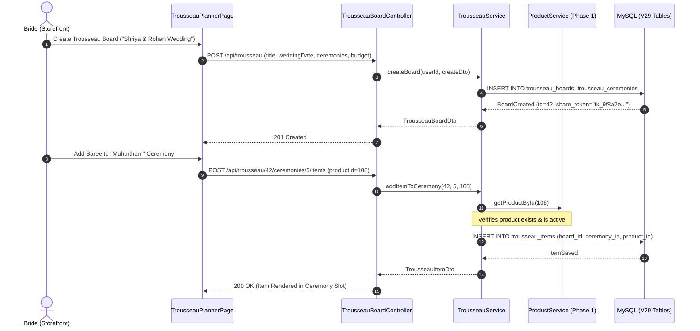
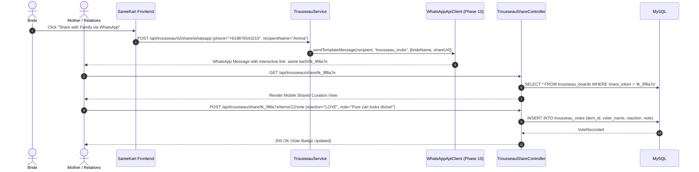
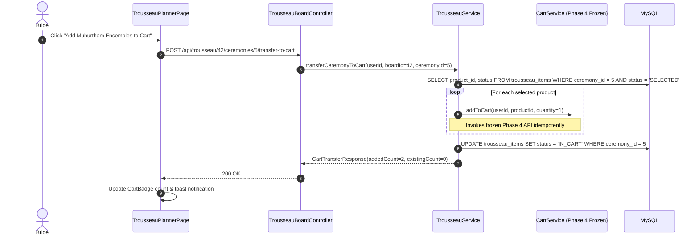

# SareeKart — Phase 11 Architecture Plan

> **Document Status:** ARCHITECTURAL BLUEPRINT (DISCOVERY ONLY — DO NOT IMPLEMENT YET)  
> **Subsystem:** Collaborative Bridal Trousseau Studio & Multi-Party Wedding Wardrobe Curator  
> **Target Version:** SareeKart v3.6 / Phase 11  

---

## 1. Executive Architectural Blueprint

The **Collaborative Bridal Trousseau Studio** empowers brides, couples, families, and boutique stylists to co-curate complete wedding wardrobe ensembles across distinct ceremonies (Engagement, Haldi, Mehendi, Sangeet, Muhurtham, Reception) backed by authentic live handloom inventory, AI-driven palette matching, and multi-party voting via mobile web and WhatsApp.

```
┌──────────────────────────────────────────────────────────────────────────────────────────────────┐
│                                       STOREFRONT / CLIENTS                                       │
│                                                                                                  │
│   Bride / Host (Web UI)        Guest Collaborators (Mobile Web)       Family on WhatsApp         │
│   • Full curation & budget     • Token-based voting link              • Interactive reply cards  │
│   • 1-Click Cart conversion    • Reaction chips & comments            • Quick reaction buttons   │
└────────────────┬───────────────────────────────┬───────────────────────────────┬─────────────────┘
                 │                               │                               │
                 │ Authenticated REST            │ Token-guarded REST            │ Inbound Webhook
                 ▼                               ▼                               ▼
┌──────────────────────────────────────────────────────────────────────────────────────────────────┐
│                               SAREEKART BACKEND SERVICE LAYER                                    │
│                                                                                                  │
│   ┌───────────────────────────────┐     ┌───────────────────────────────┐                        │
│   │   TrousseauBoardController    │     │   TrousseauShareController    │                        │
│   │   (JWT Authenticated)         │     │   (Secure Token Guarded)      │                        │
│   └───────────────┬───────────────┘     └───────────────┬───────────────┘                        │
│                   │                                     │                                        │
│                   ▼                                     ▼                                        │
│   ┌─────────────────────────────────────────────────────────────────────┐                        │
│   │                     TrousseauService & Impl                         │                        │
│   │   • Board & Ceremony Lifecycle       • Family Voting Aggregator     │                        │
│   │   • Catalog Item Binding             • 1-Click Cart Transporter     │                        │
│   └──────┬──────────────┬──────────────┬──────────────┬─────────────┬───┘                        │
└──────────┼──────────────┼──────────────┼──────────────┼─────────────┼────────────────────────────┘
           │              │              │              │             │
           ▼              ▼              ▼              ▼             ▼
┌──────────────────┐ ┌───────────┐ ┌───────────┐ ┌────────────┐ ┌──────────────────┐
│   MySQL 8.0      │ │  Phase 4  │ │  Phase 7  │ │  Phase 8/9 │ │     Phase 10     │
│   V29 Tables     │ │  Cart     │ │  Neo4j    │ │  AI Stylist│ │  WhatsApp Client │
│   • Boards       │ │  Service  │ │  Occasion │ │  & Hybrid  │ │  Outbound Voting │
│   • Ceremonies   │ │  (Frozen) │ │  Graph    │ │  Ranker    │ │  Notifications   │
│   • Items/Votes  │ │           │ │  (Frozen) │ │  (Frozen)  │ │  (Frozen)        │
└──────────────────┘ └───────────┘ └───────────┘ └────────────┘ └──────────────────┘
```

---

## 2. Component Boundaries & Responsibilities

### 2.1 Backend Components
1. **`TrousseauBoardController` (`/api/trousseau`)**:
   - Manages board creation, ceremony definition, budget tracking, saree pinning, and cart conversion for authenticated users.
2. **`TrousseauShareController` (`/api/trousseau/share`)**:
   - Public-facing, rate-limited controller allowing invited collaborators with a high-entropy secret token (`share_token`) to view boards and cast votes without requiring full account registration.
3. **`TrousseauService` / `TrousseauServiceImpl`**:
   - Orchestrates board lifecycle, item additions with real-time stock checks, vote aggregation, and export to Phase 4 `CartService`.
4. **`TrousseauAiCuratorService`**:
   - Interfaces with Phase 9 `AiStylistService` and Phase 7 `Neo4jGraphService` to generate ceremony ensemble recommendations aligned with the wedding's primary color palette and weave heritage.
5. **`TrousseauNotificationService`**:
   - Formats and delivers WhatsApp share links and interactive voting summaries using Phase 10's `WhatsAppApiClient`.

### 2.2 Frontend Components (`frontend/src/pages/Bridal/`)
1. **`TrousseauPlannerPage.jsx` (Modernized)**:
   - Replaces hardcoded mock data with live REST queries.
   - Dynamic ceremony tabs, budget meters, and collaboration side drawer.
2. **`CeremonyItemCard.jsx`**:
   - Displays real product imagery, weaver cluster, Silk Mark certification badge, stock warning, family vote tallies, and stylist commentary.
3. **`TrousseauCatalogModal.jsx`**:
   - In-modal search and filtering to effortlessly shortlist catalog sarees into a specific ceremony slot.
4. **`FamilyShareModal.jsx`**:
   - Generates WhatsApp deep links and copyable family invite links.
5. **`SharedTrousseauView.jsx` (`/trousseau/shared/:token`)**:
   - Lightweight, mobile-optimized view for invited relatives to swipe through ceremony looks and cast immediate reactions ("Love it ❤️", "Suggest lighter drape 🌸", "Check Muhurtham color 🪔").

---

## 3. Data Flow & Sequence Workflows

### 3.1 Collaborative Board Creation & Item Shortlisting


### 3.2 Family Collaboration via WhatsApp & Mobile Web


### 3.3 1-Click Conversion to Core Commerce Cart


---

## 4. REST API Boundaries & Contracts

### 4.1 Authenticated Board Endpoints (`/api/trousseau/**`)
*Requires `Authorization: Bearer <jwt>` (Role: `CUSTOMER`)*

- **`POST /api/trousseau`**: Create a new trousseau board.
  ```json
  {
    "title": "Ananya & Siddharth's Wedding Trousseau",
    "weddingDate": "2026-11-28",
    "notes": "Traditional South Indian wedding with evening contemporary reception",
    "ceremonies": [
      { "ceremonyType": "MUHURTHAM", "title": "Traditional Muhurtham", "colorTheme": "Crimson & Pure Gold Zari", "budget": 150000 },
      { "ceremonyType": "SANGEET", "title": "Sangeet Night", "colorTheme": "Emerald Green or Royal Purple", "budget": 60000 },
      { "ceremonyType": "RECEPTION", "title": "Grand Reception", "colorTheme": "Pastel Peach Tissue Silk", "budget": 90000 }
    ]
  }
  ```
- **`GET /api/trousseau`**: List all trousseau boards owned by the authenticated user.
- **`GET /api/trousseau/{boardId}`**: Get full board details, ceremonies, shortlisted items, and aggregated vote scores.
- **`PUT /api/trousseau/{boardId}`**: Update board title, wedding date, or overall notes.
- **`DELETE /api/trousseau/{boardId}`**: Soft-delete / archive a trousseau board.

### 4.2 Ceremony & Item Management Endpoints
- **`POST /api/trousseau/{boardId}/ceremonies`**: Add a ceremony to an existing board.
- **`DELETE /api/trousseau/{boardId}/ceremonies/{ceremonyId}`**: Remove a ceremony.
- **`POST /api/trousseau/{boardId}/ceremonies/{ceremonyId}/items`**: Shortlist a catalog saree into a ceremony.
  ```json
  {
    "productId": 108,
    "stylistNotes": "Selected for morning kanyadanam ritual; pairs with heirloom temple jewelry",
    "isAiRecommended": false
  }
  ```
- **`PATCH /api/trousseau/{boardId}/ceremonies/{ceremonyId}/items/{itemId}`**: Update item status (`SHORTLISTED`, `SELECTED`, `ARCHIVED`) or personal notes.
- **`DELETE /api/trousseau/{boardId}/ceremonies/{ceremonyId}/items/{itemId}`**: Remove item from ceremony slot.

### 4.3 Commerce Bridge Endpoints
- **`POST /api/trousseau/{boardId}/ceremonies/{ceremonyId}/transfer-to-cart`**: Adds all `SELECTED` items from the ceremony into the user's Phase 4 Cart.
- **`POST /api/trousseau/{boardId}/transfer-all-to-cart`**: Adds all `SELECTED` items across the entire wedding board into the Cart.

### 4.4 Public / Guest Collaboration Endpoints (`/api/trousseau/share/**`)
*Secured via High-Entropy Share Token (No JWT required, protected by IP rate limiting)*

- **`GET /api/trousseau/share/{shareToken}`**: View read-only board summary with ceremonies, shortlisted sarees, and public vote tallies.
- **`POST /api/trousseau/share/{shareToken}/items/{itemId}/vote`**: Cast reaction.
  ```json
  {
    "voterName": "Aunt Radhika",
    "reaction": "LOVE",
    "note": "The contrast pallu is breathtaking! Perfect for the mandap lighting."
  }
  ```
  *(Reaction enum: `LOVE`, `LIKE`, `PASS`, `NEEDS_REVIEW`)*

---

## 5. Database Schema Design (`V29`)

A dedicated, isolated migration file `V29__create_collaborative_trousseau_tables.sql` encapsulates all Phase 11 domain tables:

```sql
-- 1. Main Trousseau Board
CREATE TABLE trousseau_boards (
    id BIGINT AUTO_INCREMENT PRIMARY KEY,
    user_id BIGINT NOT NULL,
    title VARCHAR(150) NOT NULL,
    wedding_date DATE NULL,
    notes TEXT NULL,
    share_token VARCHAR(64) NOT NULL UNIQUE,
    is_public_voting BOOLEAN NOT NULL DEFAULT TRUE,
    status VARCHAR(30) NOT NULL DEFAULT 'ACTIVE',
    created_at TIMESTAMP DEFAULT CURRENT_TIMESTAMP,
    updated_at TIMESTAMP DEFAULT CURRENT_TIMESTAMP ON UPDATE CURRENT_TIMESTAMP,
    CONSTRAINT fk_trousseau_user FOREIGN KEY (user_id) REFERENCES users (id) ON DELETE CASCADE,
    INDEX idx_trousseau_user (user_id),
    INDEX idx_trousseau_token (share_token)
) ENGINE=InnoDB DEFAULT CHARSET=utf8mb4 COLLATE=utf8mb4_unicode_ci;

-- 2. Ceremony Groups within a Board
CREATE TABLE trousseau_ceremonies (
    id BIGINT AUTO_INCREMENT PRIMARY KEY,
    board_id BIGINT NOT NULL,
    ceremony_type VARCHAR(50) NOT NULL, -- 'ENGAGEMENT', 'HALDI', 'MEHENDI', 'SANGEET', 'MUHURTHAM', 'RECEPTION', 'OTHER'
    title VARCHAR(100) NOT NULL,
    color_theme VARCHAR(100) NULL,
    target_budget DECIMAL(10,2) NULL,
    display_order INT NOT NULL DEFAULT 0,
    created_at TIMESTAMP DEFAULT CURRENT_TIMESTAMP,
    CONSTRAINT fk_trousseau_ceremony_board FOREIGN KEY (board_id) REFERENCES trousseau_boards (id) ON DELETE CASCADE,
    INDEX idx_ceremony_board (board_id)
) ENGINE=InnoDB DEFAULT CHARSET=utf8mb4 COLLATE=utf8mb4_unicode_ci;

-- 3. Shortlisted Products in Ceremonies
CREATE TABLE trousseau_items (
    id BIGINT AUTO_INCREMENT PRIMARY KEY,
    board_id BIGINT NOT NULL,
    ceremony_id BIGINT NOT NULL,
    product_id BIGINT NOT NULL,
    added_by_user_id BIGINT NULL,
    is_ai_recommended BOOLEAN NOT NULL DEFAULT FALSE,
    notes TEXT NULL,
    status VARCHAR(30) NOT NULL DEFAULT 'SHORTLISTED', -- 'SHORTLISTED', 'SELECTED', 'IN_CART', 'PURCHASED', 'ARCHIVED'
    created_at TIMESTAMP DEFAULT CURRENT_TIMESTAMP,
    updated_at TIMESTAMP DEFAULT CURRENT_TIMESTAMP ON UPDATE CURRENT_TIMESTAMP,
    CONSTRAINT fk_trousseau_item_board FOREIGN KEY (board_id) REFERENCES trousseau_boards (id) ON DELETE CASCADE,
    CONSTRAINT fk_trousseau_item_ceremony FOREIGN KEY (ceremony_id) REFERENCES trousseau_ceremonies (id) ON DELETE CASCADE,
    CONSTRAINT fk_trousseau_item_product FOREIGN KEY (product_id) REFERENCES products (id) ON DELETE RESTRICT,
    INDEX idx_item_ceremony (ceremony_id),
    INDEX idx_item_product (product_id)
) ENGINE=InnoDB DEFAULT CHARSET=utf8mb4 COLLATE=utf8mb4_unicode_ci;

-- 4. Collaborator Invitations & Access
CREATE TABLE trousseau_collaborators (
    id BIGINT AUTO_INCREMENT PRIMARY KEY,
    board_id BIGINT NOT NULL,
    name VARCHAR(100) NOT NULL,
    phone VARCHAR(20) NULL,
    email VARCHAR(150) NULL,
    role VARCHAR(30) NOT NULL DEFAULT 'VOTER', -- 'CO_CURATOR', 'VOTER', 'VIEWER'
    invite_status VARCHAR(30) NOT NULL DEFAULT 'PENDING', -- 'PENDING', 'ACCEPTED', 'DECLINED'
    created_at TIMESTAMP DEFAULT CURRENT_TIMESTAMP,
    CONSTRAINT fk_trousseau_collab_board FOREIGN KEY (board_id) REFERENCES trousseau_boards (id) ON DELETE CASCADE,
    INDEX idx_collab_board (board_id)
) ENGINE=InnoDB DEFAULT CHARSET=utf8mb4 COLLATE=utf8mb4_unicode_ci;

-- 5. Multi-Party Votes & Feedback
CREATE TABLE trousseau_votes (
    id BIGINT AUTO_INCREMENT PRIMARY KEY,
    item_id BIGINT NOT NULL,
    voter_name VARCHAR(100) NOT NULL,
    voter_phone VARCHAR(20) NULL,
    user_id BIGINT NULL,
    reaction VARCHAR(30) NOT NULL, -- 'LOVE', 'LIKE', 'PASS', 'NEEDS_REVIEW'
    note TEXT NULL,
    created_at TIMESTAMP DEFAULT CURRENT_TIMESTAMP,
    CONSTRAINT fk_trousseau_vote_item FOREIGN KEY (item_id) REFERENCES trousseau_items (id) ON DELETE CASCADE,
    CONSTRAINT fk_trousseau_vote_user FOREIGN KEY (user_id) REFERENCES users (id) ON DELETE SET NULL,
    INDEX idx_vote_item (item_id)
) ENGINE=InnoDB DEFAULT CHARSET=utf8mb4 COLLATE=utf8mb4_unicode_ci;
```

---

## 6. AI Grounding & Safety Specification

The Trousseau Studio leverages AI for automated ensemble suggestions (e.g., finding complementary sarees for bridesmaids or mother-of-the-bride):

1. **Grounding Source:**
   - Strict catalog grounding via existing Phase 8/9 vector embeddings and Neo4j graph nodes.
   - LLM receives a pre-filtered list of in-stock candidate SKU records matching the ceremony's color palette and occasion tag.
2. **Prohibited LLM Outputs:**
   - The AI is prohibited from inventing imaginary weave clusters, non-existent GI tags, or synthetic discounts.
   - Prices and stock levels are never rendered by the LLM; the frontend injects authoritative pricing from `ProductDto`.
3. **Prompt-Injection Protections:**
   - User notes and wedding titles are strictly sanitized (HTML entity encoding + regex alphanumeric bounds) before passing into AI prompts.
4. **SLA & Fallbacks:**
   - AI curation requests have a 3500ms timeout. If Spring AI / Gemini fails or times out, the service falls back deterministically to Phase 8's hybrid vector similarity ranker without user disruption.

---

## 7. Failure Isolation & Blast Radius Proof

To protect frozen Phases 1–10, the Trousseau Studio adheres to strict isolation boundaries:

| Core Subsystem | Blast Radius Isolation Guarantee |
|---|---|
| **Product Browsing & Search** | Completely decoupled. Trousseau tables are isolated; reading catalog data is done via read-only repository calls. Catalog operations proceed even if trousseau tables are locked. |
| **Cart & Wishlist** | Trousseau items are converted to cart items via the standard, public `CartService.addItem()` method. Any failure during trousseau conversion simply rolls back the conversion transaction, leaving the user's existing cart unchanged. |
| **Order Checkout & Payment** | Zero direct integration with checkout or Razorpay. Once items are in the cart, checkout is handled entirely by frozen Phase 5 services. |
| **Inventory Decrement** | Stock is verified on adding to trousseau, but inventory is NOT locked or reserved by trousseau shortlisting. Inventory reservation only occurs during actual checkout in Phase 5. |
| **WhatsApp Service** | Outbound WhatsApp notifications are dispatched asynchronously via `@Async` and an internal thread pool. Network delays with Meta's servers never block HTTP response threads. |

---

## 8. Security Boundaries & Access Control

1. **Board Ownership:**
   - Write actions (`POST /api/trousseau`, adding items, deleting ceremonies) require valid JWT matching `board.userId` or role `ADMIN`.
2. **Share Token Cryptographic Entropy:**
   - `share_token` is generated using `java.security.SecureRandom` producing 256 bits of entropy (Base64URL encoded, 43 characters), making brute-force enumeration mathematically infeasible ($2^{256}$ search space).
3. **Voting Abuse Prevention:**
   - Public voting via share tokens is rate-limited (max 10 votes per minute per IP).
   - Input fields (`voterName`, `note`) are sanitized against XSS and restricted to 100 chars and 500 chars respectively.
4. **PII Redaction:**
   - Public share view (`/trousseau/share/{token}`) redacts customer emails, full home addresses, and phone numbers.
