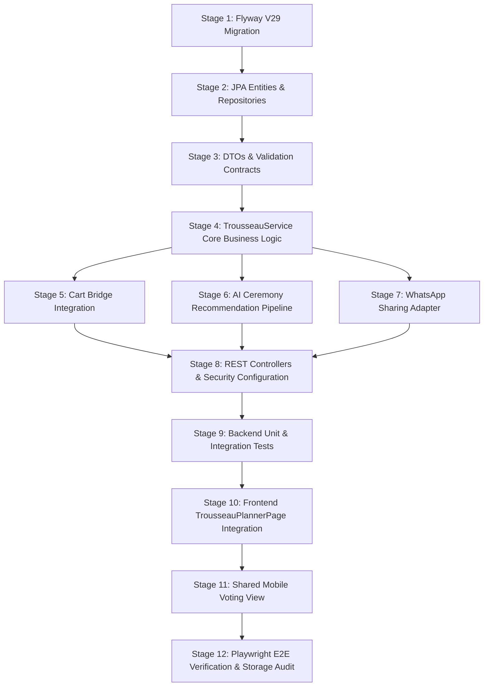

# SareeKart — Phase 11 Implementation Plan

> **Document Status:** IMPLEMENTATION BLUEPRINT (DISCOVERY ONLY — DO NOT IMPLEMENT YET)  
> **Subsystem:** Collaborative Bridal Trousseau Studio & Multi-Party Wedding Wardrobe Curator  
> **Prerequisites:** Phases 1–10 Complete & Frozen (`78373ec`)  
> **Rule Enforcement:** Zero code changes, zero database migrations, zero commits until explicit user approval.  

---

## 1. Migration Safety & Database Evolution

### 1.1 New Flyway Migration: `V29`
- **File Name:** `backend/backend/src/main/resources/db/migration/V29__create_collaborative_trousseau_tables.sql`
- **Immutability Invariant:** Historical migrations `V17` through `V28` remain strictly read-only and will not be touched or re-executed.
- **Additive Schema Design:** All tables (`trousseau_boards`, `trousseau_ceremonies`, `trousseau_items`, `trousseau_collaborators`, `trousseau_votes`) are strictly new tables.
- **Zero Impact on Existing Data:** No existing columns are renamed, dropped, or modified. Foreign keys to `users(id)` and `products(id)` reference existing primary keys with non-blocking constraints (`ON DELETE CASCADE` for boards/ceremonies, `ON DELETE RESTRICT` for products to preserve catalog audit integrity).

### 1.2 Rollback & Disaster Recovery Strategy
- In the event of an aborted deployment, a non-destructive downward script `U29__drop_trousseau_tables.sql` is defined:
  ```sql
  DROP TABLE IF EXISTS trousseau_votes;
  DROP TABLE IF EXISTS trousseau_collaborators;
  DROP TABLE IF EXISTS trousseau_items;
  DROP TABLE IF EXISTS trousseau_ceremonies;
  DROP TABLE IF EXISTS trousseau_boards;
  ```
- Dropping these tables leaves all core commerce entities (`users`, `products`, `orders`, `carts`, `conversations`) 100% intact and undamaged.

---

## 2. 12-Stage Implementation Roadmap



### Stage 1: Flyway V29 Database Migration
- Add `V29__create_collaborative_trousseau_tables.sql` defining:
  - `trousseau_boards`, `trousseau_ceremonies`, `trousseau_items`, `trousseau_collaborators`, `trousseau_votes`.
  - Add indexing on `share_token`, `user_id`, `board_id`, `ceremony_id`, `product_id`.

### Stage 2: JPA Domain Entities & Repositories
- Create entities in `com.sareekart.entity`:
  - `TrousseauBoard.java`
  - `TrousseauCeremony.java`
  - `TrousseauItem.java`
  - `TrousseauCollaborator.java`
  - `TrousseauVote.java`
- Create repositories in `com.sareekart.repository`:
  - `TrousseauBoardRepository.java` (find by user ID, find by share token)
  - `TrousseauCeremonyRepository.java` (find by board ID ordered by display order)
  - `TrousseauItemRepository.java` (find by ceremony ID, find by product ID)
  - `TrousseauVoteRepository.java` (find by item ID, aggregate reaction counts)

### Stage 3: Data Transfer Objects & Validation
- Create DTOs in `com.sareekart.dto.trousseau`:
  - `CreateTrousseauBoardRequest.java` (`@NotBlank`, `@FutureOrPresent`, wedding ceremonies list)
  - `TrousseauBoardResponse.java` (aggregated budget, ceremonies, vote summaries)
  - `AddCeremonyItemRequest.java` (`@NotNull productId`, optional notes)
  - `CastVoteRequest.java` (`@NotBlank voterName`, `@NotNull reaction`, notes)
  - `TransferToCartResponse.java` (count of added items, items already in cart)

### Stage 4: TrousseauService Core Business Logic
- Create `com.sareekart.service.TrousseauService` & `TrousseauServiceImpl`:
  - Enforce board ownership for authenticated customer operations.
  - Implement secure share token generation (`SecureRandom`, 256-bit entropy).
  - Add catalog product validation (check product exists, is active, stock > 0).
  - Aggregate ceremony items and vote statistics.

### Stage 5: Cart Bridge Integration
- Implement `transferCeremonyToCart(Long userId, Long boardId, Long ceremonyId)`:
  - Iterates over items marked `SELECTED` for the ceremony.
  - Invokes frozen `CartService.addToCart(userId, productId, 1)`.
  - Marks item status as `IN_CART`.
  - Atomic transaction ensuring no partial state leaves the user bewildered.

### Stage 6: AI Ceremony Recommendation Pipeline
- Create `TrousseauAiService`:
  - Connects to Phase 9 `AiStylistService` and Phase 8 `RecommendationService`.
  - Given a ceremony type (e.g. `MUHURTHAM`), target color theme, and budget, retrieves matching authentic sarees and returns curated ensemble pairings with high-confidence match scores.

### Stage 7: WhatsApp Sharing & Notification Adapter
- Integrate with Phase 10 `WhatsAppApiClient`:
  - Generates interactive WhatsApp share invitation messages with deep links (`/trousseau/shared/{token}`).
  - Sends asynchronous notification alerts when family members vote or leave comments.

### Stage 8: REST Controllers & Security Configuration
- Create `com.sareekart.controller.TrousseauBoardController`:
  - Authenticated routes at `/api/trousseau/**`.
- Create `com.sareekart.controller.TrousseauShareController`:
  - Public token routes at `/api/trousseau/share/**`.
- Update `SecurityConfig.java`:
  - Allow permitAll on `/api/trousseau/share/**`.
  - Require authenticated role `CUSTOMER` on `/api/trousseau/**`.

### Stage 9: Backend Unit & Integration Tests
- `TrousseauServiceImplTest.java`:
  - Board creation, ceremony creation, item addition, duplicate item prevention.
  - Vote recording and reaction tally calculation.
  - Cart transfer verification (mocking `CartService`).
- `TrousseauControllerSecurityTest.java`:
  - Ensure unauthorized users cannot access or edit private boards.
  - Ensure valid share tokens allow guest voting without login.
  - Verify invalid tokens return HTTP 404.

### Stage 10: Frontend TrousseauPlannerPage Modernization
- Refactor `frontend/src/pages/Bridal/TrousseauPlannerPage.jsx`:
  - Replace static `SAMPLE_CEREMONIES` with API calls (`GET /api/trousseau`).
  - Wire up "Add Saree to Ceremony" search drawer querying live `/api/products`.
  - Wire up "Transfer to Cart" button triggering CartContext refresh.
  - Display live stock badges ("Only 2 left in stock!").

### Stage 11: Shared Mobile Voting View
- Create `frontend/src/pages/Bridal/SharedTrousseauView.jsx`:
  - Clean, mobile-first responsive layout for invited relatives.
  - Interactive reaction chips (❤️ Love, 👍 Like, 🌸 Suggest Change).
  - Comment modal for custom notes.
  - WhatsApp share trigger for easy re-forwarding in family groups.

### Stage 12: Playwright E2E Verification & Storage Audit
- Create `tests/phase11-bridal-trousseau.spec.js`:
  - Test 1: Authenticated bride creates trousseau board with ceremonies.
  - Test 2: Bride searches catalog and adds a Kanchipuram saree to Muhurtham ceremony.
  - Test 3: Guest accesses board via share token link and casts a "LOVE" vote with note.
  - Test 4: Bride sees updated vote tally and clicks "Add to Cart".
  - Test 5: Verify item appears in checkout cart.
- Run full backend regression (362 existing tests + new Phase 11 tests).
- Run disk space health check (`~/scripts/check_disk_health.sh`).

---

## 3. Comprehensive Test Matrix

| Test Layer | Test Class / Suite | Coverage Focus | Success Target |
|---|---|---|---|
| **Unit Test** | `TrousseauServiceImplTest` | Board CRUD, ceremony validation, token entropy, vote tallying | 100% Pass |
| **Unit Test** | `TrousseauCartBridgeTest` | CartService integration, duplicate item handling, stock checks | 100% Pass |
| **Security Test** | `TrousseauSecurityTest` | RBAC isolation, public token rate limiting, XSS sanitation | 100% Pass |
| **Integration Test**| `TrousseauControllerIntegrationTest` | MockMvc end-to-end API flows and HTTP status codes | 100% Pass |
| **Regression** | Full Backend Suite (`./mvnw test`) | All 362 existing Phase 1–10 tests + Phase 11 tests | 100% Pass (Zero Regressions) |
| **Frontend Unit** | `TrousseauPlannerPage.test.jsx` | React component state, ceremony tabs, modal triggers | 100% Pass |
| **E2E Integration**| `phase11-bridal-trousseau.spec.js` | Complete user journey from board creation to voting & cart | 5 / 5 Scenarios Passing |

---

## 4. Frozen-Phase Protection & Invariance Checklist

To guarantee zero regression across preceding milestones, the implementation must adhere to this checklist:

1. **Phase 1 (Product & Image Lifecycle):**
   - No modifications to `Product.java`, `ProductImage.java`, or image uploading pipelines.
2. **Phase 2 (Categories & Product Attributes):**
   - No modifications to `Category.java`, `Fabric.java`, `Occasion.java`, or `Color.java`.
3. **Phase 3 (Search & Filtering):**
   - No modifications to `ProductSpecificationBuilder.java`.
4. **Phase 4 (Cart & Wishlist):**
   - No modifications to `Cart.java`, `CartItem.java`, `CartService.java`, or `V25` tables. Trousseau conversion invokes public methods only.
5. **Phase 5 (Orders & Inventory):**
   - No modifications to `Order.java`, `OrderItem.java`, `OrderService.java`, or `V26` tables.
6. **Phase 6 (Customer Behavior & Telemetry):**
   - No schema changes to `V27`. Trousseau events are published via standard `CustomerEventService.logEvent()`.
7. **Phase 7 (Neo4j Knowledge Graph):**
   - No modifications to Neo4j schema, Cypher projections, or `GraphCircuitBreaker`.
8. **Phase 8 (AI Recommendations & Hybrid Ranking):**
   - No alterations to hybrid scoring weights or cosine similarity logic.
9. **Phase 9 (AI Luxury Saree Stylist):**
   - No alterations to `AiStylistService` prompts or grounding contracts.
10. **Phase 10 (WhatsApp AI Commerce Assistant):**
    - No changes to webhook ingestion, HMAC validation, or `V28` conversation tables.

---

## 5. Measurable Acceptance Criteria

1. **Database & Schema:**
   - Flyway migration `V29` executes cleanly without warning or lock contention.
   - Zero historical migrations (`V17`–`V28`) altered.
2. **Board & Ceremony Management:**
   - A registered user can create a Trousseau Board with customizable ceremonies and target budgets.
   - Saree SKUs from the live catalog can be attached to ceremonies with personal and stylist notes.
3. **Multi-Party Collaboration:**
   - Each board has a unique, secure, 256-bit token.
   - External visitors using the share token can view shortlisted looks and cast reactions ("LOVE", "LIKE", "PASS") with notes without needing a login account.
   - Real-time vote tallies are updated and visible to the board owner.
4. **Commerce Conversion:**
   - Clicking "Add to Cart" on a ceremony or board seamlessly populates the user's Phase 4 cart with the selected sarees.
5. **Quality & Resilience:**
   - Full backend regression test pass rate: **100% (362+ / 362+ passing)**.
   - Frontend bundle size: all chunks strictly $< 500\text{ kB}$.
   - Storage headroom: free space $\ge 30\%$ maintained at all times.
6. **Execution Discipline:**
   - ZERO implementation steps executed until the user explicitly reviews and approves the plan.
