# Phase 12: Production Hardening, Security, Performance & Release Readiness — Architecture & Implementation Plan

> **Document Status:** CANONICAL ARCHITECTURE & STAGED IMPLEMENTATION PLAN  
> **Repository:** `/Users/chaitanyachaitu/Downloads/SareeKart-main`  
> **Branch:** `master`  
> **Policy:** Free disk space >= 30%, chunk sizes < 500 kB, zero regressions to Phases 1–11.  

---

## Architecture Overview

```mermaid
graph TD
    subgraph S1["Stage 1: Config & Secrets"]
        C1["application-prod.yaml"]
        C2["HikariCP Pool Tuning"]
        C3["Env Var Overrides"]
        C4["Graceful Shutdown (30s)"]
    end

    subgraph S2["Stage 2: Security & CORS"]
        H1["CorsConfigurationSource"]
        H2["HSTS, Frame DENY, CSP Headers"]
        H3["SecurityFilterChain Audit"]
    end

    subgraph S3["Stage 3: Database & Indexing"]
        D1["V30__production_performance_indexes.sql"]
        D2["Catalog (active, price) Index"]
        D3["Cart/Wishlist Composite Indexes"]
        D4["hibernate.ddl-auto: validate in Prod"]
    end

    subgraph S4["Stage 4: Observability & Health"]
        O1["spring-boot-starter-actuator"]
        O2["/actuator/health & /actuator/info"]
        O3["Production Log Levels (INFO/WARN)"]
    end

    subgraph S5["Stage 5: Frontend Security & Resilience"]
        F1["npm audit fix (Vulnerabilities)"]
        F2["Top-Level ErrorBoundary.jsx"]
        F3["Bundle Size Verification (< 500 kB)"]
    end

    subgraph S6["Stage 6: Operations & Disaster Recovery"]
        M1["manage.sh backup rotation (keep 10)"]
        M2["manage.sh restore_db command"]
        M3["Storage Discipline Health Check"]
    end

    subgraph S7["Stage 7: E2E Regression & Sign-Off"]
        R1["Backend 450+ Test Suite (100% Pass)"]
        R2["Playwright E2E Regression Matrix"]
        R3["Cold Boot & Shutdown Verification"]
        R4["Final Production Release Sign-Off"]
    end

    S1 --> S2 --> S3 --> S4 --> S5 --> S6 --> S7
```

---

## Detailed Stage Specifications

### Stage 1: Production Profiles & Secrets Hardening
- **Objective:** Separate development and production profiles; eliminate hardcoded secrets; configure robust connection pooling and graceful shutdown.
- **Files to Modify / Create:**
  - `backend/backend/src/main/resources/application.yaml`: Add `${JWT_SECRET:...}`, `${SPRING_DATASOURCE_URL:...}`, HikariCP defaults, and `server.shutdown: graceful`.
  - `backend/backend/src/main/resources/application-prod.yaml`: Create production-specific profile with `hibernate.ddl-auto: validate`, strict env var requirements without insecure defaults, HikariCP max pool 20, min idle 5, connection timeout 20s.
- **Acceptance Gate:**
  - Backend compiles cleanly (`./mvnw compile`).
  - Existing tests continue to pass using test/dev profile defaults.

---

### Stage 2: Security, CORS & HTTP Headers Architecture
- **Objective:** Configure robust CORS handling with parameterized origin whitelists, add modern HTTP security response headers, and audit endpoint access controls.
- **Files to Modify / Create:**
  - `backend/backend/src/main/java/com/sareekart/config/SecurityConfig.java`:
    - Add `@Value("${app.cors.allowed-origins:http://localhost:5173}")` origin whitelist.
    - Register `CorsConfigurationSource` bean with `GET, POST, PUT, DELETE, OPTIONS, PATCH`.
    - Configure HTTP response headers: `http.headers(headers -> headers.frameOptions(fo -> fo.deny()).xssProtection(...).contentTypeOptions(...))`.
  - `backend/backend/src/test/java/com/sareekart/config/SecurityHeadersAndCorsTest.java`: Author automated test verifying CORS preflight handling and presence of security headers.
- **Acceptance Gate:**
  - `SecurityHeadersAndCorsTest` passes 100%.
  - Existing security test suites pass without regression.

---

### Stage 3: Database Migration V30 & Performance Indexes
- **Objective:** Author canonical Flyway migration `V30` adding high-throughput composite indexes to accelerate catalog discovery, cart lookups, and order filtering.
- **Files to Modify / Create:**
  - `backend/backend/src/main/resources/db/migration/V30__production_performance_indexes.sql`:
    - `CREATE INDEX idx_products_active_price ON products (active, price);`
    - `CREATE INDEX idx_products_active_category ON products (active, category_id);`
    - `CREATE INDEX idx_cart_items_cart_product ON cart_items (cart_id, product_id);`
    - `CREATE INDEX idx_wishlists_user_product ON wishlists (user_id, product_id);`
- **Acceptance Gate:**
  - SQL script parses and applies cleanly against MySQL database.
  - `SHOW INDEX FROM products` confirms index presence.

---

### Stage 4: Observability, Health Probes & Actuator
- **Objective:** Provide Kubernetes / cloud-ready liveness, readiness, and metrics endpoints for production observability.
- **Files to Modify / Create:**
  - `backend/backend/pom.xml`: Add `spring-boot-starter-actuator`.
  - `backend/backend/src/main/resources/application.yaml`: Configure `management.endpoints.web.exposure.include: health,info,metrics` and `management.endpoint.health.show-details: when-authorized`.
  - `backend/backend/src/main/java/com/sareekart/config/SecurityConfig.java`: Permit `/actuator/health` and `/actuator/info` publicly for load balancer health probes; restrict `/actuator/metrics/**` to `ADMIN`/`OWNER`.
  - `backend/backend/src/test/java/com/sareekart/controller/ActuatorHealthTest.java`: Automated test validating health probe returns `{"status":"UP"}`.
- **Acceptance Gate:**
  - `ActuatorHealthTest` passes 100%.
  - `curl -s http://localhost:8081/actuator/health` returns HTTP 200 `{"status":"UP"}`.

---

### Stage 5: Frontend Security, npm Vulnerability Fix & Error Boundaries
- **Objective:** Remediate 7 npm audit vulnerabilities, implement top-level React Error Boundary for crash resilience, and verify bundle budget compliance.
- **Files to Modify / Create:**
  - `frontend/`: Run `npm audit fix` to resolve vulnerable packages (`react-router`, `postcss`, `nanoid`, etc.).
  - `frontend/src/components/common/ErrorBoundary.jsx`: Create accessible, luxury-styled React Error Boundary catching unhandled exceptions and providing a "Refresh Atelier" recovery action.
  - `frontend/src/App.jsx` or `frontend/src/main.jsx`: Wrap root component tree with `<ErrorBoundary>`.
- **Acceptance Gate:**
  - `npm audit` reports 0 high/critical vulnerabilities.
  - `npm run build` succeeds with all chunks strictly < 500 kB.
  - `npm run lint` passes with 0 errors and 0 warnings.

---

### Stage 6: Operational Resilience & Disaster Recovery
- **Objective:** Harden operational scripts for backup retention management and automated database restoration.
- **Files to Modify / Create:**
  - `manage.sh`:
    - Enhance `backup_db`: Automatically rotate and retain only the 10 most recent backups to prevent disk exhaustion.
    - Add `restore_db <backup_file>`: Validates backup existence and restores `sareekart_db` with confirmation prompt.
  - Storage discipline verification via `~/scripts/check_disk_health.sh`.
- **Acceptance Gate:**
  - `manage.sh backup_db` creates backup and prunes old dumps correctly.
  - Storage headroom remains >= 30% free space.

---

### Stage 7: Final Platform E2E Regression & Master Release Sign-Off
- **Objective:** Execute full end-to-end regression across all 11 phases, verifying backend, frontend, database, AI, and Playwright workflows.
- **Files to Modify / Create:**
  - Full backend regression: `./mvnw test` across all 450+ tests.
  - Full Playwright E2E regression: `npx playwright test --project=chromium`.
  - Cold restart verification: `./manage.sh restart` verifying ports 8081 and 5173 come up healthy.
  - Generate final Phase 12 Completion & Master Platform Release Sign-Off artifact.
- **Acceptance Gate:**
  - 100% backend test pass rate.
  - 100% frontend Playwright pass rate.
  - 0 lint errors, bundle chunk budget < 500 kB, disk space >= 30% free.
