# Phase 12: Production Hardening, Security, Performance & Release Readiness — Discovery & System Audit Report

> **Document Status:** DISCOVERY & COMPREHENSIVE PLATFORM AUDIT  
> **Rule Enforcement:** Strictly canonical workspace (`/Users/chaitanyachaitu/Downloads/SareeKart-main`), zero unauthorized regressions to Phases 1–11.  
> **Preceding Phases (Frozen & Complete):**  
> - Phase 1 (Product + Image Lifecycle): ✅ Verified  
> - Phase 2 (Categories + Attributes): ✅ Verified  
> - Phase 3 (Search + Filtering): ✅ Verified  
> - Phase 4 (Cart + Wishlist): ✅ Verified  
> - Phase 5 (Orders + Inventory): ✅ Verified  
> - Phase 6 (Customer Behavior Telemetry): ✅ Verified  
> - Phase 7 (Neo4j Knowledge Graph): ✅ Verified  
> - Phase 8 (AI Recommendations & Hybrid Ranking): ✅ Verified  
> - Phase 9 (AI Luxury Saree Stylist & Drape Concierge): ✅ Verified  
> - Phase 10 (WhatsApp AI Commerce Assistant): ✅ Verified  
> - Phase 11 (Collaborative Bridal Trousseau Studio): ✅ Verified & Signed Off  

---

## 1. Executive Platform Audit

SareeKart has achieved complete functional coverage across 11 phases, spanning standard luxury e-commerce, reactive customer telemetry, knowledge graphs, conversational generative AI, omnichannel Meta WhatsApp messaging, and collaborative bridal wardrobe curation.

Before deploying or merging to production, the platform requires a dedicated **Production Hardening, Security, Performance & Release Readiness** pass across all 9 architectural pillars.

```mermaid
flowchart TD
    subgraph P12_Pillars["Phase 12: Production Readiness Pillars"]
        P1["1. Configuration & Secrets Quarantine"]
        P2["2. Auth, CORS & Security Headers"]
        P3["3. Flyway V30 & DB Index Optimization"]
        P4["4. API Resilience & Circuit Breakers"]
        P5["5. Observability & Health Probes"]
        P6["6. Backup & Disaster Recovery"]
        P7["7. Frontend Security & npm Remediation"]
        P8["8. Bundle Budget & Storage Discipline"]
        P9["9. Full E2E Platform Regression"]
    end
    P1 --> P2 --> P3 --> P4 --> P5 --> P6 --> P7 --> P8 --> P9
```

---

## 2. Platform Audit Findings Across the 9 Pillars

### Pillar 1: Production Configuration & Secrets Quarantine
- **Current State:**
  - Single `application.yaml` with hardcoded fallback secrets:
    - `jwt.secret: SareeKartSecretKey2024ForJWTTokenGenerationAndValidation`
    - `datasource.url: jdbc:mysql://localhost:3306/sareekart_db...`
    - `datasource.username: root`, `password: root123`
    - `whatsapp.api.token: "dummy_whatsapp_token"`
    - `spring.ai.openai.api-key: "sk-proj-dummy-key"`
  - Missing a dedicated, immutable `application-prod.yaml` profile.
  - Missing HikariCP pool parameters (`maximum-pool-size`, `minimum-idle`, `connection-timeout`, `leak-detection-threshold`).
  - Missing graceful shutdown configuration (`server.shutdown: graceful`).
- **Required Action:**
  - Create `application-prod.yaml` with strict environment variable enforcement (`${SPRING_DATASOURCE_URL}`, `${JWT_SECRET}`, `${RAZORPAY_KEY_ID}`, etc.).
  - Configure HikariCP connection pool with production defaults (max pool size 20, min idle 5, connection timeout 20s, leak detection 30s).
  - Enable `server.shutdown: graceful` with 30s timeout in both base and prod configs.

### Pillar 2: Authentication, Authorization, CORS & HTTP Headers
- **Current State:**
  - `SecurityConfig.java` disables CSRF (standard for stateless JWT), but lacks explicit `CorsConfigurationSource` with parameterized allowed origins.
  - Missing HTTP security headers:
    - Content-Security-Policy (CSP)
    - Strict-Transport-Security (HSTS)
    - X-Content-Type-Options: `nosniff`
    - X-Frame-Options: `DENY`
    - Referrer-Policy: `strict-origin-when-cross-origin`
    - Permissions-Policy
  - Public endpoint list in `SecurityConfig.java` has grown organically across 11 phases.
- **Required Action:**
  - Implement parameterized `CorsConfigurationSource` reading `app.cors.allowed-origins` (defaulting to safe local origins in dev, configurable in prod).
  - Add security headers DSL to `SecurityFilterChain` enforcing HSTS, FrameOptions DENY, and XSS protection.
  - Audit and document the exact matrix of public vs. authenticated vs. role-guarded endpoints (`OWNER`, `MANAGER`, `ADMIN`, `CUSTOMER`).

### Pillar 3: Database Migrations, Schema Discipline & Index Optimization
- **Current State:**
  - `spring.jpa.hibernate.ddl-auto: update` is active. In production, this must be `validate` to prevent accidental DDL mutations.
  - Relational indexes audit revealed:
    - High-volume queries on `products` filtering by `active` and `price` lack a composite index `idx_products_active_price` or `idx_products_active_category`.
    - `orders` has indexes on `(user_id, created_at)` and `(status, created_at)`, which is excellent.
    - `trousseau_boards` has unique `share_token` and index on `user_id`.
    - `trousseau_votes` has indexes on `item_id` and FK on `user_id`.
- **Required Action:**
  - Introduce `V30__production_performance_indexes.sql`:
    - Composite index `idx_products_active_price` on `products(active, price)`.
    - Composite index `idx_products_active_category` on `products(active, category_id)`.
    - Index `idx_cart_items_cart_product` on `cart_items(cart_id, product_id)`.
    - Index `idx_wishlists_user_product` on `wishlists(user_id, product_id)`.
  - Configure `hibernate.ddl-auto: validate` in `application-prod.yaml`.

### Pillar 4: API Resilience, Circuit Breakers & Graceful Degradation
- **Current State:**
  - `GlobalExceptionHandler.java` catches generic `Exception.class` and returns clean JSON without leaking stack traces.
  - Neo4j graph service has circuit breaker protection with deterministic SQL fallbacks.
  - AI Stylist has grounding checks ensuring SKUs exist.
  - Trousseau rate limiting enforces 10 votes/min per IP/phone.
- **Required Action:**
  - Standardize request timeouts across WebFlux clients (OpenAI API, WhatsApp API, Razorpay).
  - Add explicit exception handler for `BadCredentialsException`, `AccessDeniedException`, and validation errors with standardized API error codes.
  - Ensure zero raw SQL or uncontrolled query generation.

### Pillar 5: Observability, Monitoring & Health Probes
- **Current State:**
  - `spring-boot-starter-actuator` is currently missing from `pom.xml`.
  - Log levels in `application.yaml` are set to `DEBUG` for `com.sareekart` and `org.hibernate.SQL: DEBUG`. In production, this causes high disk I/O and rapid log file bloating.
- **Required Action:**
  - Add `spring-boot-starter-actuator` to `pom.xml`.
  - Expose health, info, and metric endpoints:
    - `management.endpoints.web.exposure.include: health,info,metrics`
    - `management.endpoint.health.show-details: when-authorized`
    - Secure privileged actuator endpoints behind `ADMIN`/`OWNER` roles.
  - In `application-prod.yaml`, set logging to `INFO` for application and `WARN` for Hibernate/SQL.

### Pillar 6: Backup, Disaster Recovery & Operational Tooling
- **Current State:**
  - `manage.sh` contains `start_app`, `stop_app`, `status_app`, and `backup_db`.
  - `backup_db` creates timestamped SQL dumps in `backups/`.
  - Missing automated backup rotation (pruning backups older than 7 days) and a dedicated `restore_db` validation script.
- **Required Action:**
  - Enhance `manage.sh`:
    - Add `restore_db <backup_file>` command with confirmation prompts.
    - Add automated backup rotation keeping the last 10 backups to prevent disk exhaustion.
    - Verify backup & restore cycle against test database.

### Pillar 7: Frontend Security & Dependency Vulnerability Remediation
- **Current State:**
  - `npm audit` in `frontend/` reported 7 vulnerabilities (2 moderate, 5 high) in `react-router`, `postcss`, `nanoid`, `brace-expansion`, and `browserslist`.
  - Production build succeeds in ~260ms.
- **Required Action:**
  - Execute `npm audit fix` in `frontend/` to upgrade vulnerable transitive packages without breaking React 19 / React Router 7 compatibility.
  - Verify zero runtime regressions after dependency update.
  - Implement top-level React Error Boundary (`ErrorBoundary.jsx`) to catch unexpected frontend exceptions gracefully.

### Pillar 8: Storage Optimization & Bundle Discipline
- **Current State:**
  - Free disk space: **46.1% (105.2 GiB)** — fully compliant with >= 30% rule.
  - Frontend production build chunks: All strictly under 500 kB (largest `vendor-react` is 227 kB, studio is 44 kB).
  - Pure SVG and Tailwind icons; zero heavy charting packages.
- **Required Action:**
  - Maintain bundle chunk budget < 500 kB after all fixes.
  - Maintain free storage headroom >= 30% at all times.

### Pillar 9: End-to-End Platform Verification & Sign-Off Matrix
- **Current State:**
  - 450 backend tests passing.
  - 8/8 Phase 11 Playwright tests passing.
- **Required Action:**
  - Execute full backend test suite (`./mvnw test`) — 100% pass rate.
  - Execute full Playwright E2E regression suite across all critical modules.
  - Verify clean startup, health check response, and clean shutdown.

---

## 3. Candidate Scope Formulation

Phase 12 will execute in **7 structured, auditable stages**:

| Stage | Title | Focus Area |
|---|---|---|
| **Stage 1** | **Production Profiles & Secrets Hardening** | `application-prod.yaml`, HikariCP tuning, env var overrides, graceful shutdown |
| **Stage 2** | **Security & HTTP Headers Architecture** | CORS configuration source, CSP/HSTS/Frame security headers, endpoint audit |
| **Stage 3** | **Database Migration V30 & Performance Indexes** | `V30` migration with composite indexes, `ddl-auto: validate` configuration |
| **Stage 4** | **Observability, Health Probes & Actuator** | `spring-boot-starter-actuator`, `/actuator/health`, production log levels |
| **Stage 5** | **Frontend Security, npm Audit & Error Boundaries** | `npm audit fix`, global React `ErrorBoundary.jsx`, XSS sanitation |
| **Stage 6** | **Operational Resilience & Disaster Recovery** | `manage.sh` backup rotation & restore validation, disk health audit |
| **Stage 7** | **Final Platform E2E Regression & Master Sign-Off** | Full 450+ backend regression, Playwright E2E suite, production release sign-off |
