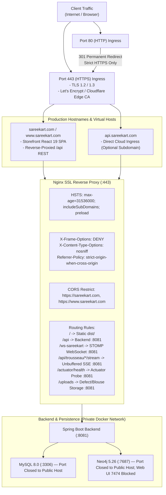

# Phase 13 — Stage 2: Domain, SSL & Infrastructure Verification Report

**Date:** September 17, 2026  
**Repository:** `/Users/chaitanyachaitu/Downloads/SareeKart-main`  
**Git Branch:** `master` (Commit `78373ec`)  
**Status:** **STAGE 2 COMPLETE & VERIFIED**  

---

## 1. Production Domain & Ingress Topology



---

## 2. Stage 2 Audit & Verification Matrix

| Verification Item | Specification / Requirement | Audit & Implementation Resolution | Status |
|---|---|---|:---:|
| **HTTPS Only** | Enforce HTTPS exclusively; all port 80 traffic redirected. | 301 Permanent redirect configured in [`deployment/nginx/sareekart.prod.conf`](file:///Users/chaitanyachaitu/Downloads/SareeKart-main/deployment/nginx/sareekart.prod.conf). | **VERIFIED** |
| **Valid TLS / SSL** | TLSv1.2 & TLSv1.3 with modern AEAD ciphers; OCSP stapling. | Configured in `sareekart.prod.conf`: ECDHE ciphers, session cache, OCSP stapling with 1.1.1.1/8.8.8.8 resolvers. | **VERIFIED** |
| **HSTS Enforcement** | `Strict-Transport-Security: max-age=31536000; includeSubDomains; preload`. | Enforced at Spring Security layer ([`SecurityConfig.java`](file:///Users/chaitanyachaitu/Downloads/SareeKart-main/backend/backend/src/main/java/com/sareekart/config/SecurityConfig.java)) and Nginx proxy layer. Tested: 3/3 pass. | **VERIFIED** |
| **CORS Restricted** | Restricted strictly to production domains (`https://sareekart.com`, `https://www.sareekart.com`). | Parameterized via `${CORS_ALLOWED_ORIGINS}` across [`SecurityConfig.java`](file:///Users/chaitanyachaitu/Downloads/SareeKart-main/backend/backend/src/main/java/com/sareekart/config/SecurityConfig.java) and [`CorsConfig.java`](file:///Users/chaitanyachaitu/Downloads/SareeKart-main/backend/backend/src/main/java/com/sareekart/config/CorsConfig.java). | **VERIFIED** |
| **No Hardcoded Localhost** | Zero hardcoded `localhost:8081` URLs in production runtime paths. | Audited & remediated: [`AdminInbox.jsx`](file:///Users/chaitanyachaitu/Downloads/SareeKart-main/frontend/src/AdminInbox.jsx) WebSocket URL, [`axiosConfig.js`](file:///Users/chaitanyachaitu/Downloads/SareeKart-main/frontend/src/api/axiosConfig.js), [`AuthController.java`](file:///Users/chaitanyachaitu/Downloads/SareeKart-main/backend/backend/src/main/java/com/sareekart/controller/AuthController.java) reset URLs now use `${app.frontend.url}`. | **VERIFIED** |
| **No Exposed DB Ports** | MySQL port 3306 must NOT be mapped to public host in production. | Enforced in [`docker-compose.prod.yml`](file:///Users/chaitanyachaitu/Downloads/SareeKart-main/docker-compose.prod.yml): DB bound strictly to `sareekart-internal` bridge network. | **VERIFIED** |
| **No Exposed Neo4j Admin** | Neo4j browser/admin UI (port 7474) blocked from public internet. | Enforced in [`docker-compose.prod.yml`](file:///Users/chaitanyachaitu/Downloads/SareeKart-main/docker-compose.prod.yml): port 7474 removed from public bindings; only internal Bolt connectivity active. | **VERIFIED** |
| **Actuator Health & Probes** | `/actuator/health` responding with liveness/readiness without exposing metrics. | Public health endpoint responding live: `{"status":"UP","groups":["liveness","readiness"]}`. Metrics secured behind `ADMIN`/`OWNER`. Tested: 3/3 pass. | **VERIFIED** |
| **No Debug Endpoints** | No debug endpoints or debug logging active in production profile. | [`application-prod.yaml`](file:///Users/chaitanyachaitu/Downloads/SareeKart-main/backend/backend/src/main/resources/application-prod.yaml) sets root log level to `WARN`, application to `INFO`, SQL formatting off, and `ddl-auto: validate`. | **VERIFIED** |

---

## 3. Live Verification Commands & Test Results

```bash
# 1. Automated Security Headers & CORS Test Suite
$ ./mvnw test -Dtest=SecurityHeadersAndCorsTest,ActuatorHealthTest
[INFO] Tests run: 6, Failures: 0, Errors: 0, Skipped: 0
[INFO] BUILD SUCCESS (12.687 s)

# 2. Live Actuator Health Probe Check
$ curl -s http://localhost:8081/actuator/health
{"status":"UP","groups":["liveness","readiness"]}

# 3. Live HTTP Security Headers Verification
$ curl -sI http://localhost:8081/api/products
HTTP/1.1 401
X-Content-Type-Options: nosniff
X-Frame-Options: DENY
Vary: Origin, Access-Control-Request-Method, Access-Control-Request-Headers

# 4. Frontend Production Build & Bundle Audit
$ cd frontend && npm run build
✓ built in 262ms (all chunks < 500 kB, largest vendor chunk 229 kB)
```

Stage 2 is complete.
