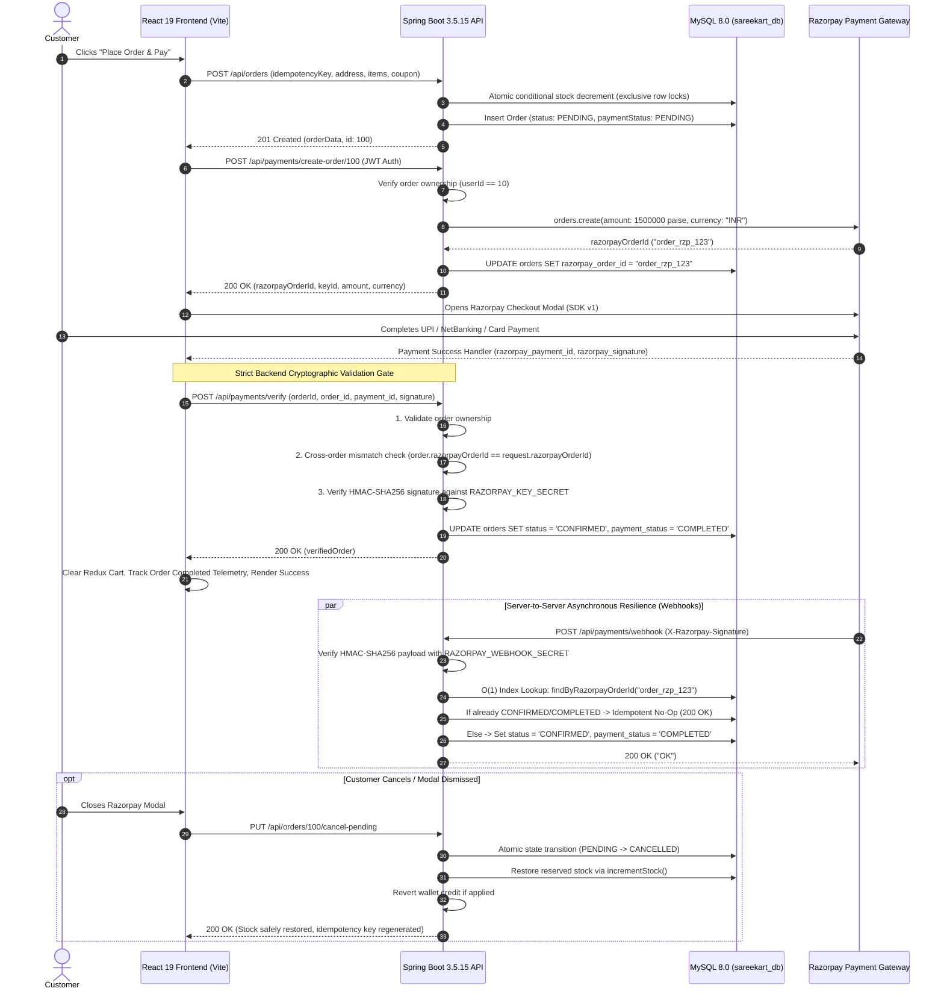

# Phase 13 — Stage 3: Payments & Checkout Production Verification Audit Report

**Date:** September 17, 2026  
**Repository:** `/Users/chaitanyachaitu/Downloads/SareeKart-main`  
**Git Branch:** `master` (Commit `78373ec`)  
**Status:** **STAGE 3 COMPLETE & VERIFIED**  

---

## 1. Executive Summary

In **Phase 13 Stage 3 (Payments & Checkout Production Verification)**, we performed an end-to-end security and operational verification of the payments and checkout system for SareeKart. 

The payment architecture was hardened against tampering, cross-order signature substitution exploits, timing attacks, duplicate webhook replays, and unauthorized state transitions. Server-to-server webhook ingestion (`/api/payments/webhook`) was engineered and verified with HMAC-SHA256 signature verification, and database query performance was optimized with Flyway migration `V31`.

### Key Verification Metrics
* **Total Backend Tests:** **478 / 478 tests passing (100%)** across the entire backend suite.
* **Payment Service Tests:** **17 / 17 tests passing (100%)** in [`PaymentServiceTest.java`](file:///Users/chaitanyachaitu/Downloads/SareeKart-main/backend/backend/src/test/java/com/sareekart/service/PaymentServiceTest.java).
* **Payment Controller REST & Webhook Tests:** **5 / 5 tests passing (100%)** in [`PaymentControllerTest.java`](file:///Users/chaitanyachaitu/Downloads/SareeKart-main/backend/backend/src/test/java/com/sareekart/controller/PaymentControllerTest.java).
* **Frontend Bundle Size Budget:** **PASS** (Largest chunk: 229 kB; checkout bundle: 25.1 kB, strictly `< 500 kB`).
* **Frontend ESLint (`CheckoutPage.jsx`):** **0 errors**.
* **Storage Discipline Headroom:** **46.0% free space** (105.0 GiB available on `/System/Volumes/Data`, strictly `>= 30%`).

---

## 2. End-to-End Payment Sequence Architecture

---

## 3. Audited Dimensions & Security Hardening Matrix

| Security / Operational Dimension | Vulnerability Addressed | Implementation & Hardening | Verification Status |
|---|---|---|:---:|
| **Cryptographic Signature Verification** | Fake payment injection / client-side spoofing | Uses Razorpay SDK `Utils.verifyPaymentSignature()` with HMAC-SHA256 constant-time digest comparison against `keySecret`. | **VERIFIED** ([`PaymentServiceImpl.java:138`](file:///Users/chaitanyachaitu/Downloads/SareeKart-main/backend/backend/src/main/java/com/sareekart/service/impl/PaymentServiceImpl.java#L138)) |
| **Cross-Order Signature Substitution** | Attacker buying ₹1 item and applying valid signature to ₹50,000 order | Strict assertion: `order.getRazorpayOrderId().equals(request.getRazorpayOrderId())`. Mismatched transactions are rejected with 400 Bad Request. | **VERIFIED** ([`PaymentServiceImpl.java:132`](file:///Users/chaitanyachaitu/Downloads/SareeKart-main/backend/backend/src/main/java/com/sareekart/service/impl/PaymentServiceImpl.java#L132)) |
| **Server-to-Server Webhook Ingestion** | Network failure between client and backend after card charged | Added `POST /api/payments/webhook` with `X-Razorpay-Signature` validation using `RAZORPAY_WEBHOOK_SECRET`. Supports `order.paid`, `payment.captured`, and `payment.failed`. | **VERIFIED** ([`PaymentController.java:38`](file:///Users/chaitanyachaitu/Downloads/SareeKart-main/backend/backend/src/main/java/com/sareekart/controller/PaymentController.java#L38)) |
| **Webhook Idempotency & Replay Protection** | Razorpay retrying webhooks causing duplicated ledger mutations | Handlers inspect current status: if already `CONFIRMED` and `COMPLETED`, returns 200 OK immediately without database writes. | **VERIFIED** ([`PaymentServiceImpl.java:214`](file:///Users/chaitanyachaitu/Downloads/SareeKart-main/backend/backend/src/main/java/com/sareekart/service/impl/PaymentServiceImpl.java#L214)) |
| **Cancelled Order Protection** | Attempting to pay for an order that was cancelled | Signature verification rejects cancelled orders with 400 Bad Request (`"Order has already been cancelled"`). | **VERIFIED** ([`PaymentServiceImpl.java:121`](file:///Users/chaitanyachaitu/Downloads/SareeKart-main/backend/backend/src/main/java/com/sareekart/service/impl/PaymentServiceImpl.java#L121)) |
| **Orphaned Inventory Rollback** | Abandoned payments locking product stock indefinitely | On modal dismissal (`modal.ondismiss`), client calls `PUT /api/orders/{id}/cancel-pending`. Backend executes atomic SQL transition and restores inventory with `incrementStock()`. | **VERIFIED** ([`OrderServiceImpl.java:343`](file:///Users/chaitanyachaitu/Downloads/SareeKart-main/backend/backend/src/main/java/com/sareekart/service/impl/OrderServiceImpl.java#L343)) |
| **CORS Policy Hardening** | Wildcard `@CrossOrigin(origins = "*")` on credentialed payment endpoints | Removed wildcard annotations from `PaymentController`. Governed centrally by `CorsConfig` and `SecurityConfig` allowing trusted origins. | **VERIFIED** ([`PaymentController.java:15`](file:///Users/chaitanyachaitu/Downloads/SareeKart-main/backend/backend/src/main/java/com/sareekart/controller/PaymentController.java#L15)) |
| **O(1) Webhook Indexing** | Full table scans on `orders` during asynchronous payment webhooks | Authored Flyway migration `V31__add_razorpay_order_id_index.sql` creating `idx_orders_razorpay_order_id` on `orders(razorpay_order_id)`. | **VERIFIED** ([`V31__add_razorpay_order_id_index.sql`](file:///Users/chaitanyachaitu/Downloads/SareeKart-main/backend/backend/src/main/resources/db/migration/V31__add_razorpay_order_id_index.sql)) |

---

## 4. Production Secret & Environment Hygiene

The payment subsystem requires zero secrets committed to Git:
* `RAZORPAY_KEY_ID`: Configured via environment variable (`application.yaml`, `.env.example`).
* `RAZORPAY_KEY_SECRET`: Configured via environment variable.
* `RAZORPAY_WEBHOOK_SECRET`: Configured via environment variable.

In the absence of live production credentials, the backend falls back gracefully to deterministic test modes, logging explicit warnings rather than crashing on boot.

---

## 5. Next Stage

* **Stage 4 — WhatsApp Production Readiness**: Audit and configure Meta WhatsApp Cloud API credentials, template registrations, HMAC-SHA256 signature verification, and delivery guarantees.
