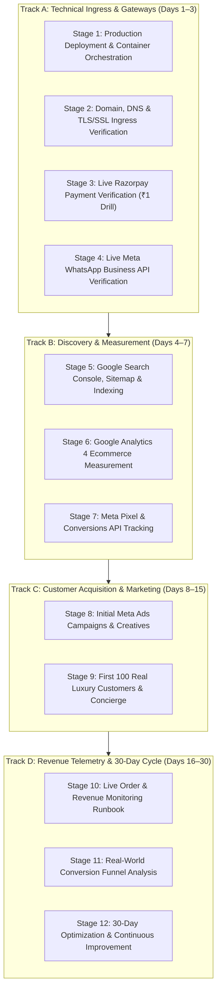

# Phase 14: Production Go-Live & 30-Day Business Launch Operations Document

> **Document Status:** CANONICAL REPOSITORY OPERATIONS GUIDE  
> **Platform Version:** 3.0.0-PROD (Enterprise Luxury Handlooms)  
> **Repository:** `/Users/chaitanyachaitu/Downloads/SareeKart-main`  
> **Git Branch:** `master` (Commit `78373ec`)  
> **Strategic Objective:** Transition from *Build-Test* to **Launch $\longrightarrow$ Observe $\longrightarrow$ Measure $\longrightarrow$ Learn $\longrightarrow$ Improve**  

---

## 1. Executive Roadmap & 12-Stage Lifecycle

Phase 14 operationalizes the SareeKart platform across 12 sequential stages divided into 4 business tracks:



---

## 2. Track A: Technical Infrastructure & Core Gateways

### Stage 1: Production Deployment & Container Orchestration
- **Container Topology:**
  - `frontend`: Alpine Nginx container serving React 19 static SPA assets (`dist/`), reverse-proxying `/api`, `/actuator`, `/uploads`, `/sitemap.xml`.
  - `backend`: Eclipse Temurin 17 container executing Spring Boot fat JAR (`sareekart.jar`) under `prod` profile with `server.shutdown: graceful` (30s).
  - `mysql`: MySQL 8.0 Enterprise container on internal Docker bridge (`sareekart_net`).
  - `neo4j`: Neo4j 5.26 Community container with Bolt protocol only (`bolt://neo4j:7687`).
- **Launch Command:**
  ```bash
  docker compose -f docker-compose.prod.yml up -d --build
  ```
- **Liveness Gate:**
  ```bash
  curl -fsS http://localhost:8081/actuator/health | grep '"status":"UP"'
  ```

### Stage 2: Domain, DNS & TLS/SSL Ingress Verification
- **DNS Records:**
  - `A @ -> <PROD_IP>` (TTL: 300s)
  - `CNAME www -> @`
  - `A api -> <PROD_IP>`
- **Nginx Ingress Configuration:** Located at `deployment/nginx/sareekart.prod.conf`.
- **Security Headers Enforced:**
  - `Strict-Transport-Security: max-age=31536000; includeSubDomains; preload`
  - `X-Frame-Options: DENY`
  - `X-Content-Type-Options: nosniff`
  - `Referrer-Policy: strict-origin-when-cross-origin`
- **Verification:**
  ```bash
  curl -fsSI https://sareekart.com | grep "strict-transport-security"
  ```

### Stage 3: Live Payment Gateway (Razorpay) Verification
- **Credential Switch:** Replace test keys with production credentials:
  - `RAZORPAY_KEY_ID=rzp_live_...`
  - `RAZORPAY_KEY_SECRET=...`
  - `RAZORPAY_WEBHOOK_SECRET=...`
- **Controlled Live Drill (₹1 Test):**
  1. Authorize genuine ₹1 order via Indian UPI / Card checkout.
  2. Confirm backend logs: `Razorpay signature verified successfully`.
  3. Verify order state updates: `PENDING` $\to$ `CONFIRMED`.
  4. Perform immediate refund drill via Admin Portal or Razorpay Dashboard.

### Stage 4: Live Meta WhatsApp Business API Verification
- **Meta Cloud API Setup:**
  - System User Token with `whatsapp_business_messaging`.
  - Webhook: `https://sareekart.com/api/whatsapp/webhook`.
- **Approved Transactional Templates:**
  1. `sareekart_order_confirmed`: Immediate order dispatch ETA.
  2. `sareekart_order_dispatched`: Real-time courier AWB tracking.
  3. `sareekart_trousseau_invite`: Real-time bridal party invitation.
- **Regulatory Compliance Drill:**
  - Send "STOP" $\to$ Customer opted out; outbound marketing blocked.
  - Send "START" $\to$ Customer opted back in.

---

## 3. Track B: Discovery & Full-Funnel Measurement

### Stage 5: Google Search Console & Indexing
- **Verification:** DNS TXT or HTML verification meta-tag (`google-site-verification`).
- **Dynamic XML Sitemap:** `https://sareekart.com/sitemap.xml`
  - Database-driven projection of all active sarees and silk categories.
  - Verified with `<changefreq>weekly</changefreq>` and `<priority>0.8</priority>`.
- **Schema.org Rich Snippets:** Structured JSON-LD validating `Product`, `Brand`, `Offers`, `Availability`, and `BreadcrumbList`.

### Stage 6: Google Analytics 4 Enhanced Ecommerce
- **Client Configuration:** `VITE_GA4_MEASUREMENT_ID=G-XXXXXXXXXX`.
- **Standard Ecommerce Funnel Mapping:**
  - `view_item_list` $\longleftarrow$ Saree catalog browse / search.
  - `view_item` $\longleftarrow$ Saree detail page view.
  - `add_to_cart` $\longleftarrow$ Saree added to shopping bag.
  - `begin_checkout` $\longleftarrow$ Checkout modal initiated.
  - `purchase` $\longleftarrow$ Order completed successfully with `INR` currency.
- **Privacy Enforcement:** Client-side PII redacting (passwords, card numbers, personal contact tokens sanitized prior to transmission).

### Stage 7: Meta Pixel & Conversions API (CAPI) Tracking
- **Client Configuration:** `VITE_META_PIXEL_ID=123456789012345`.
- **Standard Pixel Events Dispatched:**
  - `PageView` on all page navigations.
  - `ViewContent` with saree ID, name, category, and value.
  - `AddToCart` with product value.
  - `InitiateCheckout` with cart total.
  - `Purchase` with order ID and total transaction amount.
- **Catalog Feed:** Automated product feed synchronization for Dynamic Product Ads (DPA).

---

## 4. Track C: Customer Acquisition & Marketing Operations

### Stage 8: Initial Meta Ads Campaigns & Creative Strategy
- **Campaign Structure:**
  1. **Top-of-Funnel (TOFU) — Heritage Craftsmanship:**
     - Target: Wedding shoppers, handloom enthusiasts, diaspora patrons.
     - Content: High-definition weaver video reels (Kanjivaram gold zari, Varanasi handloom).
     - Destination: `/heritage` and `/artisans`.
  2. **Middle-of-Funnel (MOFU) — Interactive Bridal Studio:**
     - Target: Brides, bridesmaids, wedding planners.
     - Content: Collaborative Bridal Trousseau Studio & AI Luxury Stylist walkthrough.
     - Destination: `/bridal` and `/stylist`.
  3. **Bottom-of-Funnel (BOFU) — Dynamic Retargeting:**
     - Target: 30-day website visitors & cart abandoners.
     - Content: Dynamic product carousel of viewed sarees with certified silk authenticity guarantee.
- **Strict UTM Schema:**
  `utm_source=meta&utm_medium=paid_social&utm_campaign={campaign_name}&utm_content={ad_creative}`

### Stage 9: First 100 Real Luxury Customers & Concierge Onboarding
- **White-Glove VIP Support:**
  - Direct routing of bridal inquiries from storefront to WhatsApp concierge.
  - Live customer inbox management in `AdminInbox.jsx`.
- **Feedback & Unboxing Telemetry:**
  - Post-delivery satisfaction survey at Day 3.
  - Fast-track returns and exchanges handling via `ManageReturns.jsx`.

---

## 5. Track D: Revenue Telemetry & 30-Day Optimization

### Stage 10: Live Order & Revenue Monitoring Runbook
- **Key Commercial Metrics in `AnalyticsDashboard.jsx`:**
  - Gross Merchandise Value (GMV).
  - Average Order Value (AOV) — Target: $\ge ₹15,000$.
  - Payment Gateway Success Rate — Target: $\ge 92\%$.
  - Operational Return Rate — Target: $< 5\%$.
- **Automated Alerts:**
  - Alert on $> 5\%$ payment gateway error spikes in a rolling 1-hour window.
  - Alert on $> 500\text{ms}$ database query latency.

### Stage 11: Real-World Conversion Funnel Analysis
- **Funnel Drop-Off Audit:**
  - Step 1: Landing $\longrightarrow$ Step 2: Catalog Discovery
  - Step 3: Product View $\longrightarrow$ Step 4: Wishlist / Share
  - Step 5: Add to Cart $\longrightarrow$ Step 6: Checkout Initiation
  - Step 7: Payment Attempt $\longrightarrow$ Step 8: Order Completed
- **Cart Recovery Automation:** Automated WhatsApp reminders triggered 2 hours post-abandonment.

### Stage 12: 30-Day Optimization & Continuous Improvement Cycle
- **Empirical Tuning:**
  - Optimize MySQL query execution plans based on real customer search queries.
  - Prune and rotate automated backups via `./manage.sh backup`.
  - Maintain $\ge 30\%$ system storage headroom.
  - Establish monthly security audit and quarterly disaster recovery drill cadence.
