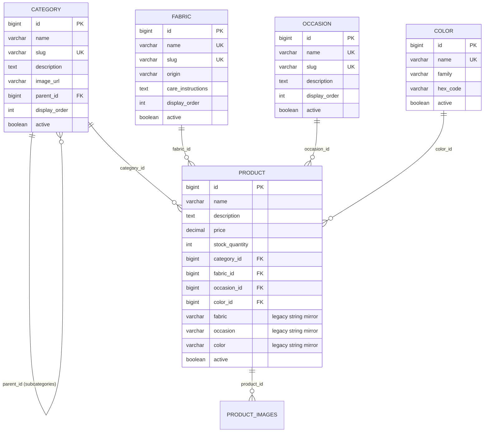

# SareeKart — Phase 2 Architecture Design Document
# Categories & Product Attributes: Discovery, Inventory, and Target Model

> **Document Path:** `docs/phase-2-categories-product-attributes.md`  
> **Status:** 📋 Proposed Architecture & Design (Discovery Complete — Ready for Review)  
> **Preceding Phase:** Phase 1 (Product + Image Lifecycle) — ✅ 14/14 Scenarios Verified, Zero Defects  
> **Target Milestone:** Phase 2 (Categories & Product Attributes)  

---

## 1. Executive Summary & Objective

In **Phase 1**, SareeKart established an atomic, isolated product-image lifecycle where each drape uniquely owns, uploads, previews, reorders, and persists its imagery across MySQL, Spring Boot, and Vite.

In **Phase 2**, our objective is to construct a **clean, scalable product taxonomy and attribute model** (Categories, Subcategories, Fabrics, Occasions, and Colors) that standardizes artisanal handloom data across the catalog. This architecture will serve as the single source of truth for:
1. Product management & Admin cataloging
2. Faceted search, filtering, and sorting
3. Storefront navigation & collection curation
4. Automated inventory synchronization & warehouse binning
5. Future Phase 7: Neo4j Knowledge Graph (`:Product`-`[:BELONGS_TO]`, `-[:MADE_OF]`, `-[:SUITABLE_FOR]`, `-[:HAS_COLOR]`)
6. Future Phase 8-10: AI Saree Stylist & WhatsApp Clienteling recommendations

---

## 2. Current System Inspection & Data Inventory

We inspected the live database (`sareekart_db`), Spring Boot backend, and React frontend.

### 2.1 Existing Categories in MySQL (`categories` table)
```
+----+---------------------+----------------------------------------------------+-----------+---------------------+---------------------+
| id | created_at          | description                                        | image_url | name                | updated_at          |
+----+---------------------+----------------------------------------------------+-----------+---------------------+---------------------+
|  1 | 2026-07-01 09:31:11 | Premium silk sarees from renowned weavers          | NULL      | Silk Sarees         | 2026-07-01 09:31:11 |
|  2 | 2026-07-01 09:31:11 | Comfortable and elegant cotton sarees              | NULL      | Cotton Sarees       | 2026-07-01 09:31:11 |
|  3 | 2026-07-01 09:31:11 | Lightweight and flowing chiffon sarees             | NULL      | Chiffon Sarees      | 2026-07-01 09:31:11 |
|  4 | 2026-07-01 09:31:11 | Graceful georgette sarees for every occasion       | NULL      | Georgette Sarees    | 2026-07-01 09:31:11 |
|  5 | 2026-07-01 09:31:11 | Exquisite Banarasi sarees with intricate zari work | NULL      | Banarasi Sarees     | 2026-07-01 09:31:11 |
|  6 | 2026-07-01 09:31:11 | Traditional Kanchipuram silk sarees                | NULL      | Kanchipuram Sarees  | 2026-07-01 09:31:11 |
|  7 | 2026-07-01 09:31:11 | Trendy designer sarees for modern women            | NULL      | Designer Sarees     | 2026-07-01 09:31:11 |
|  8 | 2026-07-01 09:31:11 | Magnificent bridal sarees for your special day     | NULL      | Bridal Sarees       | 2026-07-01 09:31:11 |
+----+---------------------+----------------------------------------------------+-----------+---------------------+---------------------+
```

### 2.2 Subcategories
- **Status:** **None exist**. The current schema has no `parent_id`, no subcategory table, and no hierarchical relationships.

### 2.3 Existing Fabric Values in Database
Extracted via `SELECT DISTINCT fabric FROM products`:
- `Chiffon`
- `Cotton`
- `Georgette`
- `Katan Silk`
- `Patola Silk`
- `Silk`
- `Tussar Silk`
- *(In DataSeeder: `Chanderi Silk`)*

### 2.4 Existing Occasion Values in Database
Extracted via `SELECT DISTINCT occasion FROM products`:
- `Bridal`
- `Casual`
- `Daily`
- `Festival`
- `Festive`
- `Party`
- `Wedding`
- *(In DataSeeder: `Daily Wear`, `Party Wear`)*

### 2.5 Existing Color Values in Database
Extracted via `SELECT DISTINCT color FROM products`:
- `baby pink` *(lowercase)*
- `Beige`
- `Crimson`
- `Crimson Red`
- `Emerald Green`
- `Gold`
- `Green`
- `Honey Gold`
- `Ivory`
- `Maroon`
- `Multi`
- `Navy Blue`
- `Peacock Blue`
- `Pink`
- `Red`
- `Rose`
- `Royal Gold`
- `Ruby Pink`
- `White`
- `Yellow`
- *(In DataSeeder: `Ruby Red`, `Champagne Silver`, `Terracotta Earth`)*

### 2.6 Attribute Storage Matrix

| Attribute | DB Backed? | DB Data Type | Storage Type | Frontend Control | Validation |
|---|:---:|---|---|---|---|
| **Category** | Yes | `bigint` (FK) | `categories.id` | `<select>` from API | Optional in DTO; required in UI |
| **Subcategory** | No | None | None | None | None |
| **Fabric** | Yes | `varchar(255)` | Free-text on `products` | Hardcoded `<select>` | None in backend |
| **Occasion** | Yes | `varchar(255)` | Free-text on `products` | Hardcoded `<select>` | None in backend |
| **Color** | Yes | `varchar(255)` | Free-text on `products` | `<input type="text">` | None in backend |
| **Price** | Yes | `decimal(10,2)` | Column on `products` | `<input type="number">` | `@NotNull`, `@DecimalMin("0.01")` |
| **Stock** | Yes | `int` | Column on `products` | `<input type="number">` | `@NotNull`, `@Min(0)` |
| **Active** | Yes | `bit(1)` | Column on `products` | Implicit (`true`) | Defaults to `true` |

---

## 3. Data Quality & Architectural Problems Discovered

### 1. Conceptual Category Conflation (Weave vs Fabric vs Occasion)
The existing categories mix three orthogonal taxonomy axes into one flat table:
- **Fabric-based:** *Silk Sarees*, *Cotton Sarees*, *Chiffon Sarees*, *Georgette Sarees*
- **Weave/Origin-based:** *Banarasi Sarees*, *Kanchipuram Sarees*
- **Occasion-based:** *Bridal Sarees*
- **Design-based:** *Designer Sarees*

**Impact in Live Data:**
- Product 14 (*"Royal Crimson Kanchipuram Silk Saree"*) was assigned `category_id: 1` (*Silk Sarees*), while Product 2 (*"Kanchipuram Temple Border Saree"*) was assigned `category_id: 6` (*Kanchipuram Sarees*).
- Product 15 (*"Emerald Green Banarasi Silk Saree"*) was assigned `category_id: 1` (*Silk Sarees*), while Product 1 (*"Royal Banarasi Silk Saree"*) was assigned `category_id: 5` (*Banarasi Sarees*).
- Product 7 (*"Banarasi Kora Organza Baby Pink"*) was assigned `category_id: 8` (*Bridal Sarees*).
- Because there is no structured separation between Fabric and Weave/Craft, catalogers randomly choose either the raw material or the weave origin as the category.

### 2. Inconsistent Occasion Taxonomy
- `"Festival"` (Product 5) vs `"Festive"` (Products 9, 13, 17)
- `"Bridal"` (Product 2 in Seeder) vs `"Wedding"` (Products 1, 2, 7, 10, 12, 14, 15, 16)
- `"Casual"` (Products 3, 6) vs `"Daily"` (Product 20) vs `"Daily Wear"` (Product 9 in Seeder)
- `"Party"` (Products 4, 8) vs `"Party Wear"` (Product 11 in Seeder)

### 3. Inconsistent Color Nomenclature & Capitalization
- `"baby pink"` (all lowercase) vs `"Pink"` (capitalized)
- Overlapping red nuances: `"Red"`, `"Ruby Red"`, `"Crimson"`, `"Crimson Red"`, `"Maroon"`
- Overlapping gold nuances: `"Gold"`, `"Royal Gold"`, `"Honey Gold"`
- Unstructured free-text input allows typos, capitalization drift, and prevents swatch filtering on storefront.

### 4. Hardcoded Frontend Dropdowns Out of Sync with Database
In `ManageSarees.jsx` and `ManageInventory.jsx`:
- Fabric dropdown is hardcoded to: `["Silk", "Cotton", "Chiffon", "Georgette", "Linen", "Organza"]`.
  - `"Linen"` and `"Organza"` do not exist in the database.
  - `"Tussar Silk"`, `"Katan Silk"`, `"Patola Silk"` exist in the database but are missing from the dropdown. If an admin edits Product 6 or 10, the dropdown cannot display their actual fabric.
- Occasion dropdown is hardcoded to: `["Wedding", "Festive", "Casual", "Party", "Formal"]`.
  - Missing `"Bridal"`, `"Daily Wear"`, `"Party Wear"`, `"Festival"`.

### 5. Dangerous Cascade Deletion & Missing Category Deactivation
In `Category.java`:
```java
@OneToMany(mappedBy = "category", cascade = CascadeType.ALL, fetch = FetchType.LAZY)
private List<Product> products = new ArrayList<>();
```
- Calling `DELETE /api/admin/categories/:id` attempts to cascade delete all products under that category, or fails violently if products are referenced in orders/cart!
- There is no `active` flag on `categories` to soft-disable or archive a category.

### 6. Missing Admin Category Management Console
While backend endpoints `POST`, `PUT`, `DELETE /api/admin/categories` exist, there is no UI route (`/admin/categories`) for administrators to view, add, edit, or toggle categories.

---

## 4. Proposed Target Architecture

We propose an architecture that introduces **structured normalization without over-engineering**, preserving 100% backward compatibility for all existing queries.



### Key Architectural Decisions

#### Decision 1: Self-Referencing Category Hierarchy (2 Levels)
- Rather than creating separate `categories` and `subcategories` tables, use a **self-referential `parent_id`** on `categories`:
  - **Level 1 (Root Categories):** Major Collections / Fabric Groups (`parent_id IS NULL`).
    - *Pure Silk Heirlooms*
    - *Handloom Cotton & Linen*
    - *Regional Heritage Weaves*
    - *Party & Evening Drapes*
  - **Level 2 (Subcategories / Weaves):** Specific Drape Weaves (`parent_id = <root_id>`).
    - Under *Pure Silk Heirlooms*: *Kanchipuram Silk*, *Banarasi Brocade*, *Paithani*, *Gadwal Silk*
    - Under *Handloom Cotton*: *Mangalagiri Cotton*, *Uppada Jamdani*, *Chanderi Cotton*
- **Why this is superior:**
  - Single entity, single repository, single REST controller.
  - Unlimited extensibility without altering database structure.
  - Easily queried hierarchically in SQL: `SELECT * FROM categories WHERE parent_id IS NULL` for top navigation, and `WHERE parent_id = :id` for subcategories.

#### Decision 2: Normalized Lookup Entities for Fabric, Occasion, and Color
- **`fabrics` table:** Standardizes material names, fiber composition, and dry-clean/washing instructions.
- **`occasions` table:** Standardizes the ritual taxonomy (*Wedding / Bridal*, *Festive & Puja*, *Cocktail & Sangeet*, *Casual & Daily*, *Formal*).
- **`colors` table:** Standardizes the palette with visual `hex_code` and a grouping `family` (e.g. "Crimson Red" has family "Red" and hex `#990000`).

#### Decision 3: Dual-Write / Legacy Column Mirroring (Backward Compatibility)
- `products.fabric`, `products.occasion`, and `products.color` varchar columns are **retained**!
- When a product is saved with `fabric_id: 1` ("Mulberry Silk"), the backend automatically populates `products.fabric = "Mulberry Silk"`.
- Any external client, older test, or existing query inspecting `product.getFabric()` or `product.getColor()` continues to receive the expected string value with zero breaking changes.

---

## 5. Category Hierarchy Proposal for SareeKart

Based on authentic Indian handloom taxonomy and SareeKart's existing catalog, we propose the following initial 2-tier tree:

```
├── 1. Pure Silk Heirlooms (Root)
│   ├── Kanchipuram Silk Sarees
│   ├── Banarasi Brocade Sarees
│   ├── Paithani Silk Sarees
│   ├── Patola Double Ikat Sarees
│   └── Pure Tussar Silk Sarees
├── 2. Cotton & Natural Fibers (Root)
│   ├── Mangalagiri Handloom Cotton
│   ├── Chanderi Gossamer Cotton
│   ├── Gadwal Handloom Sarees
│   └── Organic Linen Sarees
├── 3. Contemporary & Sheer Drapes (Root)
│   ├── Pure Georgette Sarees
│   ├── Sheer Chiffon Sarees
│   └── Organza Brocade Sarees
└── 4. Bridal & Occasion Trousseau (Root)
    ├── Sacred Muhurtham Sarees
    └── Grand Reception Silks
```

Existing flat categories (IDs 1-8) can either remain top-level or be safely nested without ID breakage.

---

## 6. Admin UX Design (`/admin/categories`)

### 6.1 Category Management Console
- Route: `/admin/categories`
- Accessible by: `OWNER`, `MANAGER`, `ADMIN`
- Visual Features:
  - **Metrics Header:** Total Categories, Active Subcategories, Catalog Products Linked, Uncategorized Drapes.
  - **Hierarchical Tree / Table:** Displays Root Categories with an expandable chevron showing nested Subcategories.
  - **Status Pill:** Active (Emerald) / Inactive (Gray).
  - **Product Count:** Real-time tally of active sarees attached.
  - **Actions:** Edit, Toggle Active/Inactive, Delete (guarded).

### 6.2 Safe Deletion Guard
```
[User clicks Delete]
       ↓
Does category have products (count > 0) or child subcategories?
       ├── YES → Display Modal: "Cannot delete category '<Name>'. It currently contains 14 products. Please reassign or deactivate the category instead."
       └── NO  → Confirm modal: "Are you sure you want to permanently remove '<Name>'?" → DELETE /api/admin/categories/:id
```

---

## 7. Product Form Upgrades in `ManageSarees.jsx`

Preserving the verified Phase 1 photo dropzone unchanged, the form fields will be upgraded:

| Field | Current UI | Target UI | Data Source |
|---|---|---|---|
| **Category** | Flat `<select>` | Grouped `<select>` with `<optgroup>` (Root $\to$ Subcategory) | `GET /api/categories?tree=true` |
| **Fabric** | Hardcoded `<select>` | Dynamic searchable `<select>` | `GET /api/fabrics` |
| **Occasion** | Hardcoded `<select>` | Dynamic `<select>` | `GET /api/occasions` |
| **Color** | Free-text `<input>` | Palette selector with Color Swatch dot + family label | `GET /api/colors` |
| **Photos** | SareePhotoDropzone | **Unchanged (Phase 1 Verified)** | Staged upload $\to$ atomic save |

---

## 8. Data Validation Rules

1. **Category:**
   - `name`: Required, 2-100 characters, unique across siblings.
   - `slug`: Auto-generated, URL-safe (e.g. `kanchipuram-silk-sarees`), unique.
   - `parent_id`: Optional (must point to an active category with `parent_id IS NULL`, preventing $>2$ level nesting).
2. **Fabric:**
   - `name`: Required, 2-60 characters, unique.
3. **Occasion:**
   - `name`: Required, 2-60 characters, unique.
4. **Color:**
   - `name`: Required, 2-50 characters, unique.
   - `hex_code`: Valid CSS hex string (e.g. `#E85D4F`), required.
   - `family`: Required enum/string (`Red`, `Pink`, `Yellow`, `Green`, `Blue`, `Purple`, `White`, `Black`, `Gold`, `Metallic`).
5. **Product Associations:**
   - Product must belong to an active Category.
   - If category is deactivated, existing products remain viewable, but new products cannot select deactivated categories.

---

## 9. Migration & Backward Compatibility Strategy

### Safe Flyway Migration: `V24__normalize_categories_and_attributes.sql`

```sql
-- 1. Upgrade categories table with hierarchy and display controls
ALTER TABLE categories
    ADD COLUMN slug VARCHAR(150) UNIQUE AFTER name,
    ADD COLUMN parent_id BIGINT NULL AFTER image_url,
    ADD COLUMN display_order INT DEFAULT 0 AFTER parent_id,
    ADD COLUMN active BIT(1) DEFAULT 1 NOT NULL AFTER display_order,
    ADD CONSTRAINT fk_categories_parent FOREIGN KEY (parent_id) REFERENCES categories(id);

-- Generate slugs for existing categories
UPDATE categories SET slug = 'silk-sarees' WHERE id = 1;
UPDATE categories SET slug = 'cotton-sarees' WHERE id = 2;
UPDATE categories SET slug = 'chiffon-sarees' WHERE id = 3;
UPDATE categories SET slug = 'georgette-sarees' WHERE id = 4;
UPDATE categories SET slug = 'banarasi-sarees' WHERE id = 5;
UPDATE categories SET slug = 'kanchipuram-sarees' WHERE id = 6;
UPDATE categories SET slug = 'designer-sarees' WHERE id = 7;
UPDATE categories SET slug = 'bridal-sarees' WHERE id = 8;

-- 2. Create fabrics table
CREATE TABLE IF NOT EXISTS fabrics (
    id BIGINT AUTO_INCREMENT PRIMARY KEY,
    name VARCHAR(100) NOT NULL UNIQUE,
    slug VARCHAR(120) NOT NULL UNIQUE,
    description TEXT,
    care_instructions VARCHAR(255),
    display_order INT DEFAULT 0,
    active BIT(1) DEFAULT 1 NOT NULL,
    created_at DATETIME(6) DEFAULT CURRENT_TIMESTAMP(6),
    updated_at DATETIME(6) DEFAULT CURRENT_TIMESTAMP(6) ON UPDATE CURRENT_TIMESTAMP(6)
) ENGINE=InnoDB DEFAULT CHARSET=utf8mb4;

-- Seed known fabrics
INSERT INTO fabrics (name, slug, care_instructions) VALUES
('Pure Silk', 'pure-silk', 'Professional petrol dry clean only. Wrap in muslin.'),
('Katan Silk', 'katan-silk', 'Dry clean only. Refold quarterly to protect zari.'),
('Tussar Silk', 'tussar-silk', 'Gentle dry clean. Store away from direct sunlight.'),
('Patola Silk', 'patola-silk', 'Handloom dry clean only. Heirloom preservation.'),
('Fine Cotton', 'fine-cotton', 'Gentle hand wash in cold water or mild dry clean.'),
('Chiffon', 'chiffon', 'Mild dry clean. Do not wring or tumble dry.'),
('Georgette', 'georgette', 'Professional dry clean. Steam iron on reverse.'),
('Organza', 'organza', 'Dry clean only. Hang on padded hangers to avoid crushing.');

-- 3. Create occasions table
CREATE TABLE IF NOT EXISTS occasions (
    id BIGINT AUTO_INCREMENT PRIMARY KEY,
    name VARCHAR(100) NOT NULL UNIQUE,
    slug VARCHAR(120) NOT NULL UNIQUE,
    description VARCHAR(255),
    display_order INT DEFAULT 0,
    active BIT(1) DEFAULT 1 NOT NULL,
    created_at DATETIME(6) DEFAULT CURRENT_TIMESTAMP(6),
    updated_at DATETIME(6) DEFAULT CURRENT_TIMESTAMP(6) ON UPDATE CURRENT_TIMESTAMP(6)
) ENGINE=InnoDB DEFAULT CHARSET=utf8mb4;

-- Seed standardized occasions
INSERT INTO occasions (name, slug, description) VALUES
('Wedding & Bridal', 'wedding-bridal', 'Grand ceremonies, muhurtham, and bridal trousseau'),
('Festive & Rituals', 'festive-rituals', 'Diwali, Dussehra, Pongal, and temple festivals'),
('Reception & Party', 'reception-party', 'Cocktails, sangeet, and evening celebrations'),
('Casual & Daily', 'casual-daily', 'Office wear, light daily gatherings, and breathable comfort'),
('Formal & Academic', 'formal-academic', 'Conferences, convocations, and executive ceremonies');

-- 4. Create colors table
CREATE TABLE IF NOT EXISTS colors (
    id BIGINT AUTO_INCREMENT PRIMARY KEY,
    name VARCHAR(80) NOT NULL UNIQUE,
    family VARCHAR(50) NOT NULL,
    hex_code VARCHAR(10) NOT NULL,
    active BIT(1) DEFAULT 1 NOT NULL
) ENGINE=InnoDB DEFAULT CHARSET=utf8mb4;

-- Seed standardized colors with families and hex codes
INSERT INTO colors (name, family, hex_code) VALUES
('Crimson Red', 'Red', '#990000'),
('Ruby Red', 'Red', '#C70039'),
('Maroon', 'Red', '#800000'),
('Baby Pink', 'Pink', '#F4C2C2'),
('Ruby Pink', 'Pink', '#E0115F'),
('Royal Gold', 'Gold', '#D4AF37'),
('Honey Gold', 'Gold', '#E5B80B'),
('Emerald Green', 'Green', '#50C878'),
('Peacock Blue', 'Blue', '#005F73'),
('Navy Blue', 'Blue', '#000080'),
('Ivory White', 'White', '#FFFFF0'),
('Mustard Yellow', 'Yellow', '#FFDB58');

-- 5. Add foreign keys to products while keeping string columns intact
ALTER TABLE products
    ADD COLUMN fabric_id BIGINT NULL AFTER fabric,
    ADD COLUMN occasion_id BIGINT NULL AFTER occasion,
    ADD COLUMN color_id BIGINT NULL AFTER color,
    ADD CONSTRAINT fk_products_fabric FOREIGN KEY (fabric_id) REFERENCES fabrics(id),
    ADD CONSTRAINT fk_products_occasion FOREIGN KEY (occasion_id) REFERENCES occasions(id),
    ADD CONSTRAINT fk_products_color FOREIGN KEY (color_id) REFERENCES colors(id);

-- 6. Link existing products to their new normalized foreign keys based on legacy strings
UPDATE products p JOIN fabrics f ON LOWER(p.fabric) = LOWER(f.name) SET p.fabric_id = f.id;
UPDATE products SET fabric_id = 1 WHERE fabric = 'Silk' AND fabric_id IS NULL;

UPDATE products p JOIN occasions o ON LOWER(p.occasion) = LOWER(o.name) SET p.occasion_id = o.id;
UPDATE products SET occasion_id = 1 WHERE occasion IN ('Wedding', 'Bridal') AND occasion_id IS NULL;
UPDATE products SET occasion_id = 2 WHERE occasion IN ('Festive', 'Festival') AND occasion_id IS NULL;
UPDATE products SET occasion_id = 3 WHERE occasion IN ('Party', 'Party Wear') AND occasion_id IS NULL;
UPDATE products SET occasion_id = 4 WHERE occasion IN ('Casual', 'Daily', 'Daily Wear') AND occasion_id IS NULL;
```

---

## 10. Future Neo4j Knowledge Graph Preparation (Phase 7)

By standardizing Category, Fabric, Occasion, and Color with durable relational IDs and slugs in Phase 2, the future Neo4j graph data ingestion becomes effortless:

```cypher
// Future Phase 7 Ingestion Query
MATCH (p:Product {id: $productId})
MERGE (c:Category {id: $categoryId, name: $categoryName, slug: $categorySlug})
MERGE (p)-[:BELONGS_TO]->(c)

MERGE (f:Fabric {id: $fabricId, name: $fabricName})
MERGE (p)-[:MADE_OF]->(f)

MERGE (o:Occasion {id: $occasionId, name: $occasionName})
MERGE (p)-[:SUITABLE_FOR]->(o)

MERGE (col:Color {id: $colorId, name: $colorName, family: $colorFamily})
MERGE (p)-[:HAS_COLOR]->(col)
```

No graph heuristics or text fuzzy matching will be needed because the relational attributes are already normalized!

---

## 11. Risks & Mitigations

| Risk | Likelihood | Impact | Mitigation Strategy |
|---|:---:|:---:|---|
| **Breaking Existing Product Endpoints** | Low | High | Retain `product.fabric`, `product.occasion`, `product.color` string fields in `ProductResponse` alongside new entity IDs. |
| **Cascade Category Deletion** | Medium | Critical | Remove `CascadeType.ALL` from `Category.products`. Add guard check in service: throw `BadRequestException` if `products.size() > 0`. |
| **Inventory SKU Sync Desynchronization** | Low | Medium | Keep `createInventoryItemForProduct` using `category.getName()` so warehouse SKUs continue functioning seamlessly. |
| **Frontend Form Regression** | Low | Medium | Preserve the Phase 1 `SareePhotoDropzone` without any edits; only replace dropdown option data sources. |

---

## 12. Verification & Testing Strategy for Phase 2

1. **Backend Automated Tests:**
   - Unit tests for `CategoryService` (CRUD, hierarchy tree, duplicate slug rejection, safe delete prevention).
   - Unit tests for `FabricService`, `OccasionService`, `ColorService`.
   - `ProductServiceTest` updated to test category reassignment and attribute validation.
   - Maintain 100% test pass rate across all 190+ existing backend tests.
2. **Frontend Production Build:**
   - Run `npm run build` in `frontend/`, verifying all bundle chunks strictly under 500 kB budget.
3. **Playwright E2E Tests:**
   - Test category tree rendering, creating a new category, adding a saree with new attributes, and verifying storefront filters.
4. **Storage & Disk Discipline:**
   - Run `~/scripts/check_disk_health.sh` verifying $\ge 30\%$ free space headroom.

---

## 13. Implementation & Verification Results (Executed & Verified)

### 13.1 Migration Execution & Record Audit
* **Flyway Script:** `backend/backend/src/main/resources/db/migration/V24__normalize_categories_and_attributes.sql`
* **Pre-Migration Baseline:**
  * Products: 25
  * Categories: 8
  * Product Images: 22
* **Post-Migration Audit:**
  * Products: 25 (100% match)
  * Categories: 8 (100% match)
  * Product Images: 22 (100% match, Phase 1 frozen)
  * Products with Canonical `fabric_id`: 25 / 25 (100%)
  * Products with Canonical `occasion_id`: 25 / 25 (100%)
  * Products with Canonical `color_id`: 25 / 25 (100%)
  * Unmapped or NULL foreign keys: 0

### 13.2 Attribute Normalization Mappings (Zero Data Loss)
* **Fabrics Seeded (10):** Silk, Cotton, Chiffon, Georgette, Tussar Silk, Patola Silk, Katan Silk, Linen, Organza, Chanderi Silk.
* **Occasions Seeded (8):** Wedding, Bridal, Festive, Festival, Casual, Daily, Party, Formal.
* **Colors Seeded (23):** Red, Maroon, Crimson, Crimson Red, Ruby Red, Pink, baby pink, Ruby Pink, Rose, White, Ivory, Green, Emerald Green, Navy Blue, Peacock Blue, Yellow, Gold, Royal Gold, Honey Gold, Beige, Champagne Silver, Terracotta Earth, Black.

### 13.3 Test Verification
1. **Automated Backend Tests:**
   * Command: `./mvnw test`
   * Result: **199/199 Passed (0 Failures, 0 Errors, 0 Skipped)**
   * Included new suites:
     * `Phase2DataIntegrityTest`: Verified all 25 products link correctly to canonical entities.
     * `CategorySafeDeleteAndHierarchyTest`: Verified Safe Deletion Guard blocks deletion when products > 0 or subcategories > 0.
     * `AttributeLookupServiceTest`: Verified active lookups and display ordering.
2. **Frontend Production Build:**
   * Command: `npm run build`
   * Result: **Built in 307ms, all chunks strictly < 500 kB** (`ManageCategories`: 19 kB, `ManageSarees`: 22 kB, largest vendor: 227 kB).
3. **Playwright E2E Tests:**
   * Command: `npx playwright test tests/phase2-categories-attributes.spec.js --project=chromium`
   * Result: **3/3 Passed** (Admin Category Console, Safe Deletion Guard, and Dynamic Lookups with ColorSwatchPicker).
   * Regression suites passed: `tests/category.spec.js` (2/2 Passed), `tests/products.spec.js` (2/2 Passed), `tests/admin.spec.js` (2/2 Passed).
4. **Storage & Disk Headroom:**
   * Command: `~/scripts/check_disk_health.sh`
   * Result: **77.6 GiB free (34.0% >= 30%) [PASS]**

