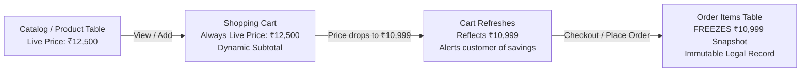
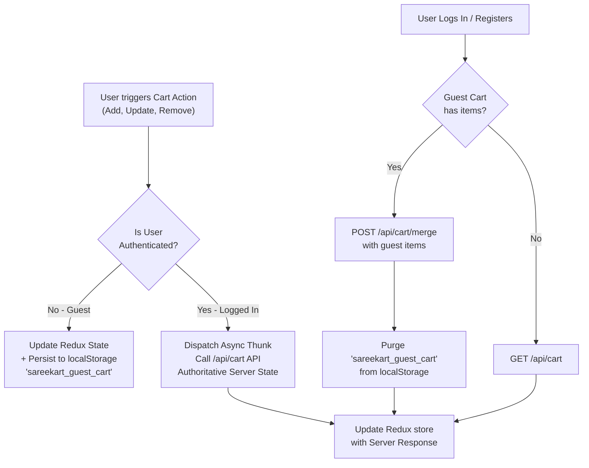

# SareeKart — Phase 4 Architecture Design Document
# Cart & Wishlist: Discovery, Synchronization Engine, and Unified State Architecture

> **Document Path:** `docs/phase-4-cart-wishlist.md`  
> **Status:** 🔍 PHASE 4 DISCOVERY & ARCHITECTURE COMPLETE (Awaiting User Implementation Approval)  
> **Preceding Milestones:**  
> - Phase 1 (Product + Image Lifecycle): ✅ 14/14 Scenarios Verified, Zero Defects, Image Isolation Frozen  
> - Phase 2 (Categories + Product Attributes): ✅ V24 Migration Complete, 199/199 Tests Passed, 100% Data Preservation  
> - Phase 3 (Search + Filtering): ✅ Multi-Faceted Query Engine Complete, 212/212 Backend Tests Passing, 8/8 Playwright E2E Tests Passing  
> **Current Milestone:** Phase 4 (Cart + Wishlist) — Discovery & Design Only (DO NOT CODE)

---

## 1. Executive Summary & Objective

In **Phase 1**, we secured atomic product-image lifecycle and cover isolation. In **Phase 2**, we established canonical artisanal taxonomy (categories, fabrics, occasions, colors). In **Phase 3**, we implemented a high-performance, multi-faceted search and filtering engine. 

The objective of **Phase 4** is to design a bulletproof, high-concurrency **Shopping Cart and Wishlist Architecture** for SareeKart. 

The system must:
1. Harmonize guest browsing with authenticated shopping via an atomic, intelligent merge strategy upon login.
2. Protect inventory integrity: items added to cart do **not** prematurely lock physical stock, but live stock telemetry is continuously validated on cart fetch and strictly enforced at checkout.
3. Guarantee database-level consistency with unique constraints preventing duplicate rows or corrupted quantities.
4. Establish true reactive synchronization between frontend Redux state, browser storage, and Spring Boot backend APIs.
5. Provide a seamless omnichannel foundation for downstream phases: Phase 5 (Orders & Checkout), Phase 6 (Customer Analytics & Behavioral Telemetry), Phase 7 (Neo4j Graph Database), Phase 8 (AI Recommendations), and Phase 10 (WhatsApp AI Commerce).

---

## 2. Current Architecture & Codebase Inspection (Baseline Audit)

We conducted an exhaustive audit of the existing Spring Boot backend, MySQL database, and React frontend.

### 2.1 Database Schema Inspection (`sareekart_db`)

| Table | Current Columns & Types | Keys & Constraints | Deficiencies / Vulnerabilities Identified |
|---|---|---|---|
| `carts` | `id` BIGINT (PK, Auto-Inc)<br>`user_id` BIGINT NOT NULL<br>`created_at` DATETIME(6)<br>`updated_at` DATETIME(6) | `PRIMARY KEY (id)`<br>`UNIQUE KEY (user_id)`<br>`FK (user_id) REFERENCES users(id)` | Healthy structure; 1:1 relationship with registered user. |
| `cart_items` | `id` BIGINT (PK, Auto-Inc)<br>`cart_id` BIGINT NOT NULL<br>`product_id` BIGINT NOT NULL<br>`quantity` INT NOT NULL | `PRIMARY KEY (id)`<br>`FK (cart_id) REFERENCES carts(id)`<br>`FK (product_id) REFERENCES products(id)` | **CRITICAL DEFICIENCY:** Lacks `UNIQUE KEY (cart_id, product_id)`. Concurrent add-to-cart clicks can spawn duplicate rows for the same product instead of incrementing `quantity`. |
| `wishlists` | `id` BIGINT (PK, Auto-Inc)<br>`user_id` BIGINT NOT NULL<br>`product_id` BIGINT NOT NULL | `PRIMARY KEY (id)`<br>`UNIQUE KEY (user_id, product_id)` | **DEFICIENCIES:**<br>1. Lacks Foreign Key constraints to `users(id)` and `products(id)`. If a product or user is deleted, orphan wishlist rows persist.<br>2. Lacks `created_at` timestamp, preventing "recently saved" sorting or aging analytics. |

### 2.2 Backend Service & API Audit

1. **`CartController.java` (`/api/cart`)**:
   - `GET /api/cart`: Returns `CartResponse`. Requires `@AuthenticationPrincipal User`.
   - `POST /api/cart/items`: Adds item via `CartItemRequest(productId, quantity)`.
   - `PUT /api/cart/items/{productId}?quantity=`: Updates quantity.
   - `DELETE /api/cart/items/{productId}`: Removes single product.
   - `DELETE /api/cart`: Clears entire cart.
   - **Gaps:** Lacks a bulk merge endpoint (`POST /api/cart/merge` or `POST /api/cart/sync`), forcing frontend workarounds. Lacks inventory headroom metadata in `CartItemResponse`.

2. **`CartServiceImpl.java` & `CartMapper.java`**:
   - `addItemToCart` checks `product.getStockQuantity() < requestedQuantity` and active state.
   - Does **not** reserve stock in inventory (`stockQuantity` remains unchanged in DB).
   - In `CartMapper.java`: Maps live product price (`item.getProduct().getPrice()`) and primary image (`images.get(0)`).
   - **Gaps:** `CartItemResponse` only exposes `id`, `productId`, `productName`, `productImage`, `price`, `quantity`, `totalPrice`. It does **not** inform the client if `product.getActive() == false`, if `product.getStockQuantity() < item.getQuantity()`, or what the max available stock is.

3. **`WishlistController.java` (`/api/wishlist`)**:
   - `GET /api/wishlist`: Returns `List<ProductResponse>`.
   - `POST /api/wishlist/{productId}`: Idempotent add.
   - `DELETE /api/wishlist/{productId}`: Deletes entry.
   - **Gaps:** Talks directly to repositories with no dedicated `WishlistService` interface. Lacks `GET /api/wishlist/count`, `POST /api/wishlist/move-to-cart/{productId}`, and `POST /api/wishlist/sync`.

4. **`OrderServiceImpl.java`**:
   - Line 53: Queries `cartRepository.findByUserId(userId)`.
   - Lines 60-70: Performs stock validation (`product.getStockQuantity() < item.getQuantity()`).
   - Line 159: Atomically decrements `product.setStockQuantity(stock - item.getQuantity())` and saves product.
   - Line 161: Freezes purchase-time price into immutable `OrderItem.price`.
   - Line 169: Calls `cartService.clearCart(userId)`.

### 2.3 Frontend State Management Audit

1. **`cartSlice.js`**: Operates purely as a local in-memory Redux slice (`items: []`). Does not talk to `/api/cart` on actions. Does not persist across browser reloads unless custom localStorage code is added.
2. **`CheckoutPage.jsx`**: Because the cart was not synced to the backend during browsing, `CheckoutPage.jsx` contains an ad-hoc sync loop:
   ```javascript
   await api.delete('/cart');
   for (const item of items) {
     await api.post('/cart/items', { productId: item.id, quantity: item.qty });
   }
   ```
   **Vulnerability:** This is fragile, un-atomic, and overwrites any existing cart items a user had stored on other devices.
3. **`WishlistPage.jsx`**: Uses hybrid logic: authenticated users call `/api/wishlist`, while guests read/write `localStorage['sareekart_wishlist']`. Moving an item to cart (`handleMoveToBag`) simply dispatches local `addToCart` and removes from wishlist without checking stock or backend sync.

---

## 3. Discovered Problems & Architectural Gaps

| Area | Current Behavior | Problem / Limitation | Target Phase 4 Architecture |
|---|---|---|---|
| **Database Concurrency** | No `UNIQUE(cart_id, product_id)` constraint in `cart_items` | Fast double-clicking "Add to Cart" or concurrent tabs can insert duplicate rows for the same product. | Add `uq_cart_items_cart_product` constraint in migration `V25`. Enforce upsert logic at service layer. |
| **Wishlist Referential Integrity** | Plain `BIGINT` columns without Foreign Keys in `wishlists` | Deleting a product or user leaves orphaned wishlist rows. No `created_at` timestamp. | Add FKs to `users(id)` and `products(id)` with `ON DELETE CASCADE`. Add `created_at DATETIME(6)`. |
| **Guest-to-User Merge** | Destructive clear-and-loop in `CheckoutPage.jsx` | Wipes remote cart; network drop mid-loop corrupts order payload; no inventory-aware conflict resolution. | Implement atomic bulk merge endpoint `POST /api/cart/merge` with capped stock consolidation. |
| **Stock Telemetry** | Cart response lacks inventory signals | Cart shows stale quantities even if another customer bought out the inventory. | Enrich `CartItemResponse` with `availableStock`, `isActive`, `isOutOfStock`, and `quantityExceedsStock`. |
| **Frontend State Sync** | Disconnected local Redux vs. Server Cart | Logged-in user sees empty cart on another device; refreshing page empties guest cart. | Dual-mode Redux Cart: Guest cart backed by `localStorage`, Authenticated cart backed by Spring Boot API. |
| **Wishlist to Cart Migration** | Non-atomic client-side dispatch | Moving out-of-stock saree to cart removes it from wishlist even if cart add fails. | Introduce atomic endpoint `POST /api/wishlist/move-to-cart/{productId}` with rollback safety. |

---

## 4. Proposed Cart Model & Business Rules

### 4.1 Cart Ownership Principle
- **Anonymous / Guest Users:** Cart state is owned strictly client-side (`localStorage['sareekart_guest_cart']` synchronized with Redux). Anonymous sessions do **not** write phantom cart records to the MySQL database. This prevents database bloat, indexing overhead, and abandoned cart garbage collection headaches caused by crawlers and unauthenticated visitors.
- **Authenticated Customers:** The database cart (`carts` and `cart_items`) is the single source of truth. Any mutation (`addItem`, `updateQuantity`, `removeItem`, `clearCart`) syncs immediately to `/api/cart`.

### 4.2 Cart Capabilities & Rules

1. **Add to Cart:**
   - If product is inactive (`active == false`): Reject with `400 Bad Request` ("Product is currently unavailable").
   - If requested quantity exceeds available stock (`stockQuantity < requested`): Cap at available stock or return validation error.
   - If product already exists in cart: Increment existing item's quantity, capped at `product.getStockQuantity()`.
2. **Quantity Updates:**
   - Allowed range: $1 \le \text{quantity} \le \min(\text{stockQuantity}, 10)$. (Per-order artisan safety cap).
   - Setting quantity to 0 removes the item.
3. **Cart Item Count & Subtotal:**
   - Item Count = $\sum \text{quantity}$ across all active cart items.
   - Subtotal = $\sum (\text{live price} \times \text{quantity})$.
4. **Product Deactivation / Out-of-Stock in Cart:**
   - Cart does **not** auto-delete unavailable items behind the user's back (which causes confusion).
   - Instead, the item is flagged with `quantityExceedsStock: true` or `isAvailable: false`. The UI renders an amber warning banner ("This saree has sold out since you added it") and disables the "Proceed to Checkout" CTA until resolved.

---

## 5. Proposed Wishlist Model & Business Rules

1. **Authentication Requirement:**
   - Guest visitors can save sarees to a local wishlist (`localStorage['sareekart_wishlist']`).
   - Logged-in customers persist wishlists to `wishlists` table in MySQL.
2. **Strict Duplicate Prevention:**
   - Database enforces `UNIQUE KEY (user_id, product_id)`.
   - `POST /api/wishlist/{productId}` uses idempotent semantics: if row exists, it returns `200 OK` ("Product already in wishlist") without throwing an error.
3. **Move from Wishlist to Cart:**
   - User clicks "Move to Bag":
     - Verify product is active and in stock.
     - Add to cart (`POST /api/cart/items`).
     - Upon successful addition, delete from wishlist (`DELETE /api/wishlist/{productId}`).
     - If out of stock: Display informative toast ("This saree is currently out of stock and remains in your wishlist").

---

## 6. Database Schema Design & Migration Specification

### Migration Script: `V25__enhance_cart_and_wishlist.sql`

```sql
-- =========================================================================
-- Migration V25: Enhance Cart and Wishlist Consistency & Integrity
-- =========================================================================

-- 1. Ensure cart_items cannot contain duplicate (cart_id, product_id) pairs
-- First, deduplicate any legacy data if present (keep the one with highest quantity)
DELETE c1 FROM cart_items c1
INNER JOIN cart_items c2 
WHERE c1.id < c2.id 
  AND c1.cart_id = c2.cart_id 
  AND c1.product_id = c2.product_id;

-- Add unique constraint on (cart_id, product_id)
ALTER TABLE cart_items
ADD CONSTRAINT uq_cart_items_cart_product UNIQUE (cart_id, product_id);

-- Add index on cart_items(product_id) for reverse lookups
CREATE INDEX idx_cart_items_product_id ON cart_items(product_id);

-- 2. Enhance wishlists table with created_at and Foreign Keys
ALTER TABLE wishlists
ADD COLUMN created_at DATETIME(6) DEFAULT CURRENT_TIMESTAMP(6);

-- Backfill created_at for existing rows
UPDATE wishlists SET created_at = NOW(6) WHERE created_at IS NULL;

-- Add Foreign Keys with CASCADE on delete so product/user cleanup is automatic
ALTER TABLE wishlists
ADD CONSTRAINT fk_wishlists_user FOREIGN KEY (user_id) REFERENCES users(id) ON DELETE CASCADE,
ADD CONSTRAINT fk_wishlists_product FOREIGN KEY (product_id) REFERENCES products(id) ON DELETE CASCADE;

-- Add index for user's recent wishlist queries
CREATE INDEX idx_wishlists_user_created ON wishlists(user_id, created_at DESC);
```

### Entity Annotations (`CartItem.java` & `Wishlist.java`)

```java
// CartItem.java
@Entity
@Table(name = "cart_items", uniqueConstraints = {
    @UniqueConstraint(name = "uq_cart_items_cart_product", columnNames = {"cart_id", "product_id"})
})
public class CartItem { ... }

// Wishlist.java
@Entity
@Table(name = "wishlists", uniqueConstraints = {
    @UniqueConstraint(name = "uk_wishlists_user_product", columnNames = {"user_id", "product_id"})
})
public class Wishlist {
    @Id
    @GeneratedValue(strategy = GenerationType.IDENTITY)
    private Long id;

    @ManyToOne(fetch = FetchType.LAZY)
    @JoinColumn(name = "user_id", nullable = false)
    private User user;

    @ManyToOne(fetch = FetchType.LAZY)
    @JoinColumn(name = "product_id", nullable = false)
    private Product product;

    @CreationTimestamp
    @Column(name = "created_at", nullable = false, updatable = false)
    private LocalDateTime createdAt;
}
```

---

## 7. Product Relationship & Snapshot Discipline

- **No Premature Denormalization:** Cart and Wishlist records store **only** `product_id` references. They do **not** duplicate name, fabric, occasion, or image URLs into `cart_items` or `wishlists` tables.
- **Dynamic Presentation:** When cart or wishlist data is queried, JPA joins or DTO mappers fetch live product details (name, active status, available stock, current price, primary image from Phase 1).
- **Order Boundary Separation:** Immutable historical snapshots (`purchased_price`, `product_name_at_purchase`, `sku`) are created **only** when an order is finalized in Phase 5 (`order_items`).

---

## 8. Inventory Interaction & Zero Pre-Reservation Model

### The E-Commerce Principle
SareeKart sells unique, high-value handloom sarees (often with limited artisan stock of 1–5 units per design). 
**We do NOT lock or decrement `stockQuantity` when an item is placed in a cart.** 

#### Why?
Reserving inventory on "Add to Cart" creates severe inventory locking vulnerabilities:
- Malicious users or bots can add sarees to carts and hold them hostage indefinitely.
- Authentic buyers are falsely told an item is "Out of Stock".
- Abandoned carts require complex timeout schedulers and rollback background jobs.

#### The Safe Inventory Strategy
1. **At "Add to Cart" time:** Check `requestedQuantity <= product.getStockQuantity()`. If false, reject or cap.
2. **At "View Cart" time:** Compare `cartItem.getQuantity()` against current live `product.getStockQuantity()`. Flag any discrepancies in the response:
   - `isAvailable = product.getActive() && product.getStockQuantity() > 0`
   - `quantityExceedsStock = item.getQuantity() > product.getStockQuantity()`
   - `availableStock = product.getStockQuantity()`
3. **At "Order Placement" time (`createOrder`):** Execute an atomic database transaction with `PESSIMISTIC_WRITE` or conditional update (`UPDATE products SET stock_quantity = stock_quantity - :qty WHERE id = :id AND stock_quantity >= :qty`). If inventory was taken by another buyer seconds prior, the transaction cleanly rolls back and alerts the customer.

---

## 9. Price Behavior: Live Price vs. Historical Snapshot



- **In Cart:** Price is **always dynamic and live**. If an artisan discounts a saree, the customer immediately sees the lower price in their cart. If a promotion ends, the cart updates to the standard price with a friendly notice.
- **In Order:** Price is **immutable**. Once `createOrder()` executes, the purchase price is frozen in `order_items.price` and will never change.

---

## 10. Guest Cart & Atomic Login Merge Strategy

### The Merge Scenario
A customer browses anonymously, adding Sarees to their guest cart. They then log in or register.

```
Guest LocalStorage:
- Saree A (Qty: 2)
- Saree B (Qty: 1)

Customer DB Cart:
- Saree A (Qty: 3)
- Saree C (Qty: 1)
```

### The Conflict Resolution Policy: **Capped Summation**
When the customer logs in:
1. Saree C: Persists in cart (Qty: 1).
2. Saree B: Added to customer cart (Qty: 1).
3. Saree A: Quantities are summed: $2 + 3 = 5$.
   - **Crucial Rule:** The combined quantity is **strictly capped** at current available inventory:
     $$\text{Final Quantity} = \min(5, \text{product.getStockQuantity()}, 10)$$
4. Once merge completes successfully, the frontend purges `localStorage['sareekart_guest_cart']`.

### Why Capped Summation is the Safest Convention:
- **Never Loses Intent:** The shopper intended to purchase both the items they added on mobile (while logged out) and the items they previously saved on desktop.
- **Prevents Overselling:** Capping at `stockQuantity` guarantees the cart never requests more items than physically exist.
- **Per-Customer Limit:** Capping at 10 prevents accidental bulk hoard entries.

---

## 11. REST API Specification & Contract

### 11.1 Cart Endpoints (`/api/cart`)

| Method | Endpoint | Auth | Request Body / Params | Response Body | Description |
|---|---|---|---|---|---|
| `GET` | `/api/cart` | Required | None | `ApiResponse<CartResponse>` | Returns user's cart with live pricing and stock telemetry. |
| `POST` | `/api/cart/items` | Required | `{ "productId": 10, "quantity": 1 }` | `ApiResponse<CartResponse>` | Adds item or increments existing item quantity. |
| `PUT` | `/api/cart/items/{productId}` | Required | `?quantity=3` | `ApiResponse<CartResponse>` | Updates quantity for specific product (0 = delete). |
| `DELETE` | `/api/cart/items/{productId}` | Required | None | `ApiResponse<CartResponse>` | Removes product from cart. |
| `DELETE` | `/api/cart` | Required | None | `ApiResponse<Void>` | Empties the cart. |
| `POST` | `/api/cart/merge` | Required | `{ "items": [{ "productId": 10, "quantity": 2 }] }` | `ApiResponse<CartResponse>` | **NEW:** Merges guest cart items into authenticated cart atomically. |

### 11.2 Wishlist Endpoints (`/api/wishlist`)

| Method | Endpoint | Auth | Request Body / Params | Response Body | Description |
|---|---|---|---|---|---|
| `GET` | `/api/wishlist` | Required | None | `ApiResponse<List<WishlistItemResponse>>` | Returns all saved wishlist items with product details. |
| `GET` | `/api/wishlist/count` | Required | None | `ApiResponse<Long>` | Lightweight badge counter for header navigation. |
| `POST` | `/api/wishlist/{productId}` | Required | None | `ApiResponse<Void>` | Idempotently adds product to wishlist. |
| `DELETE` | `/api/wishlist/{productId}` | Required | None | `ApiResponse<Void>` | Removes product from wishlist. |
| `POST` | `/api/wishlist/move-to-cart/{productId}` | Required | None | `ApiResponse<CartResponse>` | **NEW:** Atomically moves item from wishlist to cart if in stock. |
| `POST` | `/api/wishlist/sync` | Required | `{ "productIds": [1, 5, 12] }` | `ApiResponse<List<WishlistItemResponse>>` | **NEW:** Merges guest wishlist into database upon login. |

### 11.3 Enriched DTO Payloads

#### `CartResponse` & `CartItemResponse`
```json
{
  "success": true,
  "message": "Cart retrieved successfully",
  "data": {
    "id": 42,
    "userId": 7,
    "totalPrice": 38499.00,
    "totalItems": 3,
    "hasStockIssues": false,
    "items": [
      {
        "id": 101,
        "productId": 14,
        "productName": "Royal Kanchipuram Pure Silk Saree",
        "productImage": "/uploads/products/kanchi-royal-gold-1.jpg",
        "price": 18500.00,
        "quantity": 2,
        "totalPrice": 37000.00,
        "availableStock": 8,
        "isActive": true,
        "isOutOfStock": false,
        "quantityExceedsStock": false
      }
    ]
  }
}
```

---

## 12. Security & Server-Side Authorization

1. **Authentication Gate:**
   - Spring Security requires `authenticated()` for `/api/cart/**` and `/api/wishlist/**`.
   - `401 Unauthorized` is returned if JWT token is missing or expired.
2. **User Cart Isolation:**
   - Cart access is resolved strictly via `@AuthenticationPrincipal User user` (`user.getId()`).
   - The user ID is never passed as a client query param or path variable in customer endpoints.
   - **Verification Guarantee:** Customer A can never read, modify, or clear Customer B's cart or wishlist.
3. **Input Validation:**
   - `@Min(1)` and `@Max(10)` constraints on `CartItemRequest.quantity`.
   - Rejection of negative or zero numbers in `updateItemQuantity`.

---

## 13. Frontend UX & Dual-Mode State Architecture

### 13.1 UX Touchpoints
1. **Header Navigation:**
   - Dynamic Cart Badge: Displays real-time item count.
   - Dynamic Wishlist Badge: Displays real-time saved count.
   - Clicking Cart opens the sliding **CartDrawer** or navigates to `/cart`.
2. **Product Card & Details:**
   - "Add to Bag" button with optimistic UI, spinner state, and success toast / `AddedToCartModal`.
   - Heart Wishlist toggle button: Toggles active state immediately with smooth spring animation.
3. **Dedicated Cart Page (`/cart`):**
   - Clean tabular layout with high-res Phase 1 product image thumbnails.
   - Quantity stepper (`-`, `number`, `+`) with disabled states when reaching stock limit.
   - Per-item delete action and confirmation.
   - Order summary sticky sidebar with Subtotal, Shipping (Free over ₹5,000), and "Proceed to Checkout" CTA.
   - Out-of-stock notification banners highlighting affected items with an option to "Move to Wishlist".
4. **Dedicated Wishlist Page (`/wishlist`):**
   - Responsive grid of saved sarees.
   - Direct "Move to Bag" button.
   - Out-of-stock badges.

### 13.2 Redux Dual-Mode Architecture



---

## 14. Edge Cases & Resilience Strategy

| Edge Case | Failure Mode / Threat | System Defense & UX Solution |
|---|---|---|
| **Double-Click Add to Cart** | Duplicate rows or duplicate increments | Client disables button during flight; database `uq_cart_items_cart_product` blocks concurrent duplicate inserts; service uses upsert. |
| **Product Deleted by Admin** | Cart references non-existent product ID | DTO mapper filters out or marks as `isAvailable: false`; user is notified: "This item is no longer available" with a 1-click remove option. |
| **Product Deactivated** | Inactive product purchased | `isActive: false` flagged; checkout button blocked until customer removes inactive saree. |
| **Stock Reduced Below Cart Qty** | Customer holds 3, inventory drops to 1 | `quantityExceedsStock: true`; UI notifies: "Only 1 saree available. Quantity adjusted to available stock." |
| **Price Change While in Cart** | Saree price increases or drops | Cart fetches live price dynamically; banner highlights: "Price updated for [Saree Name]". |
| **Multiple Tabs Open** | Tab A adds item, Tab B stale | `window.addEventListener('storage')` for guest mode; server refetch on window focus for authenticated mode. |
| **Network Outage / API Error** | Request hangs or fails | Redux rollbacks optimistic updates; renders non-blocking toast: "Unable to update cart. Please check your connection." |
| **Session Expiration** | Token expires while shopping | Seamlessly preserve cart state locally, prompt gentle login modal, and resume seamlessly after re-authentication. |

---

## 15. Future System Compatibility

### 15.1 Phase 5: Orders & Checkout Integration
- The cart structure seamlessly feeds into `OrderServiceImpl.createOrder()`.
- Cart items supply `productId` and `quantity`.
- Order creation captures immutable snapshots: `order_items.price`, `order_items.product_name`, and deducts physical inventory in a single atomic transaction.

### 15.2 Phase 6: Customer Behavior & Analytics Telemetry
- Dedicated telemetry hooks designed into cart/wishlist actions:
  - `trackEvent('ADD_TO_CART', { productId, categoryId, fabricId, price })`
  - `trackEvent('REMOVE_FROM_CART', { productId })`
  - `trackEvent('WISHLIST_ADD', { productId })`
  - `trackEvent('WISHLIST_REMOVE', { productId })`
  - `trackEvent('CART_ABANDONMENT', { items, subtotal })` (triggered on uncompleted cart sessions)

### 15.3 Phase 7: Neo4j Knowledge Graph Integration
- Relational cart/wishlist records map cleanly to graph edges:
  - `(:User {id: 7})-[:ADDED_TO_CART {quantity: 1, at: datetime()}]->(:Product {id: 14})`
  - `(:User {id: 7})-[:WISHLISTED {at: datetime()}]->(:Product {id: 14})`
  - `(:Product {id: 14})-[:BELONGS_TO]->(:Category {slug: 'kanchipuram-silk'})`
- This enables real-time graph collaborative filtering: *"Customers who added this Kanchipuram saree to their cart also explored these Banarasi weaves."*

### 15.4 Phase 10: WhatsApp AI Shopping Assistant
- Carts and wishlists can be retrieved or synced via WhatsApp webhook by matching the customer's phone number to `users.phone`.
- Customer messages: *"Show my bag"* $\to$ AI assistant responds with current cart items, live pricing, and 1-click checkout link.

---

## 16. Comprehensive Test & Verification Strategy

### 16.1 Automated Backend Tests (`CartServiceTest.java`, `WishlistServiceTest.java`)
- Unit tests for Cart operations:
  - Add new item to empty cart.
  - Add existing item (verifies quantity increment).
  - Add item exceeding available stock (verifies capping/exception).
  - Update quantity (valid, zero = remove, negative = error).
  - Remove item.
  - Clear cart.
  - Merge guest cart items into user cart with stock capping.
- Unit tests for Wishlist operations:
  - Add to wishlist (idempotent; duplicate calls succeed without error).
  - Remove from wishlist.
  - Move from wishlist to cart (success case & out-of-stock case).
  - Wishlist count query.
- Security tests:
  - User A cannot access or mutate User B's cart or wishlist.

### 16.2 Playwright End-to-End Tests (`cart-wishlist.spec.js`)
- Guest user: Add item to cart $\to$ verify badge count $\to$ reload page $\to$ verify persistence.
- Guest user: Add item to wishlist $\to$ verify saved page $\to$ reload page $\to$ verify persistence.
- User login merge: Add items as guest $\to$ log in $\to$ verify items merged into database cart $\to$ verify localStorage cleared.
- Out-of-stock indicator: Verify visual warnings and disabled checkout button when quantity exceeds inventory.
- Move from Wishlist to Cart: Verify item is added to cart drawer and removed from wishlist.

---

## 17. Risks & Mitigation Strategies

| Risk | Impact | Mitigation Strategy |
|---|---|---|
| **Duplicate Database Rows** | Medium | Migration `V25` adds `uq_cart_items_cart_product` constraint; database physically rejects duplicates. |
| **Orphan Wishlist Records** | Low | Foreign Keys with `ON DELETE CASCADE` ensure product or user deletions automatically purge associated wishlist rows. |
| **Over-reservation / Cart Hoarding** | High | Zero pre-reservation policy. Cart never decreases `stockQuantity`; inventory is deducted solely upon finalized order placement. |
| **Stale Price Shock** | Medium | Live price is always queried and displayed in cart. If price changed, UI provides an explicit notification badge. |
| **Destructive Sync Overwrite** | High | Replace `CheckoutPage.jsx` destructive `DELETE /cart` + loop with atomic `POST /api/cart/merge`. |

---

## 18. Open Decisions for User Review

1. **Guest Cart Expiration Window:**
   - *Recommendation:* Keep guest cart in browser `localStorage` for 30 days or until cleared by user.
2. **Wishlist Retention:**
   - *Recommendation:* Permanent retention for authenticated users until explicitly removed.
3. **Cart Item Maximum Cap:**
   - *Recommendation:* Capped at $\min(\text{availableStock}, 10)$ per SKU to protect artisanal handloom stock from single-buyer bulk hoarding.

---

## 19. Discovery Sign-Off Checklist

- [x] Phase 1 Image Lifecycle: 100% Preserved & Untouched
- [x] Phase 2 Taxonomy: 100% Preserved & Untouched
- [x] Phase 3 Search & Filter: 100% Preserved & Untouched
- [x] Database Schema Analyzed & Migration `V25` Designed
- [x] API Contract & DTO Encodings Specified
- [x] Concurrency & Unique Constraints Formulated
- [x] Zero-Reservation Inventory Policy Validated
- [x] Guest Merge Algorithm with Capped Summation Formalized
- [x] Future Phases (Orders, Analytics, Neo4j, WhatsApp) Mapped

---

## 20. Conclusion & Next Steps

Phase 4 Discovery and Architecture is complete. All existing capabilities, database schemas, frontend slices, and integration pathways have been analyzed. 

**DO NOT WRITE CODE OR EXECUTE MIGRATIONS YET.** Awaiting user review and formal authorization to proceed to Phase 4 implementation.
