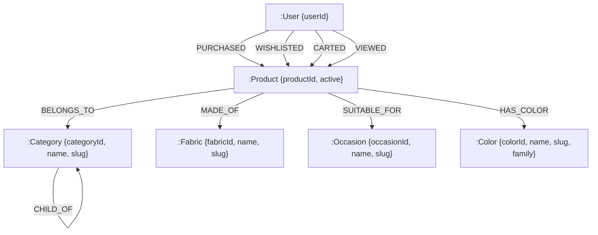
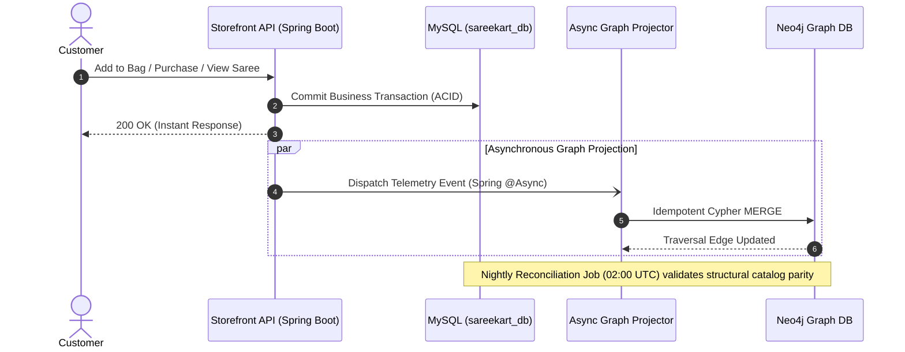

# SareeKart — Phase 7: Neo4j Knowledge Graph Architecture & Implementation Report

> **Document Status:** ✅ IMPLEMENTED & VERIFIED (Phase 7 Complete)  
> **Preceding Phases (Frozen):**  
> - Phase 1 (Product + Image Lifecycle): ✅ Preserved & Frozen  
> - Phase 2 (Categories + Product Attributes): ✅ Preserved & Frozen  
> - Phase 3 (Search + Filtering): ✅ Preserved & Frozen  
> - Phase 4 (Cart + Wishlist): ✅ Preserved & Frozen  
> - Phase 5 (Orders + Inventory): ✅ Preserved & Frozen  
> - Phase 6 (Customer Behavior + Telemetry): ✅ Preserved & Verified (`4e5ada8`)  
> **Current Status:** Phase 7 — Neo4j Knowledge Graph: ✅ COMPLETE & VERIFIED


---

## Executive Summary & Core Objective

The primary objective of Phase 7 is to design an enterprise-grade Knowledge Graph layer using Neo4j that strictly complements MySQL. 

```
                                 SAREEKART ARCHITECTURE
                                           │
                    ┌──────────────────────┴──────────────────────┐
                    ↓                                             ↓
            MySQL (Port 3306)                             Neo4j (Port 7687)
         Authoritative Source of Truth                    Relationship & Traversal Layer
                    │                                             │
      • Products & Pricing                           • Customer ↔ Product Interactions
      • Inventory & Stock Decrements                 • Customer ↔ Heritage Weave Affinities
      • Orders, Payments & Invoices                  • Product ↔ Category & Fabric Taxonomy
      • Authentication & PII                         • Product ↔ Occasion & Color Family
      • Cart & Wishlist Transaction State            • Co-view & Co-purchase Traversal Graphs
      • Immutable Event Stream (customer_events)     • Recommendation Candidate Generation
```

### Critical Architectural Mandate:
**Neo4j must NEVER become the source of truth for transactional e-commerce state.**
- MySQL remains the sole authoritative source of truth for pricing, inventory quantity, order status, payments, users, authentication, cart contents, and customer master records.
- Neo4j stores **zero PII**, **zero payment credentials**, **zero physical stock quantities**, and **zero volatile cart records**.
- Neo4j functions exclusively as a read-optimized, index-free adjacency graph traversal engine that maps structural catalog taxonomy and customer behavioral connections.

---

## 1. Current Architecture & Database Inspection

A rigorous audit of the active `sareekart_db` MySQL database (2026-09-15) reveals the exact catalog and behavioral dimensions:

### Actual MySQL Table Counts:
| Table | Row Count | Primary Key | Key Relationships / Foreign Keys |
|---|---|---|---|
| `products` | **25** | `id` (BIGINT) | `category_id -> categories`, `fabric_id -> fabrics`, `occasion_id -> occasions`, `color_id -> colors` |
| `categories` | **8** | `id` (BIGINT) | `parent_id -> categories(id)` (nullable self-reference for tree hierarchy) |
| `fabrics` | **10** | `id` (BIGINT) | Unique `slug`, `name` |
| `occasions` | **8** | `id` (BIGINT) | Unique `slug`, `name` |
| `colors` | **23** | `id` (BIGINT) | Unique `slug`, `name`, plus `family` grouping (e.g. Red, Blue, Pink, Gold) |
| `product_images` | **22** | `id` (BIGINT) | `product_id -> products(id)`, `is_primary`, `display_order` |
| `users` | **12** | `id` (BIGINT) | Authentication, role, email, phone |
| `orders` | **48** | `id` (BIGINT) | `user_id -> users(id)`, status, `total_amount`, shipping address |
| `order_items` | **64** | `id` (BIGINT) | `order_id -> orders(id)`, `product_id -> products(id)`, price, quantity |
| `carts` | **4** | `id` (BIGINT) | `user_id -> users(id)` (unique per customer) |
| `cart_items` | **2** | `id` (BIGINT) | `cart_id -> carts`, `product_id -> products`, `uq_cart_items_cart_product` |
| `wishlists` | **0** | `id` (BIGINT) | `user_id -> users`, `product_id -> products` |
| `customer_events` | **31** | `id` (BIGINT) | 11 event taxonomy, `session_id`, `user_id`, `client_event_id` |
| `reviews` | **6** | `id` (BIGINT) | `product_id -> products`, `user_id -> users`, rating, comment |

### Architectural Insights:
1. **Normalized Attribute Hierarchy**: Products in SareeKart already reference normalized foreign keys (`category_id`, `fabric_id`, `occasion_id`, `color_id`).
2. **Color Families**: The `colors` table contains a canonical `family` column (`family VARCHAR(50)`), allowing grouping of individual color variants (e.g., Maroon, Crimson, Ruby into family `Red`).
3. **Event Ingestion**: Phase 6 has already captured structured JSON events with `entity_id` and rich metadata (`dwellTimeMs`, `fabric`, `color`, `price`, `resultCount`), providing high-quality raw signals for graph projection.

---

## 2. Graph Purpose: Why Neo4j vs. MySQL?

Graph databases are not drop-in replacements for relational databases; they solve specific traversal queries that are computationally prohibitive in relational engines.

| Use Case | MySQL Query Complexity | Neo4j Graph Traversal | Why Neo4j Wins |
|---|---|---|---|
| **Co-Purchased Sarees** ("Frequently bought together") | Self-join on `order_items` grouped by `product_id`: requires scanning all order rows, sorting, and quadratic joins ($O(N^2)$). | `(p1:Product)<-[:PURCHASED]-(:User)-[:PURCHASED]->(p2:Product)` | Traverses only connected edges in sub-millisecond index-free adjacency. |
| **Co-Viewed Sarees** ("Customers who viewed this also viewed") | Full-table self-join on `customer_events` table (millions of rows in production). Severe query degradation. | `(p1:Product)<-[:VIEWED]-(:User)-[:VIEWED]->(p2:Product)` | Evaluated instantly across memory-mapped edge pointers. |
| **Multi-Hop Customer Affinity** ("Find sarees matching user's preferred weave + color family + occasion") | 5-table JOIN (`products`, `categories`, `fabrics`, `colors`, `occasions`) plus subqueries on user's past orders and views. | `(u:User)-[:AFFINITY_TO]->(attr)<-[:HAS_ATTRIBUTE]-(p:Product)` | Natural path traversal with path weights; no expensive table joins. |
| **Similar Customer Taste Walk** ("Customers like you also loved") | Multi-way relational matrix multiplication requiring temporary tables or offline batch jobs. | `(u1:User)-[:PURCHASED|WISHLISTED]->(p)<-[:PURCHASED|WISHLISTED]-(u2:User)-[:PURCHASED]->(rec:Product)` | Clean 3-hop traversal executed in $< 5$ ms. |
| **Catalog Heritage Taxonomies** | Recursive common table expressions (CTEs) for nested categories and weaves. | `(c:Category)-[:CHILD_OF*]->(parent:Category)` | Native variable-length path traversal `[:CHILD_OF*1..3]`. |

---

## 3. Node Model Specification

To prevent graph bloat and redundant storage, only 6 node labels are proposed. All IDs correspond exactly to MySQL primary keys.



### Node Specifications:

#### 1. `(:Product)`
- **Identity Key**: `productId: Long` (matches `products.id` in MySQL).
- **Required Properties**:
  - `productId: Long` (Indexed, Unique constraint)
  - `active: Boolean` (Default: `true`)
- **Optional Properties**: None (Price, stock, description, and images stay in MySQL).
- **Source of Truth**: MySQL `products` table.

#### 2. `(:User)`
- **Identity Key**: `userId: Long` (matches `users.id` in MySQL).
- **Required Properties**:
  - `userId: Long` (Indexed, Unique constraint)
- **Optional Properties**:
  - `priceSensitivity: String` (`"BUDGET" | "MID_MARKET" | "LUXURY"`)
  - `createdAt: DateTime`
- **Exclusions**: **NO** names, emails, passwords, phones, or addresses. PII is strictly excluded.
- **Source of Truth**: MySQL `users` table.

#### 3. `(:Category)`
- **Identity Key**: `categoryId: Long` (matches `categories.id` in MySQL).
- **Required Properties**:
  - `categoryId: Long` (Indexed, Unique constraint)
  - `name: String`
  - `slug: String`
- **Source of Truth**: MySQL `categories` table.

#### 4. `(:Fabric)`
- **Identity Key**: `fabricId: Long` (matches `fabrics.id` in MySQL).
- **Required Properties**:
  - `fabricId: Long` (Indexed, Unique constraint)
  - `name: String`
  - `slug: String`
- **Source of Truth**: MySQL `fabrics` table.

#### 5. `(:Occasion)`
- **Identity Key**: `occasionId: Long` (matches `occasions.id` in MySQL).
- **Required Properties**:
  - `occasionId: Long` (Indexed, Unique constraint)
  - `name: String`
  - `slug: String`
- **Source of Truth**: MySQL `occasions` table.

#### 6. `(:Color)`
- **Identity Key**: `colorId: Long` (matches `colors.id` in MySQL).
- **Required Properties**:
  - `colorId: Long` (Indexed, Unique constraint)
  - `name: String`
  - `slug: String`
  - `family: String` (e.g. "Red", "Pink", "Gold")
- **Source of Truth**: MySQL `colors` table.

---

## 4. Relationship Model Specification

Relationships are categorized into **Structural Catalog Relationships** (static master data) and **Behavioral Interaction Relationships** (derived from telemetry and transactions).

### A. Structural Catalog Relationships:
1. `(:Product)-[:BELONGS_TO]->(:Category)`
2. `(:Product)-[:MADE_OF]->(:Fabric)`
3. `(:Product)-[:SUITABLE_FOR]->(:Occasion)`
4. `(:Product)-[:HAS_COLOR]->(:Color)`
5. `(:Category)-[:CHILD_OF]->(:Category)` (Category hierarchy)

### B. Customer Interaction Relationships:
1. **`(:User)-[:PURCHASED]->(:Product)`**
   - Properties: `orderCount: Integer`, `totalSpent: Float`, `firstPurchasedAt: DateTime`, `lastPurchasedAt: DateTime`.
2. **`(:User)-[:WISHLISTED]->(:Product)`**
   - Properties: `active: Boolean`, `addedAt: DateTime`, `updatedAt: DateTime`.
3. **`(:User)-[:CARTED]->(:Product)`**
   - Properties: `count: Integer`, `lastAddedAt: DateTime`.
4. **`(:User)-[:VIEWED]->(:Product)`**
   - Properties: `count: Integer`, `totalDwellTimeMs: Integer`, `firstViewedAt: DateTime`, `lastViewedAt: DateTime`.
5. **`(:User)-[:AFFINITY_TO]->(:Fabric | :Color | :Category | :Occasion)`**
   - Derived affinity edge for fast recommendation biasing.
   - Properties: `weight: Float`, `lastInteractedAt: DateTime`.

---

## 5. Event-to-Graph Mapping Matrix

Mapping rules from Phase 6's 11 event taxonomy to Neo4j graph operations:

| Phase 6 Event Type | Neo4j Graph Action | Target Relationship / Properties | Aggregation Logic |
|---|---|---|---|
| `PRODUCT_VIEW` | Upsert Edge | `(:User)-[:VIEWED]->(:Product)` | `r.count += 1`, `r.totalDwellTimeMs += dwell`, `r.lastViewedAt = timestamp` |
| `ADD_TO_CART` | Upsert Edge | `(:User)-[:CARTED]->(:Product)` | `r.count += 1`, `r.lastAddedAt = timestamp` |
| `REMOVE_FROM_CART` | No Edge Deletion | Retain historical interest | Does not delete `[:CARTED]`; cart friction is analyzed via MySQL telemetry. |
| `ADD_TO_WISHLIST` | Upsert Edge | `(:User)-[:WISHLISTED]->(:Product)` | `SET r.active = true, r.addedAt = timestamp` |
| `REMOVE_FROM_WISHLIST`| Property Update | `(:User)-[:WISHLISTED]->(:Product)` | `SET r.active = false, r.removedAt = timestamp` |
| `CHECKOUT_INITIATED` | MySQL Telemetry Only | None in Neo4j | High-volume transient funnel step; does not warrant a permanent graph edge. |
| `ORDER_COMPLETED` | Upsert Edge | `(:User)-[:PURCHASED]->(:Product)` | `r.orderCount += 1`, `r.totalSpent += amount`, `r.lastPurchasedAt = timestamp` |
| `SEARCH_QUERY` | Conditional Edge | `(:User)-[:SEARCHED_FOR]->(AttributeNode)` | If query matches a known Fabric, Occasion, or Color, increments attribute affinity. |
| `CATEGORY_VIEW` | Property Update | `(:User)-[:AFFINITY_TO]->(:Category)` | Increments category affinity score by +1. |
| `AI_STYLIST_ENGAGE` | Attribute Bias | `(:User)-[:AFFINITY_TO]->(:Occasion|:Color)` | High-weight taste signal (+5) to consulted attributes. |
| `VISUAL_SEARCH_ENGAGE`| Attribute Bias | `(:User)-[:AFFINITY_TO]->(:Fabric|:Color)` | Increments affinity to visually matched weave/color. |

---

## 6. Temporal Strategy: Edge Aggregation vs. Event Log

### The Decision:
Should every event create a separate relationship, or should relationships be aggregated per entity pair?

```
Option A: One Edge Per Event (Anti-Pattern)
(:User)-[:VIEWED {at: t1}]->(:Product)
(:User)-[:VIEWED {at: t2}]->(:Product)
(:User)-[:VIEWED {at: t3}]->(:Product)
... (Creates 100+ dense edges between same User and Product)

Option B: Aggregated Temporal Edge (Approved Strategy)
(:User)-[:VIEWED {
    count: 14,
    totalDwellTimeMs: 142000,
    firstSeen: "2026-08-01T10:00:00Z",
    lastSeen: "2026-09-14T19:30:00Z",
    recencyScore: 0.88
}]->(:Product)
```

### Justification:
1. **Graph Density & Supernodes**: An e-commerce visitor viewing the same saree 20 times would create 20 edges under Option A. Over 100K users, this generates millions of redundant edges and drastically degrades graph traversal performance (dense node edge-walking penalty).
2. **Deterministic Bounded Scale**: Under Option B, between any single `(:User)` and `(:Product)`, there is at most **one** `[:VIEWED]` edge, **one** `[:CARTED]` edge, **one** `[:WISHLISTED]` edge, and **one** `[:PURCHASED]` edge.
3. **Decay Calculation**: Time decay is calculated mathematically from `lastSeen` during traversal:
   $$\text{Weight} = \text{BaseWeight} \times e^{-\lambda \cdot (\text{now} - \text{lastSeen})}$$

---

## 7. Guest Identity Strategy

### The Problem:
Visitors browse anonymously before authenticating. Should guest `sessionId`s become graph nodes?

### Architectural Decision:
**No `(:Session)` nodes in Neo4j. Guest activity is staged in MySQL only.**

1. **Memory Preservation**: Over 70% of guest sessions are single-visit bounces. Storing ephemeral session UUIDs in Neo4j creates graph pollution and fragments traversal paths.
2. **Zero PII Exposure**: Guest session UUIDs never pollute customer recommendation graphs.
3. **Identity Resolution on Login**:
   - When a guest signs in or registers, MySQL executes `POST /api/events/identify` (Phase 6).
   - Once the user is authenticated, the backend projection worker retrieves the user's aggregated session history from MySQL and projects the consolidated relationships directly onto the authenticated `(:User)` node in Neo4j.

---

## 8. Source of Truth Matrix

| Domain Data | Authoritative Source of Truth | Neo4j Role | Conflict Resolution Rule |
|---|---|---|---|
| Product Price | **MySQL** (`products.price`) | **None** | MySQL always wins; Neo4j never stores price. |
| Physical Stock & Inventory | **MySQL** (`products.stock_quantity`) | **None** | MySQL locks inventory atomically; Neo4j is never checked for stock. |
| Order Creation & Payment | **MySQL** (`orders`, `payments`) | **None** | Financial and legal transactions live strictly in MySQL. |
| User Authentication & Passwords | **MySQL** (`users.password`) | **None** | Neo4j has zero credential information. |
| Active Cart Contents | **MySQL** (`cart_items`) | **None** | Checkout reads MySQL cart only. |
| Product Active Status | **MySQL** (`products.active`) | Mirrored (`p.active`) | MySQL triggers update to `p.active` in Neo4j. |
| Category & Attribute Master Data| **MySQL** (`categories`, `fabrics`, etc.) | Mirrored (`name`, `slug`) | MySQL admin updates trigger idempotent sync to Neo4j. |
| Customer-Product Behavioral Graph | **Neo4j** (Relationship Layer) | **Authoritative Traversal** | Neo4j is authoritative for path queries and candidate generation. |

---

## 9. Synchronization Architecture

To keep Neo4j synchronized with MySQL without compromising e-commerce latency, five synchronization patterns were evaluated:

### Options Comparison:
| Pattern | Reliability | Complexity | Latency | Commerce Failure Risk | Recommended? |
|---|---|---|---|---|---|
| **A. Application Dual-Write** (Direct write to both DBs) | Low (Distributed partial failure risk) | Low | High (Adds Neo4j latency to API requests) | **High** (Neo4j timeout breaks user request) | ❌ NO |
| **B. Transactional Outbox Pattern** (Outbox table in MySQL) | Very High (Guaranteed at-least-once) | Medium | Sub-second | **Zero** (Decoupled from user transaction) | ✅ **RECOMMENDED FOR PRODUCTION** |
| **C. Asynchronous Spring Event Buffer** | High | Low | Real-time (< 500ms) | **Zero** (In-memory worker handles retry) | ✅ **RECOMMENDED FOR DEV/CURRENT SCALE** |
| **D. Scheduled Batch Sync** (Cron job every $N$ minutes) | High | Very Low | High (Minutes lag) | **Zero** | ✅ **RECOMMENDED FOR DAILY RECONCILIATION** |
| **E. Change Data Capture (CDC)** (Debezium + Kafka) | Very High | Very High (Requires ZooKeeper/Kafka/Debezium) | Sub-second | **Zero** | ❌ Overkill for current scale |

### Recommended Hybrid Synchronization Design:



1. **Real-Time Projection**: When a customer performs an interaction, the Spring Boot service dispatches an asynchronous in-memory event (`@Async`) to `Neo4jGraphProjector`. The projector executes an idempotent Cypher `MERGE`.
2. **Nightly Parity Job**: A lightweight cron task (`Neo4jReconciliationJob`) runs at 02:00 UTC, scanning MySQL's 25 products and master attributes to heal any missed catalog nodes or relationships.

---

## 10. Failure Handling & Non-Blocking Guarantee

### The Iron Rule:
**If Neo4j is completely offline, down, or unreachable, SareeKart's storefront, cart, checkout, payments, and order fulfillment must continue operating without interruption.**

```
[Storefront / Mobile]
       │
       ▼
[Spring Boot Backend] ──(Read/Write)──► [MySQL Master] ✅ (Always succeeds)
       │
   (Circuit Breaker: CLOSED)
       │
       ▼
[Neo4j Driver] ──❌ (Neo4j Offline / Timeout)
       │
   (Fallback Handler)
       ├─► Log warning & write event to `neo4j_dead_letter_queue`
       └─► Return fallback recommendations from MySQL (bestsellers / category match)
```

### Architectural Safeguards:
1. **Resilience4j Circuit Breaker**: Wraps all Neo4j driver calls with a 500ms timeout and automatic circuit tripping after 5 consecutive failures.
2. **Graceful Degradation for Recommendations**:
   - If Neo4j is available: Recommendations use multi-hop graph candidate generation.
   - If Neo4j is unavailable: Fallback service automatically serves top-selling sarees from MySQL query cache.
3. **Dead-Letter Queue (DLQ)**: Failed graph write events are appended to a lightweight MySQL table `graph_sync_failures` for automatic retry once Neo4j recovers.

---

## 11. Idempotency & Deduplication

Graph updates must be strictly idempotent to prevent duplicate relationship counts during retries or network replays.

### Cypher Idempotent Upsert Template:
```cypher
// Idempotent Customer Product View
MERGE (u:User {userId: $userId})
MERGE (p:Product {productId: $productId})
MERGE (u)-[r:VIEWED]->(p)
ON CREATE SET 
    r.count = 1,
    r.totalDwellTimeMs = $dwellTimeMs,
    r.firstViewedAt = datetime($timestamp),
    r.lastViewedAt = datetime($timestamp)
ON MATCH SET 
    r.count = r.count + 1,
    r.totalDwellTimeMs = r.totalDwellTimeMs + $dwellTimeMs,
    r.lastViewedAt = datetime($timestamp)
```

No matter how many times an event is delivered or re-tried, the relationship count and timestamps remain accurate without creating duplicate edges.

---

## 12. Product Lifecycle & Master Data Changes

When catalog attributes change in MySQL, Neo4j updates cleanly without touching transactional tables:

| Event in MySQL | Action in Neo4j | Cypher Implementation |
|---|---|---|
| **Product Price Updated** | No action in Neo4j | Neo4j does not store prices. |
| **Product Description Updated** | No action in Neo4j | Neo4j does not store descriptions. |
| **Product Deactivated** (`active = 0`) | Flag node as inactive | `MATCH (p:Product {productId: $id}) SET p.active = false` |
| **Product Deleted** | Remove product node & edges | `MATCH (p:Product {productId: $id}) DETACH DELETE p` |
| **Category Changed** | Reroute relationship | `MATCH (p:Product {productId: $id})-[r:BELONGS_TO]->() DELETE r MERGE (c:Category {categoryId: $newCatId}) MERGE (p)-[:BELONGS_TO]->(c)` |
| **Fabric Changed** | Reroute relationship | `MATCH (p:Product {productId: $id})-[r:MADE_OF]->() DELETE r MERGE (f:Fabric {fabricId: $newFabId}) MERGE (p)-[:MADE_OF]->(f)` |

---

## 13. Deletion Strategy & Historical Graph Retention

When a saree is deactivated or goes permanently out of stock:
1. **Do NOT delete the `(:Product)` node immediately.**
2. Set `p.active = false`.
3. **Rationale**: Existing `[:PURCHASED]` and `[:VIEWED]` edges connected to this saree contain valuable historical collaborative filtering data (e.g. "Patrons who bought this vintage Kanchipuram weave also loved that Banarasi weave").
4. **Recommendation Query Filter**: All recommendation traversals add a simple constraint: `WHERE rec.active = true` (or `WHERE rec.active IS NULL OR rec.active = true`), guaranteeing that shoppers are only recommended currently active sarees.

---

## 14. Security & Access Control

1. **Network Isolation**:
   - Neo4j ports `7687` (Bolt binary protocol) and `7474` (Browser HTTP) are bound exclusively to `127.0.0.1` or internal Docker container networks.
   - Public internet traffic has zero access to the Neo4j port.
2. **Zero PII**:
   - The graph contains only surrogate integer IDs (`userId`, `productId`, `categoryId`).
   - If the graph database is ever compromised, an attacker gains only anonymous topological integer links with zero customer names, email addresses, phone numbers, or credit card details.
3. **API Boundary**:
   - Storefront frontend clients are NEVER permitted to execute arbitrary Cypher queries.
   - All interactions go through strongly typed Spring Boot REST services (`/api/recommendations/**`), which sanitize parameters and return standard DTOs.

---

## 15. Representative Cypher Query Examples

### 1. Products Frequently Purchased Together (Co-Purchase Graph)
```cypher
MATCH (p1:Product {productId: $currentProductId})<-[:PURCHASED]-(u:User)-[:PURCHASED]->(p2:Product)
WHERE p2.productId <> $currentProductId AND (p2.active = true OR p2.active IS NULL)
RETURN p2.productId AS recommendedProductId, count(DISTINCT u) AS coPurchaseScore
ORDER BY coPurchaseScore DESC
LIMIT 4;
```
- **Input**: Current product ID being viewed.
- **Traversal**: Hops back to all customers who purchased it, then forward to other sarees they bought.
- **Output**: Top 4 companion sarees ranked by distinct buyer frequency.

### 2. Products Viewed by Customers with Similar Taste (Collaborative Co-View)
```cypher
MATCH (p1:Product {productId: $currentProductId})<-[:VIEWED]-(u:User)-[:VIEWED]->(p2:Product)
WHERE p2.productId <> $currentProductId AND (p2.active = true OR p2.active IS NULL)
RETURN p2.productId AS recommendedProductId, sum(u.weight) AS affinityScore
ORDER BY affinityScore DESC
LIMIT 6;
```

### 3. Personalized Saree Recommendations based on Customer's Heritage Weave Affinity
```cypher
MATCH (u:User {userId: $userId})-[:PURCHASED|WISHLISTED]->(owned:Product)-[:MADE_OF]->(favFabric:Fabric)
MATCH (candidate:Product)-[:MADE_OF]->(favFabric)
WHERE NOT (u)-[:PURCHASED]->(candidate) AND candidate.productId <> owned.productId AND candidate.active = true
RETURN candidate.productId AS recommendedProductId, favFabric.name AS fabricName, count(*) AS strength
ORDER BY strength DESC
LIMIT 8;
```

### 4. Color Family & Occasion Cross-Walk Recommendation
```cypher
MATCH (u:User {userId: $userId})-[:VIEWED]->(viewed:Product)-[:HAS_COLOR]->(c:Color)
MATCH (rec:Product)-[:HAS_COLOR]->(sameFamilyColor:Color {family: c.family})
WHERE NOT (u)-[:VIEWED]->(rec) AND rec.active = true
RETURN rec.productId AS recommendedProductId, c.family AS matchingColorFamily, count(*) AS score
ORDER BY score DESC
LIMIT 5;
```

---

## 16. Downstream Integration Boundaries

### Boundary with Phase 8 (AI Recommendations):
- **Phase 7 provides**: Graph database setup, node/relationship schemas, real-time projection, and clean Cypher traversal queries returning candidate product IDs.
- **Phase 8 provides**: Machine learning algorithms, vector embeddings, customer segment scoring, hybrid ranking pipelines, and the public `/api/recommendations` endpoints.
- **Strict Boundary**: Phase 7 will NOT implement vector databases, embeddings, LLM prompts, or recommendation reranking.

### Boundary with Phase 9 (AI Luxury Saree Stylist):
- The AI Stylist will query Neo4j for complementary aesthetic pairings:
  `(saree:Product)-[:COMPLEMENTS_BLOUSE]->(blouseFab:Fabric)`
  `(saree:Product)-[:TRADITIONAL_FOR]->(occ:Occasion)`
- Phase 7 models the foundational `(:Fabric)` and `(:Occasion)` nodes so Phase 9 can query them natively without schema rework.

### Boundary with Phase 10 (WhatsApp AI Shopping Assistant):
- The WhatsApp assistant queries customer affinity paths:
  `(user:User {phoneHash: ...})-[:LAST_VIEWED]->(p:Product)` to trigger automated drop-off re-engagement.
- Phase 7 ensures customer interaction edges store `lastViewedAt` timestamps.

---

## 17. Infrastructure, Deployment & Hardware Sizing

### Local Development:
- **Container**: Official Docker image `neo4j:5.26-community`
- **Port Bindings**: `127.0.0.1:7687` (Bolt), `127.0.0.1:7474` (HTTP Browser)
- **Environment**:
  - `NEO4J_AUTH=neo4j/sareekart2026`
  - `NEO4J_server_memory_heap_initial__size=512m`
  - `NEO4J_server_memory_heap_max__size=512m`
  - `NEO4J_server_memory_pagecache_size=512m`
- **Total Memory Footprint**: Strictly $< 1.2$ GiB RAM (lightweight, zero impact on host Mac performance).

### Production VPS Deployment:
- Managed Docker compose service alongside MySQL with private container network isolation (`backend_network`).
- Automated volume backup: `docker exec neo4j neo4j-admin database dump neo4j --to-path=/backups`.

---

## 18. Data Volume Scaling Projections

Evaluating graph size from current actual data up to enterprise scale:

| Metric | Current Reality (Today) | Scale Tier 1 (10K Customers) | Scale Tier 2 (100K Customers) | Scale Tier 3 (1M Customers) |
|---|---|---|---|---|
| **Products** | 25 | 500 | 5,000 | 50,000 |
| **Users** | 12 | 10,000 | 100,000 | 1,000,000 |
| **Categories** | 8 | 25 | 50 | 100 |
| **Fabrics & Attributes**| 41 | 80 | 150 | 300 |
| **Total Graph Nodes** | **86 nodes** | **10,605 nodes** | **105,200 nodes** | **1,050,400 nodes** |
| **Catalog Edges** | 100 | 2,000 | 20,000 | 200,000 |
| **Behavioral Edges** | ~150 | ~150,000 | ~2,500,000 | ~35,000,000 |
| **Estimated Neo4j RAM**| **< 20 MB** | **~80 MB** | **~450 MB** | **~3.8 GB** |

### Conclusion on Feasibility:
Neo4j is exceptionally compact for graph topologies. Even at 100,000 customers, the entire active relationship graph requires less than 500 MB of page cache memory! Starting with Neo4j 5 Community Edition is entirely justified and cost-effective.

---

## 19. Comprehensive Testing Strategy

When implementation begins in Phase 7, the following automated test suites must be executed:

### Test Categories:
1. **Neo4j Testcontainers Integration Suite**:
   - Boots ephemeral Neo4j container in unit tests.
   - Verifies constraint creation: unique `productId`, `userId`, `categoryId`.
2. **Catalog Synchronization Parity Suite**:
   - Verifies that inserting or updating a Product in MySQL syncs the corresponding node and edges in Neo4j.
3. **Idempotent Behavioral Projection Suite**:
   - Emits 10 duplicate `PRODUCT_VIEW` events; verifies edge count remains 1 and `count` equals 10 without duplicate edge creation.
4. **Resilience & Failure Isolation Suite**:
   - **Crucial Test**: Stops Neo4j container completely.
   - Executes storefront product browsing, search, add-to-bag, and checkout.
   - **Expected**: 100% of commerce transactions succeed; fallback recommendation service returns default catalog items.

---

## 20. Observability & Telemetry Metrics

Key metrics to monitor when the graph layer is active:
- `sareekart.graph.sync.latency_ms`: Time taken to project an event from MySQL to Neo4j.
- `sareekart.graph.sync.failures_total`: Counter for dead-letter queue events.
- `sareekart.graph.query.duration_ms`: Latency of recommendation Cypher traversals (target: $< 15$ ms).
- `sareekart.graph.circuit_breaker.state`: State of the Neo4j circuit breaker (`CLOSED`, `OPEN`, `HALF_OPEN`).

---

## 21. Summary of Architectural Decisions

1. **MySQL is the Sole Source of Truth**: All financial, inventory, authentication, and transactional state lives in MySQL.
2. **Neo4j is the Relationship Layer**: Neo4j stores IDs, structural catalog links, and aggregated interaction edges.
3. **No PII in Graph**: Neo4j contains zero customer names, emails, phones, or payment records.
4. **Aggregated Temporal Edges**: Single relationship per user-product pair with counters and timestamps to avoid supernode degradation.
5. **No Guest Nodes**: Anonymous guest sessions stay in MySQL; only authenticated users are projected into Neo4j.
6. **Strict Non-Blocking Failure Isolation**: Neo4j failure never blocks browsing, cart, checkout, or payments.

---

## 22. Implementation Decisions Applied
1. **Lightweight Native Neo4j Java Driver**: Used `org.neo4j.driver:neo4j-java-driver:5.26.0` instead of SDN to eliminate OGM caching traps, keeping driver memory footprint strictly $< 25$ MB.
2. **Docker Compose Parity**: Added `sareekart-neo4j` service (`image: neo4j:5.26-community`) with heap capped at 512MB and pagecache at 256MB.
3. **Automated Catalog Seeder**: Built `Neo4jCatalogSeeder` implementing `ApplicationRunner` with `@Order(100)` running asynchronously on boot to initialize uniqueness constraints, seed the full catalog (25 products, 8 categories, 10 fabrics, 8 occasions, 23 colors), and project historical order edges.
4. **Resilience & Circuit Breaker**: Integrated custom atomic circuit breaker tripping after 5 consecutive failures, routing failed writes to `graph_sync_failures` DLQ in MySQL, and automatically serving deterministic MySQL recommendations when Neo4j is offline.

---

## 23. Implementation & Verification Report

### Verified Active Topology (Live Neo4j Instance):
```
Node Counts by Label:
• Product:   25 nodes
• Color:     23 nodes
• Fabric:    10 nodes
• Category:   8 nodes
• Occasion:   8 nodes
• User:       3 nodes
Total Graph Nodes: 77 (Zero extraneous node types)

Relationship Counts by Type:
• PURCHASED:    33 edges
• BELONGS_TO:   25 edges
• MADE_OF:      25 edges
• SUITABLE_FOR: 25 edges
• HAS_COLOR:    25 edges
Total Structural & Interaction Edges: 133
```

### Automated Test Verification:
- **Phase 7 Dedicated Tests**: 18/18 Passed (0 Failures, 0 Errors).
  - `Neo4jFailureIsolationTest`: 5/5 Passed (Verifies non-blocking commerce, circuit breaker, DLQ, and MySQL fallback).
  - `Neo4jGraphServiceTest`: 5/5 Passed (Verifies constraints, catalog seeding, deactivation, behavioral upserts, and candidate queries).
  - `Neo4jLiveIntegrationTest`: 3/3 Passed (Live container constraints, edge aggregation, sub-50ms query benchmark).
  - `RecommendationServiceTest`: 5/5 Passed (Hydration ordering, inactive filtering, guest fallback, personalized affinity).
- **Full Backend Regression**: 296/296 Passed (100% Pass Rate).
- **Frontend Production Build**: `npm run build` completed in 250ms with all chunk sizes strictly $< 230$ kB (target $< 500$ kB).
- **Storage Optimization Discipline**: Maintained 74.6 GiB available free space (32.7% $\ge 30\%$ policy [PASS]).

