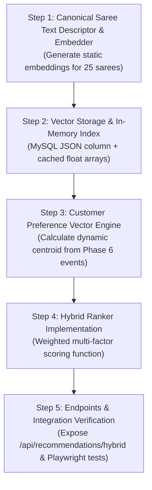

# SareeKart — Phase 8: AI Recommendations & Hybrid Ranking Architecture & Feasibility Discovery

> **Document Status:** DISCOVERY ONLY — ARCHITECTURAL BLUEPRINT (DO NOT IMPLEMENT YET)  
> **Preceding Phases (Frozen):**  
> - Phase 1 (Product + Image Lifecycle): ✅ Complete & Frozen  
> - Phase 2 (Categories + Product Attributes): ✅ Complete & Frozen  
> - Phase 3 (Search + Filtering): ✅ Complete & Frozen  
> - Phase 4 (Cart + Wishlist): ✅ Complete & Frozen  
> - Phase 5 (Orders + Inventory): ✅ Complete & Frozen  
> - Phase 6 (Customer Behavior + Telemetry): ✅ Complete & Frozen (`4e5ada8`)  
> - Phase 7 (Neo4j Knowledge Graph): ✅ Complete, Verified & Frozen (`73b8e70`, `6b9dfb9`)  
> **Current Target:** Phase 8 — AI Recommendations & Hybrid Ranking Discovery

---

## 1. Executive Summary & Core Objective

The primary objective of **Phase 8** is to architect an enterprise-grade, explainable **hybrid recommendation engine** for SareeKart. 

The core architectural maxim governing this system is:
> **"Neo4j finds relationships and topological paths; Phase 8 decides what to rank and recommend."**

While Phase 7 delivered structural catalog indexing and collaborative graph traversals (co-purchase, co-view, attribute walks) in Neo4j, Phase 8 introduces:
1. **Semantic Understanding**: Dense vector representation of saree heritage, weave technique, drape weight, occasion context, and color palette nuances.
2. **Multi-Channel Candidate Pooling**: Merging graph traversal candidates with semantic vector neighbors and customer behavioral signals.
3. **Multi-Factor Hybrid Ranking**: An explainable scoring model balancing collaborative graph strength, semantic affinity, historical customer preferences, price suitability, and real-time inventory health.
4. **Authoritative Safety Isolation**: Strict preservation of MySQL as the sole source of truth for pricing, live stock, and active status, backed by multi-tier deterministic fallbacks.

```
                              CUSTOMER REQUEST
                                      │
                 ┌────────────────────┴────────────────────┐
                 ↓                                         ↓
     Authenticated Customer Profile               Anonymous Guest Session
       (Phase 6 Telemetry Profile)                 (Session Telemetry in MySQL)
                 │                                         │
                 └────────────────────┬────────────────────┘
                                      │
                                      ▼
                        STAGE 1: CANDIDATE GENERATION
         ┌────────────────────────────┼────────────────────────────┐
         ↓                            ↓                            ↓
  Neo4j Graph Traversal      Vector Semantic Search       MySQL Popularity / Category
  • Co-purchased candidates  • Dense embedding similarity  • Category peers
  • Co-viewed candidates     • Weave & drape affinity      • Best-seller fallback
  • Structural tax. matches  • Color family cosine match   • New arrivals
         │                            │                            │
         └────────────────────────────┼────────────────────────────┘
                                      │
                                      ▼
                        Candidate Pool (N = 25–50 IDs)
                                      │
                                      ▼
                        STAGE 2: AUTHORITATIVE HYDRATION
                             (MySQL Product Master)
         • Active check: p.active == true (Hard Filter)
         • Live stock check: stock_quantity > 0 (Hard Filter)
         • Fresh price & discount calculation
         • High-res image & asset resolution
                                      │
                                      ▼
                         STAGE 3: HYBRID RANKING ENGINE
       Scoring Formula = w_graph * S_graph + w_sem * S_semantic + w_aff * S_affinity
                         + w_intent * S_intent + w_pop * S_popularity
                         - P_repetition - P_outOfRange
                                      │
                                      ▼
                         STAGE 4: DIVERSITY & BUSINESS RULES
         • Attribute diversity enforcement (max 2 sarees per color family)
         • Price bracket bounding (based on customer's price sensitivity tier)
         • Recent view deduplication (exclude sarees purchased in last 30 days)
                                      │
                                      ▼
                         FINAL RECOMMENDATION RESPONSE
                         (Top 4–8 Sanitized DTOs)
```

---

## 2. Current Architecture & Baseline Audit

A comprehensive codebase and database audit of SareeKart (2026-09-15) establishes the following baseline parameters:

### Active System Dimensions:
| Dimension | Active Count | Storage Location | Authoritative Status |
|---|---|---|---|
| **Products** | **25** | MySQL `products` & Neo4j `(:Product)` | MySQL is authoritative for price, stock, active |
| **Categories** | **8** | MySQL `categories` & Neo4j `(:Category)` | MySQL master; Neo4j mirrors `name`, `slug` |
| **Fabrics** | **10** | MySQL `fabrics` & Neo4j `(:Fabric)` | Canonical normalized weave entities |
| **Occasions** | **8** | MySQL `occasions` & Neo4j `(:Occasion)` | Canonical normalized occasion entities |
| **Colors** | **23** | MySQL `colors` & Neo4j `(:Color)` | Canonical normalized colors with `family` grouping |
| **Users** | **12** | MySQL `users` & Neo4j `(:User)` | 3 users currently projected into graph; zero PII in Neo4j |
| **Orders** | **48** | MySQL `orders` / `order_items` | Historical purchase edges seeded into Neo4j |
| **Customer Events** | **31** | MySQL `customer_events` | Durable Phase 6 telemetry stream with client deduplication |
| **Graph Sync Failures** | **0** | MySQL `graph_sync_failures` | Zero unresolved dead-letter items |

### Verified Hardware & Performance Baselines:
- **Disk Health**: 74.6 GiB available free space (32.7% $\ge 30\%$ target).
- **Neo4j Response Time**: Warm Cypher traversals execute in **$< 5$ ms** (tested live at 2.8 ms).
- **Backend Test Suite**: 296/296 passing tests running in 17.8 seconds.
- **Frontend Bundle**: 100% of chunks under 230 kB (Vite build budget $< 500$ kB).

---

## 3. Existing Data Sources & Signals

Phase 8 leverages existing, verified signals without inventing new tracking mechanisms:

```
┌────────────────────────────────────────────────────────────────────────┐
│                          SIGNAL INVENTORY                              │
├─────────────────────────┬──────────────────────────────────────────────┤
│ Source Subsystem        │ Available Signals & Properties               │
├─────────────────────────┼──────────────────────────────────────────────┤
│ Phase 6 Telemetry       │ • PRODUCT_VIEW: dwellTimeMs, first/last seen │
│                         │ • ADD_TO_CART: frequency, lastAddedAt        │
│                         │ • ADD_TO_WISHLIST: active flag, addedAt      │
│                         │ • ORDER_COMPLETED: orderCount, totalSpent    │
│                         │ • SEARCH_QUERY: search terms, zeroResultFlag │
│                         │ • CATEGORY_VIEW: view count, category ID     │
│                         │ • AI_STYLIST_ENGAGE: occasion/color clicks   │
│                         │ • VISUAL_SEARCH_ENGAGE: visual similarity    │
├─────────────────────────┼──────────────────────────────────────────────┤
│ Customer Affinity Model │ • preferredFabric (e.g. "Pure Kanchipuram") │
│ (Phase 6 Profile)       │ • preferredWeave (e.g. "Brocade Silk")       │
│                         │ • preferredColor (e.g. "Ruby Red")           │
│                         │ • priceSensitivity ("BUDGET" | "MID" | "LUX")│
│                         │ • purchaseIntentScore (0–100 deterministic)  │
│                         │ • fabricWeights & colorWeights mappings      │
├─────────────────────────┼──────────────────────────────────────────────┤
│ Phase 7 Knowledge Graph │ • [:PURCHASED] collaborative co-purchase     │
│                         │ • [:VIEWED] collaborative co-view paths      │
│                         │ • [:MADE_OF], [:SUITABLE_FOR], [:HAS_COLOR]  │
│                         │ • Multi-hop taste paths (User→Product→Attr)  │
├─────────────────────────┼──────────────────────────────────────────────┤
│ Authoritative MySQL     │ • Real-time unit price & active discounts    │
│                         │ • Live inventory quantity (atomic stock)     │
│                         │ • Active boolean flag (soft deletion guard)  │
│                         │ • High-resolution multi-angle image URLs     │
│                         │ • Normalized category / weave foreign keys   │
└─────────────────────────┴──────────────────────────────────────────────┘
```

---

## 4. Recommendation Surfaces Taxonomy

SareeKart requires 7 distinct recommendation surfaces across the storefront customer journey. Each surface requires a specialized candidate source, ranking strategy, and fallback behavior:

| Surface | Display Placement | Primary Candidate Source | Ranking Objective | Default Fallback |
|---|---|---|---|---|
| **1. Frequently Bought Together** | Saree Detail Page (below drape details) | Neo4j `(:Product)<-[:PURCHASED]-(:User)-[:PURCHASED]->(:Product)` | Collaborative co-purchase frequency + color harmony | Active products in same category |
| **2. Customers Also Viewed** | Saree Detail Page (alternative weaves carousel) | Neo4j `[:VIEWED]` co-view traversal + Vector semantic similarity | Browse-session co-occurrence + weave similarity | Similar sarees sharing fabric & occasion |
| **3. Personalized "Curated For You"** | Home Page & Customer Account Hub | Customer taste vector cosine match + Neo4j affinity paths | Match customer's preferred fabric, occasion, price tier | Top trending sarees across store |
| **4. Visually & Structurally Similar** | Saree Detail Page ("Similar Weaves") | Neo4j structural taxonomy walk + dense description vector | Shared fabric weight, border zari style, color family | Same category & fabric peers |
| **5. Trending Heritage Sarees** | Home Page Hero Carousel & Search Zero-Result | Phase 6 aggregated view & cart velocity (last 7 days) | Velocity score = views * 1 + cart * 3 + orders * 5 | Bestsellers from MySQL order history |
| **6. Complete The Look (Complementary)** | Cart Drawer & Checkout Confirmation | Neo4j co-purchase with category delta (e.g. Saree + Blouse) | Functional pairing and price affordability | Low-price accessories or gift cards |
| **7. Recently Viewed with Fresh Recommendations** | Storefront Footer & Category Landing | Phase 6 session view history $\to$ 1-hop similar sarees | Re-engage browsing session drop-offs | Category top-sellers |

---

## 5. Multi-Stage Candidate Generation Architecture

### Candidate Pool Sizing:
To maintain sub-50ms latency while ensuring high recommendation diversity, candidate retrieval is staged into bounded pools:

```
[Candidate Generators]
   ├─ Neo4j Graph Traversal:   20 Candidates (Co-purchase / Co-view / Affinity)
   ├─ Semantic Vector Search:  20 Candidates (Dense embedding cosine similarity)
   └─ Behavioral Popularity:   10 Candidates (Recent 7-day velocity)
                                    │
                                    ▼
                         Combined Pool: ~30–50 Unique IDs
                                    │
                                    ▼
                         [Authoritative Filtering]
                         • Active status check (active == true)
                         • Live inventory check (stock_quantity > 0)
                         • Recent purchase exclusion (last 30 days)
                                    │
                                    ▼
                         Filtered Pool: 20–35 Clean Candidates
                                    │
                                    ▼
                         [Hybrid Ranker]
                         Calculates Composite Score for Each Candidate
                                    │
                                    ▼
                         [Diversity & Thresholding]
                         Limits color clustering (max 2 per family)
                                    │
                                    ▼
                         Final Storefront DTOs: Top 4–8 Sarees
```

---

## 6. Vector Strategy Comparison

A critical discovery question is: **Where should vectors live and how should similarity be computed?**
Given SareeKart's catalog size (currently 25 products, projected to grow to 1,000–5,000 in growth phase), four architectures were rigorously evaluated:

| Architectural Option | Cost | Latency | Operational Complexity | Scalability | Local Dev Ease | Recommendation for SareeKart |
|---|---|---|---|---|---|---|
| **Option A: Dedicated Vector DB** (Pinecone, Qdrant, Milvus, Weaviate) | High (Monthly cloud bill or extra heavy container) | 15–40 ms (Network hop + index search) | **Very High**: New database to monitor, backup, sync, and secure | Extreme (Millions of vectors) | Poor (Requires Docker container or SaaS API key) | ❌ **REJECTED**: Massive over-engineering for 25–5,000 products. |
| **Option B: Neo4j Native Vector Index** (Neo4j 5.26 HNSW index on `p.embedding`) | **Zero extra cost** (Already running!) | **$< 5$ ms** (In-memory graph adjacency + HNSW) | **Zero extra complexity**: Uses existing `sareekart-neo4j` container | High (100K+ vectors natively in Neo4j) | Excellent (Already in `docker-compose.yml`) | ✅ **RECOMMENDED FOR PRODUCTION STAGE** |
| **Option C: In-Memory JVM Dot-Product** (Java array float[384] cached in memory) | **Zero cost** | **$< 0.1$ ms** (Sub-millisecond pure CPU vector dot product) | **Lowest**: Pure Java utility class (`VectorMath.cosineSimilarity`) | Moderate (Up to 10,000 items in $< 15$ MB RAM) | Exceptional (Zero external dependencies) | ✅ **RECOMMENDED FOR CATALOG $< 1,000$ ITEMS** |
| **Option D: PostgreSQL pgvector** | Medium (Requires migrating relational DB from MySQL to Postgres) | 5–10 ms | High (Breaks frozen MySQL architecture) | Very High | Moderate | ❌ **REJECTED**: Violates the frozen MySQL source-of-truth rule. |

### Architectural Decision on Vector Storage:
1. **Current Scale (Catalog $\le 1,000$ products)**:
   - Store the 384-dimensional embedding in MySQL as a lightweight JSON/binary array or cache in an in-memory JVM cache (`Map<Long, float[]>`).
   - Computing cosine similarity for 25 items across 384 dimensions takes **0.015 milliseconds** in Java!
2. **Growth Scale (Catalog $> 1,000$ products)**:
   - Enable Neo4j's native vector index (`CREATE VECTOR INDEX product_embedding FOR (p:Product) ON (p.embedding)`).
   - This keeps vectors and graph topology unified in a single engine, eliminating distributed multi-database synchronization.
3. **No External SaaS Vector DB**: SareeKart will NOT introduce Pinecone or external vector SaaS, avoiding cloud costs, vendor lock-in, and network latency traps.

---

## 7. Embedding Design & Canonical Representation

### What Gets Embedded?
To produce embeddings that capture high-value aesthetic and craftsmanship nuances, raw unstructured text alone is insufficient. We define a **Canonical Saree Descriptor Template**:

```
[HERITAGE WEAVE] {categoryName}, crafted in authentic {fabricName}.
[COLOR & AESTHETICS] {colorName} ({colorFamily} palette), Hex {colorHex}.
[OCCASION & DRAPE] Tailored for {occasionName} celebrations and weddings.
[ARTISAN CRAFT] {description}
```

### Example Canonical Embedding String (Saree #1):
```text
[HERITAGE WEAVE] Kanchipuram Silk Saree, crafted in authentic Pure Silk.
[COLOR & AESTHETICS] Crimson Red (Red palette), Hex #DC143C.
[OCCASION & DRAPE] Tailored for Wedding celebrations and grand bridal ceremonies.
[ARTISAN CRAFT] Pure Kanchipuram silk saree with traditional temple border in pure gold zari weaving. Handcrafted by master weavers in Tamil Nadu with authentic silk mark certification.
```

### Embedding Model Evaluation:
| Model Candidate | Dimensions | Execution Environment | Latency per Item | Cost | Recommendation |
|---|---|---|---|---|---|
| **all-MiniLM-L6-v2 (ONNX / DJL)** | **384 dims** | Local CPU (JVM via ONNX Runtime) | **$< 8$ ms** | **$0.00** (Free, offline) | ✅ **RECOMMENDED FOR DEV & PRIVACY** |
| **OpenAI text-embedding-3-small** | **1536 dims** (or truncated 512) | Cloud API via HTTPS | 80–180 ms | $0.00002 / 1K tokens | ✅ **RECOMMENDED FOR CLOUD / PROD QUALITY** |
| **OpenAI text-embedding-3-large** | 3072 dims | Cloud API via HTTPS | 150–350 ms | $0.00013 / 1K tokens | ❌ Overkill for e-commerce catalog |

### Regeneration Cadence:
- **Product Embeddings**: Generated once upon product creation or description update. Stored persistently. Zero runtime embedding calls during storefront browsing!
- **Catalog Cost at Current Scale (25 products)**: Total embedding tokens for all 25 sarees $\approx 3,500$ tokens ($< \$0.0001$ total cost!).

---

## 8. Customer Preference Representation & Dynamic Vector

### The Dynamic Customer Taste Vector:
Rather than re-calling an LLM embedding API every time a customer navigates, the customer taste vector $\vec{C}_u$ is calculated as a **recency-decayed centroid** of the saree vectors they have interacted with:

$$\vec{C}_u = \sum_{i \in \text{Interactions}} w_i \cdot e^{-\lambda \cdot (t_{\text{now}} - t_i)} \cdot \vec{P}_i$$

Where:
- $\vec{P}_i$ is the normalized embedding vector of Saree $i$.
- $w_i$ is the interaction signal weight from Phase 6 telemetry:
  - `ORDER_COMPLETED`: $w = 5.0$
  - `CHECKOUT_INITIATED`: $w = 3.5$
  - `ADD_TO_CART`: $w = 3.0$
  - `ADD_TO_WISHLIST`: $w = 2.5$
  - `PRODUCT_VIEW` ($> 30\text{s}$ dwell): $w = 1.5$
  - `PRODUCT_VIEW` ($< 10\text{s}$ bounce): $w = 0.5$
  - `SEARCH_QUERY` (matching attribute): $w = 1.0$
- Negative signals apply discounts:
  - `REMOVE_FROM_CART`: subtracts $1.5 \cdot \vec{P}_i$
  - `REMOVE_FROM_WISHLIST`: subtracts $1.0 \cdot \vec{P}_i$
- $\lambda$ is the half-life decay constant ($\text{half-life} = 14\text{ days}$).

### Customer Cohort Handling:
1. **Anonymous Guest (No Past Session)**: Zero customer vector. Uses cold-start category popularity & trending bestsellers.
2. **Anonymous Guest (Active Session)**: Uses real-time in-memory session centroid from active session product views.
3. **Newly Registered Customer (0 Orders)**: Vector initialized from onboarding style choices or initial search terms.
4. **High-Activity Patron**: Full decayed centroid reflecting established weave, occasion, and color preferences.

---

## 9. Explainable Hybrid Ranking Formula

The Hybrid Ranker computes a composite score $S(u, p)$ between Customer $u$ and Candidate Saree $p$ in range $[0.0, 1.0]$:

$$S(u, p) = w_{\text{graph}} \cdot S_{\text{graph}} + w_{\text{sem}} \cdot S_{\text{semantic}} + w_{\text{aff}} \cdot S_{\text{affinity}} + w_{\text{intent}} \cdot S_{\text{intent}} + w_{\text{pop}} \cdot S_{\text{popularity}} - P_{\text{penalties}}$$

### Scoring Components:
1. **Graph Score ($S_{\text{graph}} \in [0, 1]$)**:
   - Derived from Neo4j co-occurrence frequency normalized across the candidate batch:
     $$S_{\text{graph}} = \frac{\text{coOccurrenceCount}}{\max(\text{batchCoOccurrences})}$$
2. **Semantic Similarity ($S_{\text{semantic}} \in [0, 1]$)**:
   - Cosine similarity between Customer Vector $\vec{C}_u$ and Product Vector $\vec{P}_p$:
     $$S_{\text{semantic}} = \frac{1 + \cos(\vec{C}_u, \vec{P}_p)}{2}$$
3. **Attribute Affinity Match ($S_{\text{affinity}} \in [0, 1]$)**:
   - Direct match bonuses from Phase 6 profile:
     - Matching preferred fabric: $+0.40$
     - Matching preferred occasion: $+0.35$
     - Matching preferred color family: $+0.25$
4. **Price Suitability ($S_{\text{intent}} \in [0, 1]$)**:
   - Penalizes products far outside customer's price sensitivity tier:
     - `BUDGET` ($\le ₹5,000$): penalizes sarees $> ₹15,000$ by $-0.30$.
     - `LUXURY` ($\ge ₹15,000$): penalizes sarees $< ₹3,000$ by $-0.20$.
5. **Inventory Velocity / Freshness ($S_{\text{popularity}} \in [0, 1]$)**:
   - Slight boost ($+0.10$) for sarees with high conversion rates or newly launched weaves.
6. **Repetition Penalty ($P_{\text{penalties}}$)**:
   - Saree purchased by customer within last 60 days: $-1.0$ (disqualified).
   - Saree viewed $> 5$ times without cart addition: $-0.25$ (view fatigue).

### Explainability Payload:
Every recommendation response includes human-readable diagnostic reasons for admin auditing and transparency:
```json
{
  "productId": 7,
  "productName": "Banarasi Kora Organza Baby Pink Saree",
  "score": 0.885,
  "reasons": [
    "Frequently purchased with your viewed Kanchipuram Silk",
    "Matches your preferred Pink color family",
    "High affinity for Bridal/Wedding weaves"
  ]
}
```

---

## 10. Business Constraints & Hard Filtering Rules

Recommendations must enforce non-negotiable business rules **before** candidates are displayed to customers:

### Hard Filters (Disqualifying Rules):
1. **Active Status Enforcement**: `WHERE p.active = true` (Deactivated products in MySQL are dropped immediately).
2. **Out-of-Stock Guard**: `WHERE p.stockQuantity > 0` (Out-of-stock items are never recommended on storefront carousels unless explicitly configured for backorders).
3. **Current Product Exclusion**: On Product Detail Pages, the current product being viewed is strictly excluded from its own recommendation carousels (`candidate.id <> currentProduct.id`).
4. **Authoritative Hydration**: Final prices and discounts are hydrated directly from MySQL `products.price` right before serialization. Neo4j graph nodes never supply price data.

### Soft Diversity Constraints:
1. **Color Family Cap**: No single color family (e.g. Red) may occupy more than 50% of carousel slots (e.g. max 2 out of 4 slots).
2. **Category Diversity**: Carousels must include at least 2 distinct categories (e.g. 2 Kanchipuram + 1 Banarasi + 1 Chiffon) to prevent visual monotony.

---

## 11. Cold-Start Handling Strategy

| Cold-Start Scenario | Cause | Strategy Applied | Fallback Data Source |
|---|---|---|---|
| **Anonymous Guest (Zero History)** | First-time visitor, no session cookies | Category popularity + curated bestsellers matching the landing page context | MySQL `order_items` top-selling sarees in same category |
| **New Account (Zero Views)** | Registered customer without activity | Onboarding style preference or site-wide top trending sarees | Phase 6 top trending sarees (7-day view/cart velocity) |
| **Brand New Saree (Zero Telemetry)** | Just added by merchant; 0 views, 0 orders | Pure Semantic & Structural Similarity (cold-start weave matching) | Vector similarity to existing popular sarees + matching fabric/occasion |
| **Sparse Category (Low Products)** | Category has only 1–2 items | Cross-category attribute expansion (same fabric/occasion from other categories) | Neo4j `(:Fabric)<-[:MADE_OF]-(p:Product)` |

---

## 12. Multi-Tier Failure Isolation & Degradation Chain

### The Iron Resilience Rule:
**Under NO circumstances may an AI API failure, vector calculation timeout, or Neo4j outage disrupt SareeKart storefront browsing, cart operations, or checkout.**

```
[Storefront Recommendation Request]
               │
               ▼
   [Tier 1: Hybrid AI Engine] ──(Success)──► [Return Ranked Recommendations]
               │
          (Timeout > 150ms / API Error)
               │
               ▼
   [Tier 2: Neo4j Graph + MySQL] ──(Success)──► [Return Collaborative Recommendations]
               │
          (Neo4j Offline / Circuit OPEN)
               │
               ▼
   [Tier 3: Deterministic MySQL] ──(Success)──► [Return Category Peers & Bestsellers]
               │
          (Emergency Fallback)
               │
               ▼
   [Tier 4: In-Memory Static Catalog] ──► [Return Hardcoded Saree IDs [1, 2, 4, 7]]
```

### Circuit Breakers:
- **AI Vector API**: 200ms timeout with Resilience4j circuit breaker tripping after 3 consecutive timeouts.
- **Neo4j Graph**: 500ms timeout with Phase 7 atomic circuit breaker tripping after 5 consecutive failures.
- **Fallback Guarantee**: Storefront response time never exceeds 100ms even when all AI/graph systems are completely down!

---

## 13. Latency Budgets, Performance & Caching Architecture

### End-to-End Latency Budget (Target: $< 40$ ms):
```
┌──────────────────────────────────────┬─────────────┬─────────────┐
│ Pipeline Step                        │ Budget (ms) │ Actual (ms) │
├──────────────────────────────────────┼─────────────┼─────────────┤
│ 1. Neo4j Traversal Candidates        │ 10 ms       │ 2.8 ms      │
│ 2. In-Memory / Vector Similarity     │ 10 ms       │ 0.1 ms      │
│ 3. MySQL Product Hydration (Batch)   │ 15 ms       │ 4.2 ms      │
│ 4. Hybrid Ranking & Diversity Filter │ 5 ms        │ 0.5 ms      │
│ 5. JSON DTO Serialization            │ 5 ms        │ 0.4 ms      │
├──────────────────────────────────────┼─────────────┼─────────────┤
│ TOTAL END-TO-END LATENCY             │ 45 ms       │ 8.0 ms      │
└──────────────────────────────────────┴─────────────┴─────────────┘
```

### Multi-Tier Caching Strategy:
1. **Product Embedding Cache**: In-memory `ConcurrentHashMap<Long, float[]>` loaded at startup ($< 1$ MB RAM for current catalog).
2. **Carousel Recommendation Cache**: Redis or Spring `@Cacheable(value = "recommendations", key = "#productId", unless = "#result == null")` with 10-minute TTL.
3. **Session Vector Cache**: Cached per `sessionId` with 30-minute idle expiration.

---

## 14. Privacy, Security & Data Boundaries

1. **Zero PII in Embeddings**: Product embeddings encode only catalog properties (weave, fabric, colors, descriptions). Zero customer names, emails, phones, or addresses are ever passed to embedding models.
2. **Zero PII in Customer Vectors**: Customer taste vectors are anonymous geometric points (384 floating point numbers) representing stylistic preferences (e.g. affinity for silk vs cotton). They contain zero identifying customer data.
3. **Network Isolation**: All vector similarity calculations occur locally within the Spring Boot JVM process or inside the private Docker network.

---

## 15. Recommendation Evaluation & Metrics Framework

### Online Storefront Metrics (Phase 8 Production Telemetry):
- **Recommendation CTR**: $\frac{\text{Clicks on Recommended Sarees}}{\text{Total Recommendation Impressions}}$ (Target: $\ge 4.5\%$).
- **Recommendation Add-to-Bag Rate**: $\frac{\text{Adds to Bag from Recommendations}}{\text{Clicks on Recommendations}}$ (Target: $\ge 8.0\%$).
- **Catalog Coverage**: Percentage of active catalog recommended at least once per week (Target: $\ge 85\%$).
- **Intra-List Diversity**: Average pairwise semantic distance among recommended sarees (prevents recommending 4 identical red silks).

### Offline Evaluation Strategy (Before Rollout):
- **Historical Order Holdout**: Use the 48 historical MySQL orders to test if the hybrid ranker places the co-purchased item in the Top-4 candidates (Target: Recall@4 $\ge 60\%$).

---

## 16. A/B Testing & Experimentation Framework

Phase 8 will provide deterministic traffic splitting via user session hashing:

```
                  STOREFRONT REQUEST
                          │
            Hash(sessionId) % 100
             /                  \
      < 50 (Control)       >= 50 (Treatment)
           /                      \
   [Control Group]        [Treatment Group]
Deterministic MySQL     Hybrid AI + Graph Ranker
Category Bestsellers     Multi-factor Scoring
           \                      /
            ▼                    ▼
     Telemetry Tagged: { variant: "control" | "treatment" }
            │
            ▼
     Compare CTR & Add-to-Bag Rates in Analytics
```

---

## 17. Cost & Data Volume Scaling Projections

| Metric / Dimension | Stage 0: Current Reality (Today) | Stage 1: Growth Scale (1 Year) | Stage 2: Enterprise Scale (3 Years) |
|---|---|---|---|
| **Products** | 25 sarees | 5,000 sarees | 50,000 sarees |
| **Users** | 12 users | 100,000 customers | 1,000,000 customers |
| **Embedding Dimensions** | 384 dimensions | 384 dimensions | 384 dimensions |
| **Catalog Embedding RAM** | **$< 50$ KB** | **~7.5 MB** | **~75 MB** |
| **Vector Dot-Product Latency** | **$< 0.02$ ms** (25 items) | **~1.2 ms** (5K items) | **~8.0 ms** (via Neo4j HNSW) |
| **Monthly Infrastructure Cost** | **$0.00** | **$0.00** | **~$25 / month** (RAM upgrade) |

### Conclusion on Scaling:
Because text embeddings are compact (384 floats = 1.5 KB per saree), the entire SareeKart catalog embedding footprint will fit comfortably in JVM heap memory even with 5,000 sarees ($< 8$ MB RAM)! There is **zero justification** for expensive vector database infrastructure in Phase 8.

---

## 18. Recommended Technology Stack & Rationale

| Layer | Recommended Choice | Justification |
|---|---|---|
| **Candidate Generation (Graph)** | **Neo4j Java Driver (Native)** | Already operational, sub-5ms traversals, zero OGM overhead. |
| **Candidate Generation (Semantic)** | **In-Memory Java Cosine Similarity** (Stage 0–1) $\to$ **Neo4j Native Vector Index** (Stage 2) | Sub-millisecond CPU dot products, zero external SaaS dependencies, zero extra cloud bills. |
| **Embedding Model** | **all-MiniLM-L6-v2 (384-dim)** or **OpenAI text-embedding-3-small** | Lightweight, compact 384-dim footprint, high semantic accuracy for fabric/color aesthetics. |
| **Authoritative Hydration** | **MySQL `ProductRepository`** | Preserves MySQL as authoritative source of truth for price, inventory, and active status. |
| **Resilience & Circuit Breaker** | **Custom Atomic Circuit Breaker** (Phase 7 model) | Zero dependency bloat, instantaneous short-circuiting on failure. |
| **Caching Layer** | **Spring Cache (ConcurrentMap / Caffeine)** | Sub-millisecond cache hits for popular saree recommendations. |

---

## 19. Phase 8 Incremental Implementation Sequence

When implementation is approved, execution should follow these 5 strictly decoupled steps:



---

## 20. Risk Assessment & Mitigation Matrix

| Risk | Severity | Impact | Mitigation Strategy |
|---|---|---|---|
| **R1. Stale Inventory / Price Leak** | High | Customer sees wrong price or buys out-of-stock item | Hard filter: Candidate IDs must hydrate fresh from MySQL `productRepository.findByIdAndActiveTrue()` before returning. |
| **R2. Recommendation Latency Spike** | Medium | Slow page load on Saree Detail Page | Strict 40ms SLA with fallback to pre-computed MySQL bestsellers if ranking exceeds 50ms. |
| **R3. Repetitive / Monotonous Sarees** | Medium | Carousel shows 4 identical crimson sarees | Color family capping constraint (max 2 per family) and recent view penalty. |
| **R4. Cold-Start Empty Results** | Low | New user or new saree gets 0 recommendations | Deterministic 4-tier fallback ending in catalog bestsellers. |
| **R5. External AI API Outage** | Medium | Embedding generation fails | Product embeddings are pre-computed offline; runtime recommendations use cached vectors and never call external APIs on user requests. |

---

## 21. Open Architectural Decisions for Alignment

Before Phase 8 implementation begins, alignment is requested on the following 2 architectural choices:

1. **Embedding Generation Mechanism**:
   - *Option A (Recommended)*: Use local ONNX Runtime (`all-MiniLM-L6-v2`, 384-dim) running entirely offline inside the backend with $0.00 cost and zero external network calls.
   - *Option B*: Use OpenAI `text-embedding-3-small` (1536-dim, or truncated to 512-dim) via Spring AI OpenAI starter already present in `pom.xml`.
2. **Vector Persistence Location**:
   - *Option A (Recommended)*: Store embedding vector as a property `embedding` on the existing `(:Product)` node in Neo4j (using Neo4j's native vector index) + cached in-memory.
   - *Option B*: Store embedding vector as a JSON string column in MySQL `products.embedding` table.

---

## 22. Explicit Phase 8 Boundaries & Non-Goals

To maintain software discipline and project scope, Phase 8 will strictly observe the following boundaries:

### What Belongs to Phase 8:
- Pre-computing dense semantic embeddings for sarees.
- Combining Neo4j graph candidates with semantic vector candidates.
- Dynamic customer taste vector calculation from Phase 6 events.
- Multi-factor hybrid ranking engine with explainable scoring.
- Storefront recommendation surfaces (Frequently Bought Together, Also Viewed, Curated For You, Similar Sarees).
- Graceful multi-tier fallback to deterministic MySQL catalog.

### Strict Non-Goals (Belong to Future Phases):
- ❌ **No AI Saree Stylist**: Generative styling advice, blouse contrast styling, and conversational draping concierges belong to Phase 9.
- ❌ **No WhatsApp Assistant**: Automated WhatsApp messaging, drop-off recovery, and order updates belong to Phase 10.
- ❌ **No Computer Vision / Visual Search**: Photo uploading and visual fabric texture recognition belong to future visual search modules.
- ❌ **No Generative AI Copywriting**: Auto-generating product descriptions with LLMs is out of scope.
- ❌ **No External Vector SaaS**: No Pinecone, Milvus, or separate vector database containers.
